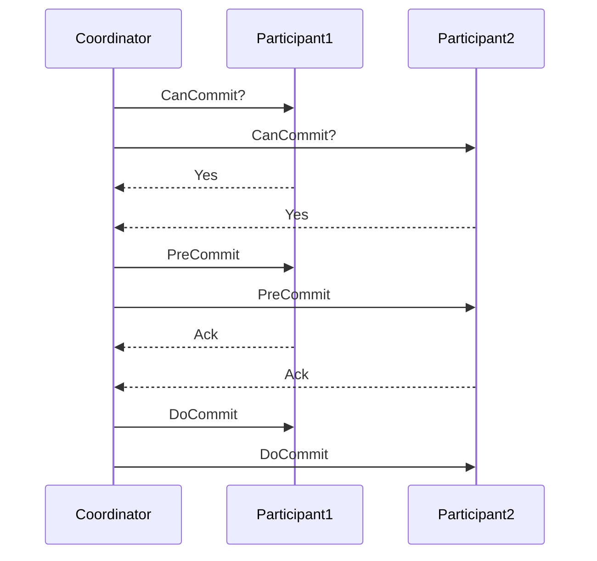

# Three-Phase Commit

## Overview

The Three-Phase Commit (3PC) protocol is an extension of the Two-Phase Commit (2PC) protocol designed to address the blocking problem in distributed transactions. It introduces an additional phase to ensure non-blocking behavior in the event of coordinator failure.

## Detailed Explanation

The 3PC protocol consists of three phases: CanCommit, PreCommit, and DoCommit. This design allows participants to make progress even if the coordinator fails after the PreCommit phase.

### Phases

1. **CanCommit Phase**: The coordinator sends a CanCommit message to all participants. Each participant replies with Yes or No based on whether they can commit the transaction.

2. **PreCommit Phase**: If all participants respond Yes, the coordinator sends a PreCommit message. Participants acknowledge and prepare to commit.

3. **DoCommit Phase**: The coordinator sends a DoCommit message, and participants commit the transaction.

If any participant responds No in CanCommit, or if timeouts occur, the transaction is aborted.

### Advantages over 2PC

- **Non-blocking**: Participants can decide to commit or abort without waiting indefinitely for the coordinator.
- **Fault tolerance**: Handles coordinator failure more gracefully.

### Disadvantages

- **Complexity**: More messages and states to manage.
- **Performance**: Additional round trips increase latency.



## Real-world Examples & Use Cases

- **Distributed Databases**: Used in systems requiring strong consistency across multiple nodes, such as in some implementations of distributed SQL databases.
- **Banking Systems**: Ensuring atomicity in transactions spanning multiple bank branches or systems.
- **Cloud Services**: Coordinating updates across microservices in a distributed architecture.

## Code Examples

### Pseudo Code for Coordinator

```java
class Coordinator {
    List<Participant> participants;
    
    boolean threePhaseCommit(Transaction tx) {
        // Phase 1: CanCommit
        for (Participant p : participants) {
            if (!p.canCommit(tx)) {
                abort(tx);
                return false;
            }
        }
        
        // Phase 2: PreCommit
        for (Participant p : participants) {
            p.preCommit(tx);
        }
        
        // Phase 3: DoCommit
        for (Participant p : participants) {
            p.doCommit(tx);
        }
        return true;
    }
}
```

### Pseudo Code for Participant

```java
class Participant {
    boolean canCommit(Transaction tx) {
        // Check if local resources allow commit
        return true; // or false
    }
    
    void preCommit(Transaction tx) {
        // Prepare to commit, e.g., write-ahead log
    }
    
    void doCommit(Transaction tx) {
        // Commit the transaction
    }
}
```

## Common Pitfalls & Edge Cases

- **Network Partitions**: Can lead to split-brain scenarios if not handled properly.
- **Timeout Handling**: Incorrect timeout values can cause unnecessary aborts.
- **Coordinator Failure**: Ensure participants can recover state.

## Tools & Libraries

- **Java**: Can be implemented using RMI or messaging libraries like Apache Kafka for coordination.
- **Databases**: PostgreSQL's two-phase commit, extended concepts.

## References

- [Wikipedia: Three-phase commit protocol](https://en.wikipedia.org/wiki/Three-phase_commit_protocol)
- [Distributed Systems: Principles and Paradigms](https://www.amazon.com/Distributed-Systems-Principles-Paradigms-Andrew/dp/0130888931)

## Github-README Links & Related Topics

- [Two-Phase Commit](two-phase-commit/README.md)
- [Saga Pattern](saga-pattern/README.md)
- [Distributed Transactions](distributed-transactions/README.md)
- [Consensus Algorithms](consensus-algorithms/README.md)