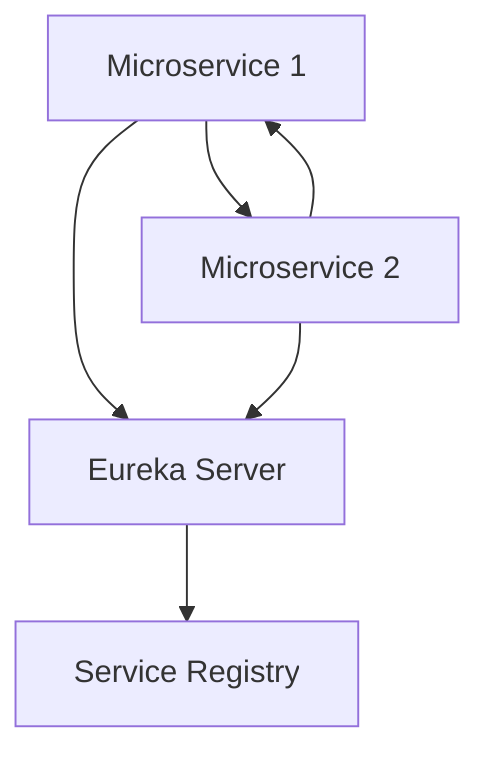

# Eureka Service Discovery

## Overview

Eureka is a service discovery tool developed by Netflix for microservices architectures. It allows services to register themselves and discover other services dynamically, enabling load balancing and failover.

## Detailed Explanation

Eureka consists of Eureka Server (registry) and Eureka Clients. Services register with the server on startup and send heartbeats. Clients query the server for service locations.

### Key Components

- **Eureka Server**: Maintains registry of services.
- **Eureka Client**: Registers with server and discovers services.
- **Service Registration**: Automatic or manual.
- **Health Checks**: Heartbeats to ensure service availability.

### Architecture Diagram



## Real-world Examples & Use Cases

- Netflix's microservices ecosystem.
- Spring Cloud applications for service registration and discovery.
- Any microservices setup requiring dynamic service location.

## Code Examples

### Spring Boot Eureka Server

```java
@SpringBootApplication
@EnableEurekaServer
public class EurekaServerApplication {
    public static void main(String[] args) {
        SpringApplication.run(EurekaServerApplication.class, args);
    }
}
```

### Spring Boot Eureka Client

```java
@SpringBootApplication
@EnableEurekaClient
public class ServiceApplication {
    public static void main(String[] args) {
        SpringApplication.run(ServiceApplication.class, args);
    }
}
```

## References

- [Spring Cloud Netflix Eureka](https://spring.io/projects/spring-cloud-netflix)
- [Netflix Eureka Wiki](https://github.com/Netflix/eureka/wiki)

## Github-README Links & Related Topics

- [Service Discovery](../service-discovery/README.md)
- [Microservices Architecture](../microservices-architecture/README.md)
- [Spring Cloud Config](../spring-cloud-config/README.md)