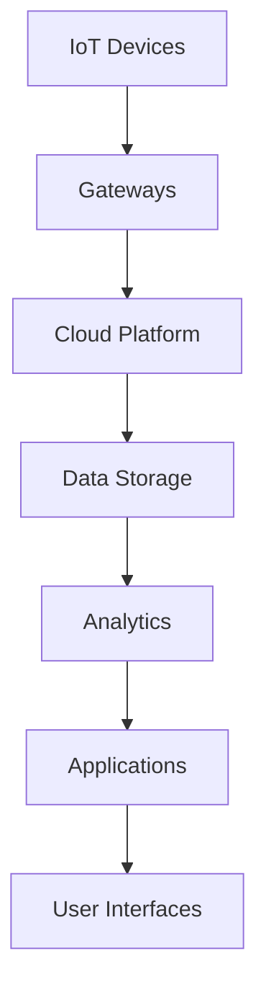

# IoT Architecture

## Overview

IoT Architecture designs systems for connecting and managing Internet of Things devices, enabling data collection, processing, and action in real-time. It addresses challenges like device heterogeneity, security, scalability, and low-power operation.

## Detailed Explanation

### Key Components

1. **IoT Devices**: Sensors, actuators, and embedded systems that collect data or perform actions.

2. **Gateways**: Edge devices that aggregate data from devices and communicate with the cloud.

3. **Cloud Platform**: Centralized infrastructure for data storage, analytics, and application hosting.

4. **Communication Protocols**: Standards like MQTT, CoAP, or HTTP for device-to-device and device-to-cloud communication.

5. **Data Processing**: Edge computing for local processing and cloud analytics for deeper insights.

6. **Security Layers**: Encryption, authentication, and secure boot to protect devices and data.

### Architecture Patterns

- **Three-Layer Architecture**: Perception (devices), Network (gateways), Application (cloud).
- **Five-Layer Architecture**: Adds Processing and Business layers.
- **Fog/Edge Computing**: Distributing computation closer to devices to reduce latency.



## Real-world Examples & Use Cases

- **Smart Homes**: Systems like Google Nest for automated lighting, heating, and security.
- **Industrial IoT (IIoT)**: Predictive maintenance in manufacturing using sensor data.
- **Healthcare Monitoring**: Wearable devices tracking vital signs for remote patient care.
- **Smart Cities**: Traffic management and environmental monitoring with connected sensors.

## Code Examples

### Publishing Data with MQTT using Paho

```python
import paho.mqtt.client as mqtt

def on_connect(client, userdata, flags, rc):
    print("Connected with result code " + str(rc))

client = mqtt.Client()
client.on_connect = on_connect

client.connect("mqtt.eclipse.org", 1883, 60)

client.publish("sensor/temperature", "25.5")

client.disconnect()
```

### Simple IoT Device Simulation

```python
import time
import random

class IoTSensor:
    def __init__(self, sensor_id):
        self.sensor_id = sensor_id

    def read_data(self):
        return random.uniform(20.0, 30.0)

sensor = IoTSensor("temp_sensor_1")
while True:
    data = sensor.read_data()
    print(f"Sensor {sensor.sensor_id}: {data}")
    time.sleep(5)
```

## References

- [IoT Architecture Patterns](https://www.oreilly.com/library/view/designing-the-internet/9781491953425/)
- [MQTT Protocol Specification](https://mqtt.org/)
- [AWS IoT Documentation](https://docs.aws.amazon.com/iot/)

## Github-README Links & Related Topics

- [IoT System Design](./iot-system-design/README.md)
- [Edge Computing](./edge-computing/README.md)
- [Security in System Design](./security-in-system-design/README.md)
- [Event Streaming with Apache Kafka](./event-streaming-with-apache-kafka/README.md)