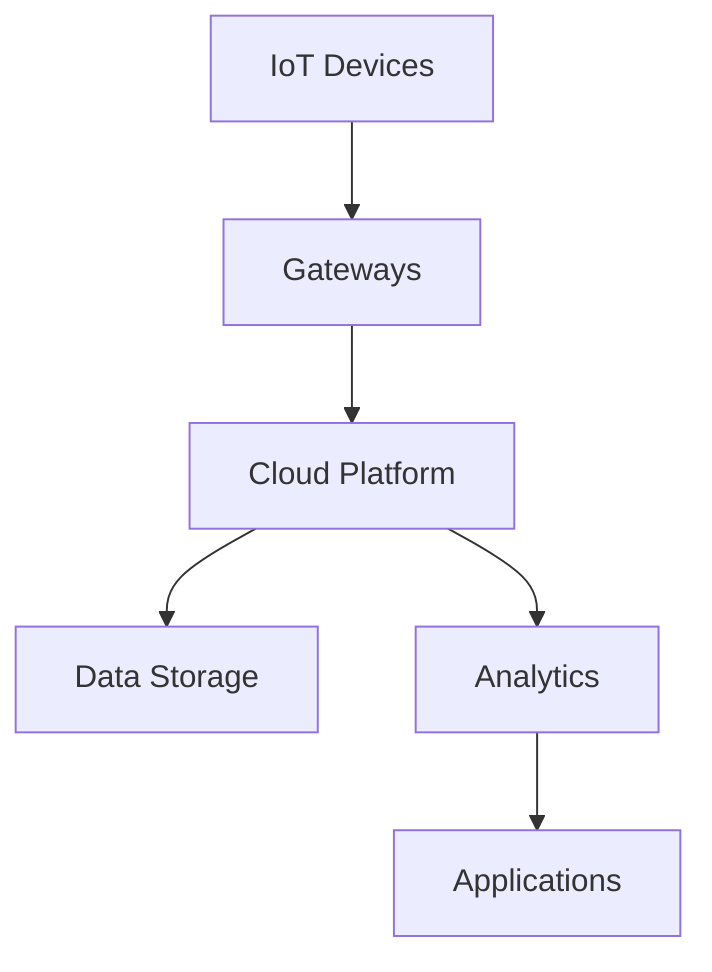

# IoT System Design

## Overview

IoT system design involves architecting networks of physical devices, sensors, and software that collect and exchange data, enabling smart, connected environments with minimal human intervention.

## Detailed Explanation

IoT systems consist of devices, connectivity, data processing, and user interfaces. Key layers:

- **Device Layer**: Sensors and actuators.
- **Connectivity Layer**: Protocols like MQTT, CoAP.
- **Data Processing Layer**: Edge computing or cloud analytics.
- **Application Layer**: User dashboards and controls.

Challenges: Security, scalability, power management, interoperability.

### IoT Architecture Diagram



## Real-world Examples & Use Cases

- **Smart Homes**: Automated lighting and security.
- **Industrial IoT**: Predictive maintenance in factories.
- **Healthcare**: Remote patient monitoring.
- **Agriculture**: Precision farming with sensors.

## Code Examples

### MQTT Publisher (Python)

```python
import paho.mqtt.client as mqtt

def on_connect(client, userdata, flags, rc):
    print("Connected with result code " + str(rc))

client = mqtt.Client()
client.on_connect = on_connect
client.connect("mqtt.eclipse.org", 1883, 60)

client.publish("sensor/temperature", "25.5")
client.disconnect()
```

### Simple IoT Device Simulation (JavaScript)

```javascript
// Simulate sensor data
const sensorData = {
    temperature: 22.5,
    humidity: 60
};

// Send to server
fetch('/api/sensor', {
    method: 'POST',
    headers: { 'Content-Type': 'application/json' },
    body: JSON.stringify(sensorData)
})
.then(response => response.json())
.then(data => console.log('Data sent:', data));
```

## References

- [IoT Architecture - AWS](https://aws.amazon.com/iot/architecture/)
- [MQTT Protocol](https://mqtt.org/)
- [IoT Design Patterns](https://www.iotforall.com/iot-design-patterns)
- [CoAP Protocol](https://coap.technology/)

## Github-README Links & Related Topics

- [Edge Computing](edge-computing/README.md)
- [Real-time Analytics](real-time-analytics/README.md)
- [API Design Principles](api-design-principles/README.md)
- [Security Best Practices in Java](security-best-practices-in-java/README.md)