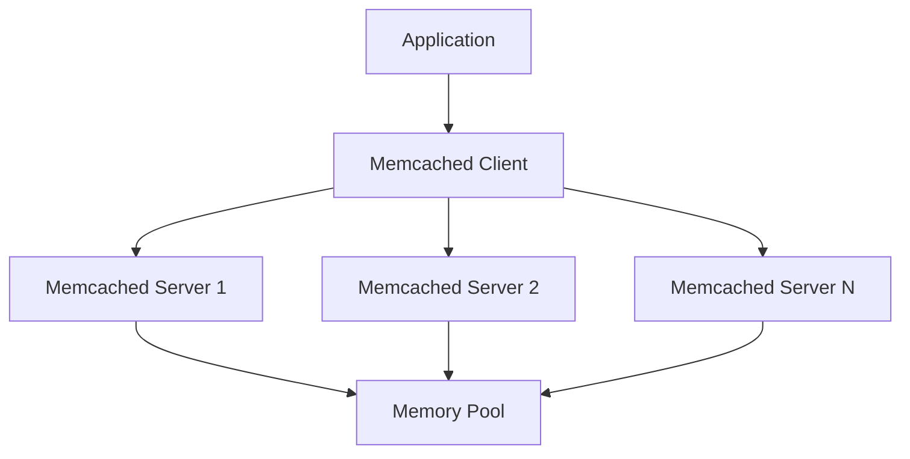

# Memcached

## Overview

Memcached is a high-performance, distributed memory object caching system, generic in nature, but intended for use in speeding up dynamic web applications by alleviating database load.

## Detailed Explanation

Memcached is an in-memory key-value store for small chunks of arbitrary data (strings, objects) from results of database calls, API calls, or page rendering. It uses a client-server architecture, with clients distributing data across multiple servers.

Key features:
- **In-memory storage**: Fast access to cached data.
- **Distributed**: Can run on multiple servers.
- **LRU eviction**: Least Recently Used items are evicted when memory is full.
- **Simple protocol**: Text-based protocol over TCP/UDP.

### Architecture Diagram



## Real-world Examples & Use Cases

- **Database Query Caching**: Cache results of expensive database queries.
- **Session Storage**: Store user session data.
- **API Response Caching**: Cache API responses to reduce load.
- **Page Fragment Caching**: Cache parts of web pages.

## Code Examples

### Java Client Example

```java
import net.spy.memcached.MemcachedClient;

public class MemcachedExample {
    public static void main(String[] args) {
        try {
            // Connect to Memcached
            MemcachedClient mcc = new MemcachedClient(
                new InetSocketAddress("127.0.0.1", 11211));

            // Set data
            mcc.set("key", 900, "value");

            // Get data
            Object value = mcc.get("key");
            System.out.println("Value: " + value);

            // Close connection
            mcc.shutdown();
        } catch (Exception e) {
            e.printStackTrace();
        }
    }
}
```

### Python Client Example

```python
import memcache

# Connect to Memcached
mc = memcache.Client(['127.0.0.1:11211'], debug=0)

# Set data
mc.set("key", "value", time=60)  # Expires in 60 seconds

# Get data
value = mc.get("key")
print("Value:", value)

# Delete data
mc.delete("key")
```

### Memcached Configuration

```bash
# Start Memcached with 64MB memory
memcached -m 64 -p 11211 -u memcache -l 127.0.0.1
```

## Common Pitfalls & Edge Cases

- **Cache Misses**: Handling when data is not in cache.
- **Cache Invalidation**: Ensuring stale data is removed.
- **Memory Limits**: Managing memory usage.
- **Concurrency**: Handling concurrent access.

## Tools & Libraries

- **Memcached Server**: Core caching server.
- **Client Libraries**: Available for various languages (Java, Python, etc.).
- **Monitoring Tools**: Tools like memcached-tool for stats.

## References

- [Memcached Official Website](https://memcached.org/)
- [Memcached Wiki](https://github.com/memcached/memcached/wiki)

## Github-README Links & Related Topics

- [Caching](./caching/)
- [Distributed Caching with Redis](./distributed-caching-with-redis/)