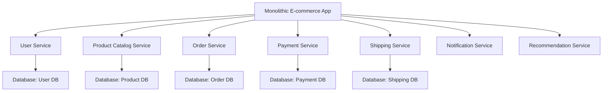

# Microservices Decomposition

## Overview

Microservices decomposition is the process of breaking down monolithic applications into smaller, independently deployable services. This architectural approach enables better scalability, maintainability, and team autonomy in software development.

## Detailed Explanation

### Decomposition Strategies

1. **Business Capability Decomposition**: Services aligned with business domains
2. **Subdomain Decomposition**: Based on Domain-Driven Design (DDD) subdomains
3. **Bounded Context**: Services defined by their business boundaries
4. **Strangler Pattern**: Gradually migrating from monolith to microservices

### Key Principles

- **Single Responsibility**: Each service has one primary function
- **Loose Coupling**: Minimal dependencies between services
- **High Cohesion**: Related functionality grouped together
- **Independent Deployment**: Services can be deployed separately
- **Domain Boundaries**: Clear separation of concerns

### Decomposition Patterns

- **Decompose by Business Capability**: User management, order processing, inventory
- **Decompose by Subdomain**: Core, supporting, and generic subdomains
- **Decompose by Workflow**: Services based on business processes
- **Decompose by Data**: Services owning specific data entities

## Real-world Examples & Use Cases

### E-commerce Platform Decomposition



### Banking System Decomposition
- Account management service
- Transaction processing service
- Loan management service
- Customer service
- Compliance and reporting service

### Social Media Platform
- User profile service
- Post management service
- Feed generation service
- Notification service
- Analytics service

## Code Examples

### Service Definition with Spring Boot
```java
@SpringBootApplication
@EnableEurekaClient
@EnableFeignClients
public class UserServiceApplication {
    public static void main(String[] args) {
        SpringApplication.run(UserServiceApplication.class, args);
    }
}

@RestController
@RequestMapping("/api/users")
public class UserController {
    
    @Autowired
    private UserService userService;
    
    @PostMapping
    public ResponseEntity<User> createUser(@RequestBody UserRequest request) {
        User user = userService.createUser(request);
        return ResponseEntity.created(
            ServletUriComponentsBuilder.fromCurrentRequest()
                .path("/{id}")
                .buildAndExpand(user.getId())
                .toUri()
        ).body(user);
    }
    
    @GetMapping("/{id}")
    public ResponseEntity<User> getUser(@PathVariable Long id) {
        return userService.getUser(id)
            .map(ResponseEntity::ok)
            .orElse(ResponseEntity.notFound().build());
    }
}
```

### Inter-Service Communication
```java
@FeignClient(name = "order-service")
public interface OrderServiceClient {
    
    @PostMapping("/api/orders")
    OrderResponse createOrder(@RequestBody OrderRequest request);
}

@Service
public class UserService {
    
    @Autowired
    private OrderServiceClient orderServiceClient;
    
    public UserWithOrders getUserWithOrders(Long userId) {
        User user = userRepository.findById(userId).orElseThrow();
        List<Order> orders = orderServiceClient.getOrdersByUserId(userId);
        return new UserWithOrders(user, orders);
    }
}
```

### Event-Driven Communication
```java
@Service
public class UserEventPublisher {
    
    @Autowired
    private KafkaTemplate<String, Object> kafkaTemplate;
    
    public void publishUserCreatedEvent(User user) {
        UserCreatedEvent event = new UserCreatedEvent(
            user.getId(),
            user.getEmail(),
            Instant.now()
        );
        kafkaTemplate.send("user-events", event);
    }
}

@Component
public class OrderEventListener {
    
    @KafkaListener(topics = "user-events", groupId = "order-service")
    public void handleUserCreated(UserCreatedEvent event) {
        // Create default shopping cart for new user
        shoppingCartService.createCartForUser(event.getUserId());
    }
}
```

## Common Pitfalls & Edge Cases

- Over-decomposition leading to complexity
- Under-decomposition maintaining monolithic issues
- Cross-service transactions and consistency
- Service discovery and communication failures
- Data duplication across services
- Testing distributed systems

## Tools & Libraries

- **Spring Cloud**: Microservices framework for Java
- **Docker**: Containerization for service isolation
- **Kubernetes**: Orchestration platform
- **Netflix Eureka**: Service discovery
- **Spring Cloud Config**: Centralized configuration

## References

- [Microservices - Martin Fowler](https://martinfowler.com/articles/microservices.html)
- [Domain-Driven Design - Eric Evans](https://domainlanguage.com/ddd/)
- [Building Microservices - Sam Newman](https://samnewman.io/books/building_microservices/)

## Github-README Links & Related Topics

- [Microservices Architecture](../microservices-architecture/README.md)
- [Microservices Design Patterns](../microservices-design-patterns/README.md)
- [Microservices Communication Patterns](../microservices-communication-patterns/README.md)
- [Service Discovery](../service-discovery/README.md)