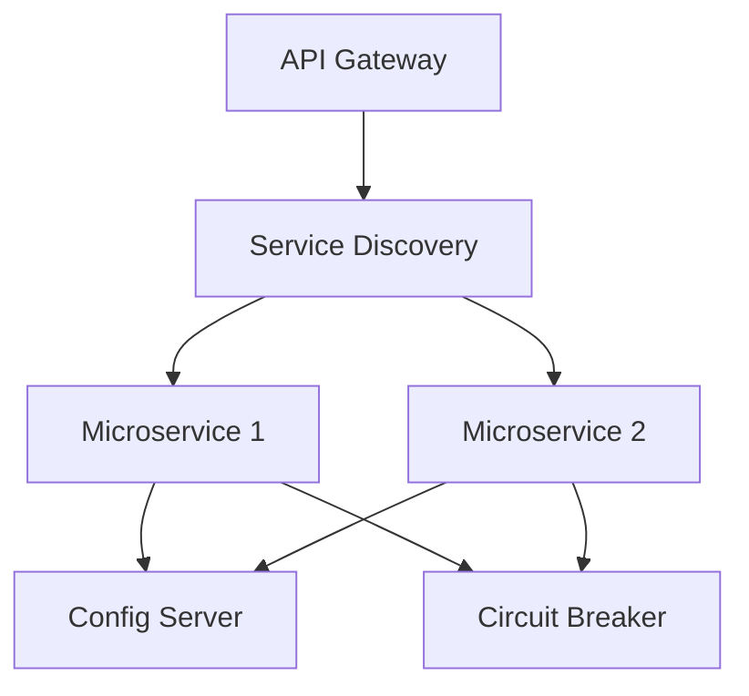

# Overview

Microservices with Spring Boot leverages the Spring ecosystem to build scalable, resilient microservices architectures. Spring Boot simplifies application setup, while Spring Cloud provides tools for service discovery, configuration management, and inter-service communication.

# Detailed Explanation

## Core Components

- **Spring Boot**: Framework for creating stand-alone, production-ready Spring applications.
- **Spring Cloud**: Suite of tools for building distributed systems.

### Key Patterns

- **Service Discovery**: Eureka server for registering and discovering services.
- **API Gateway**: Spring Cloud Gateway for routing and filtering requests.
- **Configuration Management**: Spring Cloud Config for centralized configuration.
- **Circuit Breaker**: Resilience4j or Hystrix for fault tolerance.



## Communication

- **Synchronous**: REST with Feign clients.
- **Asynchronous**: Messaging with RabbitMQ or Kafka.

# Real-world Examples & Use Cases

- **E-commerce Platform**: Separate services for user management, inventory, and payments.
- **Banking System**: Microservices for accounts, transactions, and fraud detection.
- **Media Streaming**: Services for content delivery, user profiles, and recommendations.

# Code Examples

## Spring Boot Microservice

```java
@SpringBootApplication
@EnableEurekaClient
public class UserServiceApplication {
    public static void main(String[] args) {
        SpringApplication.run(UserServiceApplication.class, args);
    }
}

@RestController
@RequestMapping("/users")
public class UserController {
    @GetMapping("/{id}")
    public User getUser(@PathVariable Long id) {
        return userService.findById(id);
    }
}
```

## Feign Client for Inter-Service Communication

```java
@FeignClient(name = "order-service")
public interface OrderClient {
    @GetMapping("/orders/user/{userId}")
    List<Order> getOrdersByUser(@PathVariable Long userId);
}
```

## Configuration with Spring Cloud Config

```yaml
# application.yml
spring:
  cloud:
    config:
      uri: http://config-server:8888
```

## Circuit Breaker with Resilience4j

```java
@Service
public class OrderService {
    @CircuitBreaker(name = "orderService", fallbackMethod = "fallback")
    public Order getOrder(Long id) {
        // Call external service
    }

    public Order fallback(Long id, Throwable t) {
        return new Order(); // Default response
    }
}
```

# Common Pitfalls & Edge Cases

- **Service Coupling**: Avoid tight coupling between services.
- **Data Consistency**: Handle distributed transactions carefully.
- **Monitoring**: Implement centralized logging and tracing.
- **Security**: Secure inter-service communication with OAuth2 or JWT.

# Tools & Libraries

- **Spring Boot**: Application framework.
- **Spring Cloud**: Microservices toolkit.
- **Eureka**: Service discovery.
- **Spring Cloud Gateway**: API gateway.

# References

- [Spring Boot Documentation](https://spring.io/projects/spring-boot)
- [Spring Cloud](https://spring.io/projects/spring-cloud)
- [Microservices with Spring](https://spring.io/guides/tutorials/microservices-with-spring-boot/)

# Github-README Links & Related Topics

- [Microservices Architecture](../microservices-architecture/)
- [Spring Framework](../spring-framework/)
- [API Gateway Design](../api-gateway-design/)
- [Event-Driven Systems](../event-driven-systems/)