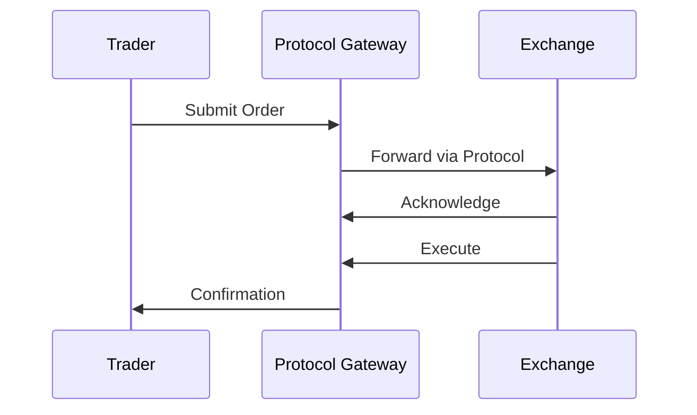

# Order Entry Protocols

## Overview

Order entry protocols enable the submission, modification, and cancellation of orders to trading venues. They define message formats for communicating order instructions between traders, brokers, and exchanges. Common protocols include FIX, OUCH, and proprietary systems. These protocols ensure reliable, low-latency order routing.

Order entry involves specifying instrument, quantity, price, type, and conditions. Protocols support various order types and handle acknowledgments and rejections.

## STAR Summary

**S: Situation** - Manual order entry was error-prone and slow; electronic systems needed standardized communication.

**T: Task** - Develop protocols for electronic order submission with reliability and speed.

**A: Action** - Exchanges and vendors created protocols like FIX and OUCH, with community standards.

**R: Result** - Electronic order entry supports millions of orders daily with high reliability.

## Detailed Explanation

Key protocols:
- FIX: Versatile, text-based, widely used.
- OUCH: Binary, Nasdaq-specific, low-latency.
- Proprietary: Venue-specific for optimization.

Features: Session management, sequence numbers, error handling.

Order flow: Submit -> Acknowledge -> Execute/Reject.

## Real-world Examples & Use Cases

1. **Broker Order Routing**: Sending client orders to exchanges.

2. **DMA**: Direct access for institutions.

3. **Algo Trading**: Automated order submission.

## Message Formats / Data Models

Example FIX NewOrderSingle (see FIX Protocol).

OUCH Enter Order: Binary structure with token, symbol, price, etc.

## Journey of a Trade



## Common Pitfalls & Edge Cases

1. **Connectivity Issues**: Handle disconnections gracefully.

2. **Order Validation**: Prevent invalid orders.

3. **Throttling**: Rate limits on submissions.

4. **Complex Orders**: Multi-leg, conditional orders.

## Tools & Libraries

- QuickFIX for FIX.
- Nasdaq SDK for OUCH.

Sample code (FIX in Python):

```python
from quickfix import Message, MsgType
order = Message()
order.getHeader().setField(MsgType(MsgType.ORDER_SINGLE))
# Set fields...
```

## Github-README Links & Related Topics

[[FIX Protocol]]
[[OUCH Protocol]]
[[Market Data]]
[[Order Types]]

## References

- [FIX Order Entry](https://www.fixtrading.org/standards/)
- [OUCH Order Entry](https://www.nasdaqtrader.com/Trader.aspx?id=OUCH)