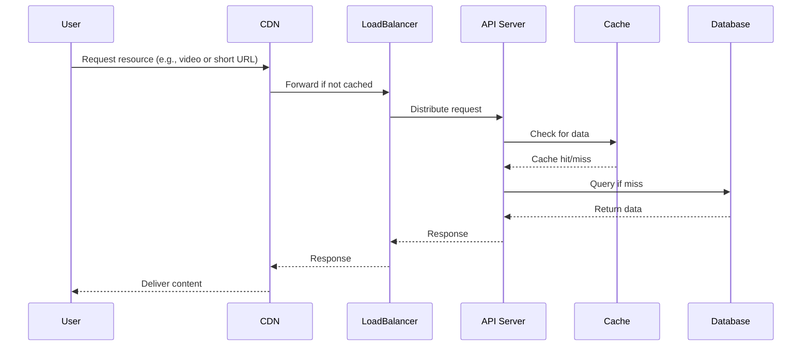

# Overview

This topic covers popular system design examples frequently encountered in technical interviews, with a focus on Low-Level Design (LLD) and High-Level Design (HLD). It includes detailed breakdowns of systems like URL Shorteners, Netflix Video Streaming, social networks, and e-commerce platforms, emphasizing scalability, reliability, and architectural patterns.

# STAR Summary

**SITUATION:** System design interviews require candidates to architect complex systems under constraints like high traffic, data consistency, and cost efficiency.

**TASK:** Design end-to-end systems that can handle real-world scale, including both high-level architecture and detailed component design.

**ACTION:** Analyze requirements, identify key components (e.g., load balancers, databases, caches), design data models, and incorporate scalability patterns like sharding and replication.

**RESULT:** Deliver designs that are robust, scalable, and aligned with industry best practices, demonstrating deep understanding of distributed systems.

# Detailed Explanation

Low-Level Design (LLD) involves detailed design of individual components, such as class diagrams, database schemas, API endpoints, algorithms, and data structures. It focuses on how specific parts of the system work internally.

High-Level Design (HLD) provides an overview of the system's architecture, including major components, their interactions, and high-level data flow. It addresses scalability, fault tolerance, and performance at a macro level.

Key examples:

- **URL Shortener (e.g., bit.ly):** HLD includes a load balancer distributing requests to API servers, which interact with a database for URL storage. LLD covers URL encoding algorithms (e.g., base62), collision handling, and analytics tracking.

- **Netflix Video Streaming:** HLD involves CDNs for content delivery, microservices for recommendations and user management, and distributed databases. LLD includes video encoding pipelines, adaptive bitrate streaming, and recommendation algorithms.

- **Social Networks (e.g., Twitter):** HLD focuses on feed generation, user timelines, and real-time updates. LLD details tweet storage, follower graphs, and push notification systems.

- **E-commerce (e.g., Amazon):** HLD includes product catalogs, order processing, and payment gateways. LLD covers inventory management, recommendation engines, and fraud detection.

Common patterns across designs: microservices vs. monoliths, eventual consistency, caching strategies, and load balancing.

# Real-world Examples & Use Cases

- **URL Shortener:** Used for link sharing on social media; handles billions of redirects daily (e.g., TinyURL processes ~10 billion URLs).

- **Video Streaming:** Netflix serves 200+ million subscribers with personalized content; uses adaptive streaming to optimize quality based on bandwidth.

- **Social Feeds:** Facebook's news feed algorithm processes trillions of interactions to curate personalized content.

- **E-commerce Platforms:** Amazon's system handles peak loads during events like Black Friday, with sub-second response times for product searches.

Case Study: Designing a URL Shortener

- Requirements: Generate short URLs, handle redirects, track clicks.

- Challenges: Uniqueness, scalability, analytics.

- Solution: Use hash functions for encoding, distributed databases for storage, Redis for caching frequent redirects.

# Message Formats / Data Models

For URL Shortener:

| Field | Type | Description |
|-------|------|-------------|
| id | BIGINT | Auto-increment primary key |
| original_url | VARCHAR(2048) | The full original URL |
| short_code | VARCHAR(10) | Base62 encoded short code |
| created_at | TIMESTAMP | Creation timestamp |
| expires_at | TIMESTAMP | Optional expiration date |
| click_count | INT | Number of redirects |

For Netflix Video Metadata:

| Field | Type | Description |
|-------|------|-------------|
| video_id | UUID | Unique video identifier |
| title | VARCHAR(255) | Video title |
| duration | INT | Duration in seconds |
| bitrate_options | JSON | Array of available bitrates |
| tags | JSON | Metadata tags for recommendations |

# Journey of a User Request



This diagram illustrates the flow for a typical user request in a scalable system, incorporating caching and load balancing.

# Common Pitfalls & Edge Cases

- **Scalability Oversights:** Failing to design for horizontal scaling; e.g., single database bottleneck in URL shortener.
- **Data Consistency Issues:** Not handling eventual consistency in distributed systems; race conditions in inventory updates.
- **Security Vulnerabilities:** Exposing sensitive data; e.g., not validating URLs in shorteners to prevent malicious redirects.
- **Edge Cases:** Handling expired URLs, duplicate short codes (use retries), high-frequency requests from bots.
- **Operational Challenges:** Not planning for database migrations or zero-downtime deployments.

# Tools & Libraries

- **Java:** Spring Boot for building microservices, Hibernate for ORM.
- **Python:** Flask/Django for APIs, Celery for async tasks.
- **Databases:** PostgreSQL for relational data, MongoDB for NoSQL, Redis for caching.
- **Infrastructure:** Kubernetes for orchestration, Docker for containerization.
- **Monitoring:** Prometheus for metrics, Grafana for dashboards.

Sample Code Snippet (Java - URL Shortener Service):

```java
@Service
public class UrlShortenerService {

    @Autowired
    private UrlRepository urlRepository;

    public String shortenUrl(String originalUrl) {
        String shortCode = generateShortCode();
        UrlEntity url = new UrlEntity(originalUrl, shortCode);
        urlRepository.save(url);
        return "https://short.ly/" + shortCode;
    }

    private String generateShortCode() {
        // Base62 encoding logic
        return Base62.encode(System.currentTimeMillis());
    }
}
```

# Github-README Links & Related Topics

[LLD HLD Basics](../lld/lld-hld-basics/)
[Microservices Architecture](../microservices-architecture/)
[Caching](../caching/)
[Load Balancing and Strategies](../load-balancing-and-strategies/)
[Database Sharding Strategies](../database-sharding-strategies/)

# References

- https://www.systemdesigninterview.com/
- https://github.com/donnemartin/system-design-primer
- https://netflixtechblog.com/
- https://engineering.fb.com/