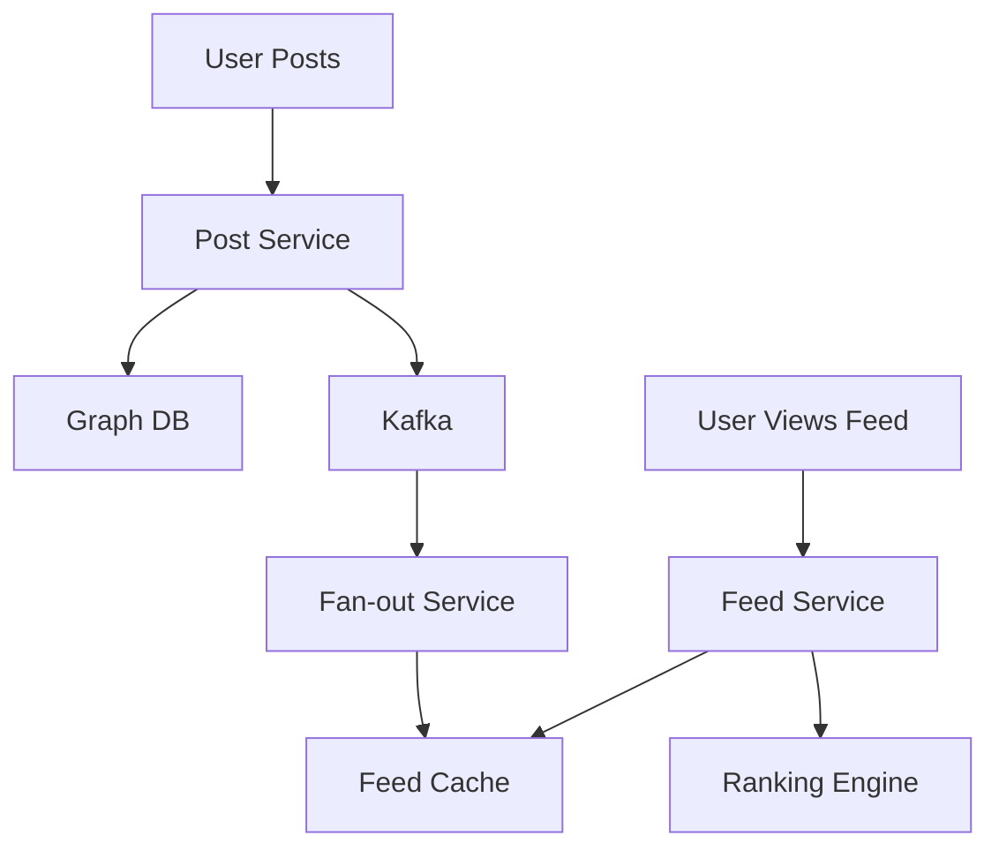

# Facebook News Feed System Design

## Overview

Facebook's News Feed is the core feature delivering personalized content to over 3 billion users. It aggregates posts from friends, pages, and groups, ranking them by relevance. The system handles billions of posts daily, real-time updates, and complex ranking algorithms.

## Detailed Explanation

### Requirements
- **Functional**: Post creation, feed generation, ranking, real-time updates.
- **Non-Functional**: Low latency, high throughput, personalization.

### Architecture
- **Write Path**: Post creation, fan-out to followers.
- **Read Path**: Feed aggregation from cache/DB.
- **Ranking**: ML-based scoring.



## Real-world Examples & Use Cases
- Personalized feeds for users.
- Viral content propagation.

## Code Examples

### Post Creation
```java
@PostMapping("/post")
public Post createPost(@RequestBody PostRequest req) {
    Post post = postService.save(req);
    kafka.send("posts", post);
    return post;
}
```

## References
- [Facebook Engineering Blog](https://engineering.fb.com/)

## Github-README Links & Related Topics
- [Event-Driven Architecture](../event-driven-architecture/README.md)
- [Distributed Tracing](../distributed-tracing/README.md)