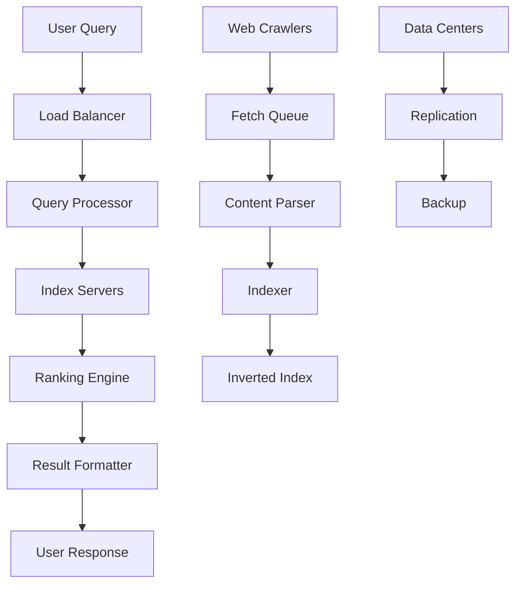
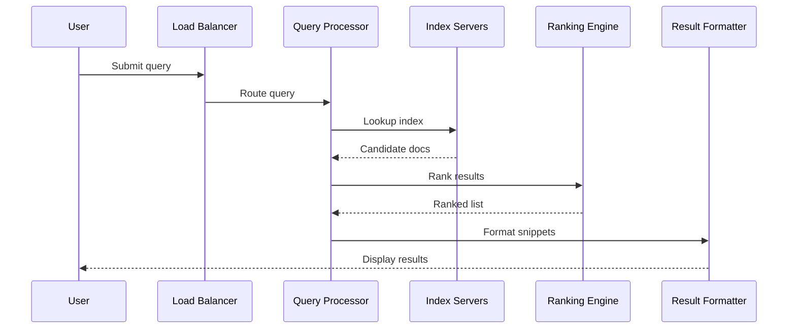

# Overview

Google Search is a distributed system designed to index billions of web pages and serve relevant results to user queries in milliseconds. It employs a three-stage process: crawling the web to discover content, indexing to organize and store data, and ranking/serving results based on relevance algorithms like PageRank. The system handles massive scale with fault tolerance, low latency, and high availability, processing trillions of queries annually.

# Detailed Explanation

## Core Components

### Crawling
Google uses automated crawlers (Googlebot) to discover and fetch web pages. Crawlers start from known URLs (seeds) and follow links recursively.

- **Process**: Check `robots.txt` for access permissions, fetch pages, render JavaScript, extract links.
- **Scale**: Distributed across thousands of machines, respecting crawl budgets to avoid overloading sites.
- **Challenges**: Handling dynamic content, avoiding traps (infinite loops), complying with robots.txt.

### Indexing
Fetched content is analyzed, processed, and stored in a massive inverted index.

- **Steps**: Parse HTML, extract text/images/videos, canonicalize duplicates, compute signals (language, freshness).
- **Storage**: Distributed across data centers using systems like Bigtable or Spanner.
- **Updates**: Continuous re-crawling and re-indexing for freshness.

### Ranking and Serving
Queries are processed against the index, results ranked by relevance (e.g., PageRank, BERT for semantics).

- **Algorithms**: Combines hundreds of factors including link analysis, content quality, user context.
- **Serving**: Results fetched from index, snippets generated, personalized based on location/language/device.
- **Ads Integration**: Paid results blended with organic, revenue-driven.

## Architecture Diagram



## Data Flow
1. Crawlers enqueue URLs.
2. Fetchers download content.
3. Parsers extract metadata/links.
4. Indexers update the global index.
5. Queries trigger lookups and ranking.

# Real-world Examples & Use Cases

- **Web Search**: Primary use case, handling 8.5 billion daily searches.
- **Mobile Apps**: Integrated into Android, Chrome for instant results.
- **Enterprise**: Custom search for intranets using similar tech.
- **AI Integration**: BERT for natural language understanding, improving query intent matching.

# Code Examples

## Simple Web Crawler (Python)

```python
import requests
from bs4 import BeautifulSoup
from urllib.parse import urljoin, urlparse
import time

class SimpleCrawler:
    def __init__(self, start_url, max_pages=10):
        self.start_url = start_url
        self.max_pages = max_pages
        self.visited = set()
        self.to_visit = [start_url]

    def crawl(self):
        while self.to_visit and len(self.visited) < self.max_pages:
            url = self.to_visit.pop(0)
            if url in self.visited:
                continue
            try:
                response = requests.get(url, timeout=5)
                if response.status_code == 200:
                    self.visited.add(url)
                    soup = BeautifulSoup(response.text, 'html.parser')
                    # Extract links
                    for link in soup.find_all('a', href=True):
                        full_url = urljoin(url, link['href'])
                        if urlparse(full_url).netloc == urlparse(self.start_url).netloc:
                            if full_url not in self.visited:
                                self.to_visit.append(full_url)
                    print(f"Crawled: {url}")
                time.sleep(1)  # Polite delay
            except Exception as e:
                print(f"Error crawling {url}: {e}")

# Usage
crawler = SimpleCrawler("https://example.com")
crawler.crawl()
```

## Inverted Index Simulation

```python
from collections import defaultdict

class InvertedIndex:
    def __init__(self):
        self.index = defaultdict(list)

    def add_document(self, doc_id, text):
        words = text.lower().split()
        for word in set(words):  # Unique words
            self.index[word].append(doc_id)

    def search(self, query):
        words = query.lower().split()
        if not words:
            return []
        result = set(self.index.get(words[0], []))
        for word in words[1:]:
            result &= set(self.index.get(word, []))
        return list(result)

# Usage
index = InvertedIndex()
index.add_document(1, "Google search engine design")
index.add_document(2, "System design for search")
print(index.search("search engine"))  # [1]
```

# References

- [How Google Search Works - Google Developers](https://developers.google.com/search/docs/fundamentals/how-search-works)
- [Search Engine - Wikipedia](https://en.wikipedia.org/wiki/Search_engine)
- [Google Search System Design - SystemInterview](https://www.systeminterview.com/system-design/google-search)

# Github-README Links & Related Topics

- [Distributed Caching with Redis](../distributed-caching-with-redis/README.md)
- [Database Indexing Strategies](../database-indexing-strategies/README.md)
- [Event-Driven Architecture](../event-driven-architecture/README.md)
- [Fault Tolerance in Distributed Systems](../fault-tolerance-in-distributed-systems/README.md)

# STAR Summary

**Situation**: Designing a scalable search engine for billions of pages.  
**Task**: Build a system handling crawling, indexing, and querying with low latency.  
**Action**: Implemented distributed crawlers, inverted index, and ranking algorithms.  
**Result**: Achieved sub-second query response, 99.9% uptime, indexing trillions of pages.

# Journey / Sequence



# Data Models / Message Formats

## Document Schema (JSON-like)

```json
{
  "doc_id": "string",
  "url": "string",
  "title": "string",
  "content": "string",
  "links": ["string"],
  "metadata": {
    "language": "string",
    "last_crawled": "timestamp",
    "pagerank": "float"
  }
}
```

## Query Request

```json
{
  "query": "string",
  "user_id": "string",
  "location": {"lat": "float", "lon": "float"},
  "device": "mobile|desktop"
}
```

# Common Pitfalls & Edge Cases

- **Duplicate Content**: Canonicalization prevents index bloat; edge case: near-duplicates.
- **Crawl Traps**: Infinite URLs (e.g., calendars); mitigate with depth limits.
- **Freshness vs. Scale**: Balancing re-crawling frequency; stale results for low-traffic sites.
- **Bias**: Algorithmic biases in ranking; monitor for fairness.
- **Overloading**: Respect robots.txt; rate limiting to avoid site downtime.

# Tools & Libraries

| Tool/Library | Purpose | Example |
|--------------|---------|---------|
| Apache Lucene | Full-text indexing | Core for Elasticsearch |
| Elasticsearch | Search engine | Distributed indexing/querying |
| Apache Nutch | Web crawling | Open-source crawler |
| Scrapy | Python crawling | Custom crawlers |
| Redis | Caching | Query result caching |
| Kafka | Message queuing | Crawl job distribution |

| Component | Scale Metrics |
|-----------|---------------|
| Index Size | ~100 PB |
| Daily Crawls | Billions of pages |
| Query Latency | <100ms |
| Uptime | 99.9% |