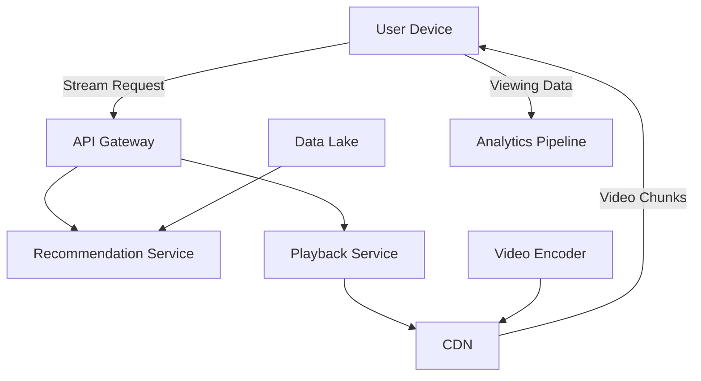

# Netflix Video Streaming Architecture

## Overview

Netflix's video streaming platform delivers high-quality video to over 200 million subscribers worldwide. It uses adaptive bitrate streaming, global CDN, and microservices for personalization. Key challenges include handling petabytes of data, low latency, and device compatibility.

Key features:
- Adaptive bitrate (ABR) for quality adjustment.
- Global content delivery via CDN.
- Recommendation engine using machine learning.
- Offline viewing and cross-device sync.

## Detailed Explanation

### Architecture Overview

Netflix employs a microservices architecture with event-driven components:

- **Client Apps**: Support multiple devices (TV, mobile, web).
- **API Gateway (Zuul)**: Routes requests and handles authentication.
- **Content Delivery**: Akamai/Open Connect CDN for video distribution.
- **Video Processing**: Encodes content into multiple formats/bitrate.
- **Recommendation Service**: Uses collaborative filtering.
- **Data Pipeline**: Processes viewing data for analytics.



### Streaming Process

1. User selects content.
2. API determines optimal bitrate based on network.
3. Fetches manifest (HLS/DASH).
4. Downloads video segments from nearest CDN edge.
5. Adaptive adjustment based on bandwidth.

### Scalability

- **CDN**: Netflix Open Connect appliances in ISPs.
- **Microservices**: Independent scaling with Kubernetes.
- **Data**: Cassandra for metadata, S3 for video storage.

## Real-world Examples & Use Cases

- **Netflix**: Streams 1 billion hours daily.
- **Hulu**: Similar ABR streaming.
- **YouTube**: Global video delivery.
- **Use Cases**:
  - Live events streaming.
  - Educational platforms.
  - Corporate video distribution.

## Code Examples

### Adaptive Bitrate Selection (Pseudocode)

```python
def select_bitrate(network_speed, available_rates):
    # available_rates = [240p, 480p, 720p, 1080p]
    for rate in reversed(available_rates):
        if network_speed > rate * 1.5:  # Buffer margin
            return rate
    return min(available_rates)

# Example
speed = 5000  # kbps
rates = [500, 1000, 2500, 5000]
selected = select_bitrate(speed, rates)  # 2500
```

### Simple Video Manifest (HLS)

```
#EXTM3U
#EXT-X-VERSION:3
#EXT-X-TARGETDURATION:10
#EXTINF:10.0,
segment1.ts
#EXTINF:10.0,
segment2.ts
```

### Microservice for Recommendations (Java/Spring)

```java
@RestController
public class RecommendationController {
    @Autowired
    private RecommendationService service;

    @GetMapping("/recommend/{userId}")
    public List<Movie> getRecommendations(@PathVariable String userId) {
        return service.recommend(userId);
    }
}
```

## Common Pitfalls & Edge Cases

- **Buffering**: Insufficient bandwidth detection.
- **Device Fragmentation**: Support legacy devices.
- **Content Piracy**: DRM and watermarking.
- **Global Latency**: CDN optimization.
- **Edge Cases**: Network drops, multi-user households, regional restrictions.

| Pitfall | Mitigation |
|---------|------------|
| High churn | Personalized recommendations |
| Bandwidth waste | Efficient encoding |
| Server overload | Auto-scaling |

## Tools & Libraries

- **CDN**: Akamai, Cloudflare.
- **Streaming**: HLS, DASH protocols.
- **Microservices**: Spring Boot, Kubernetes.
- **Data**: Cassandra, Spark for analytics.
- **ML**: TensorFlow for recommendations.

## References

- [Netflix Tech Blog](https://netflixtechblog.com/)
- [How Netflix Encodes](https://netflixtechblog.com/encoding/)
- [Adaptive Streaming](https://en.wikipedia.org/wiki/Adaptive_bitrate_streaming)

## Github-README Links & Related Topics

- [Microservices Architecture](../microservices-architecture/README.md)
- [Content Delivery Networks](../content-delivery-networks/README.md)  # Assuming exists or similar
- [Data Partitioning Strategies](../data-partitioning-strategies/README.md)
- [Event Driven Architecture](../event-driven-architecture/README.md)
- [Machine Learning Infrastructure](../machine-learning-infrastructure/README.md)