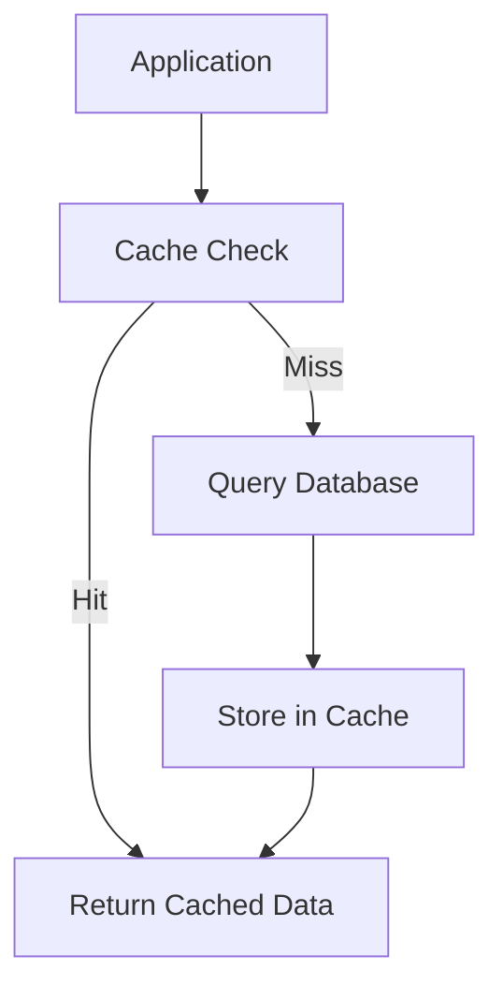

# Overview

Redis is an open source (BSD licensed), in-memory data structure store, used as a database, cache, and message broker. Redis provides data structures such as strings, hashes, lists, sets, sorted sets with range queries, bitmaps, hyperloglogs, geospatial indexes, and streams.

# Detailed Explanation

Redis is often used as a cache due to its high performance and support for various data structures. It supports persistence, replication, and clustering. For caching, common operations include setting key-value pairs with expiration times.

Key features for caching:

- **In-memory storage**: Fast access
- **Expiration**: Automatic key expiration
- **Data structures**: Beyond simple strings
- **Persistence**: Optional disk persistence

## Caching Architecture



# Real-world Examples & Use Cases

- **Session Storage**: Store user sessions in web applications
- **API Response Caching**: Cache expensive API calls
- **Rate Limiting**: Track request counts
- **Leaderboard**: Use sorted sets for rankings
- **Real-time Analytics**: Counters and hyperloglogs

# Code Examples

## Basic Caching Commands

```bash
# Set a key with expiration
SET user:123:name "John Doe" EX 3600

# Get a value
GET user:123:name

# Check if key exists
EXISTS user:123:name
```

## Python Client Example

```python
import redis

r = redis.Redis(host='localhost', port=6379, db=0)

# Set cache
r.set('key', 'value', ex=3600)

# Get cache
value = r.get('key')
print(value)

# Hash for complex data
r.hset('user:123', 'name', 'John')
r.hset('user:123', 'age', '30')
user = r.hgetall('user:123')
print(user)
```

# References

- [Redis Documentation](https://redis.io/docs/manual/data-types/)
- [Redis Commands](https://redis.io/commands/)
- [Python Client](https://redis-py.readthedocs.io/)

# Github-README Links & Related Topics

- [Redis GitHub](https://github.com/redis/redis)
- [Memcached](memcached/)
- [Database Caching](database-caching/)