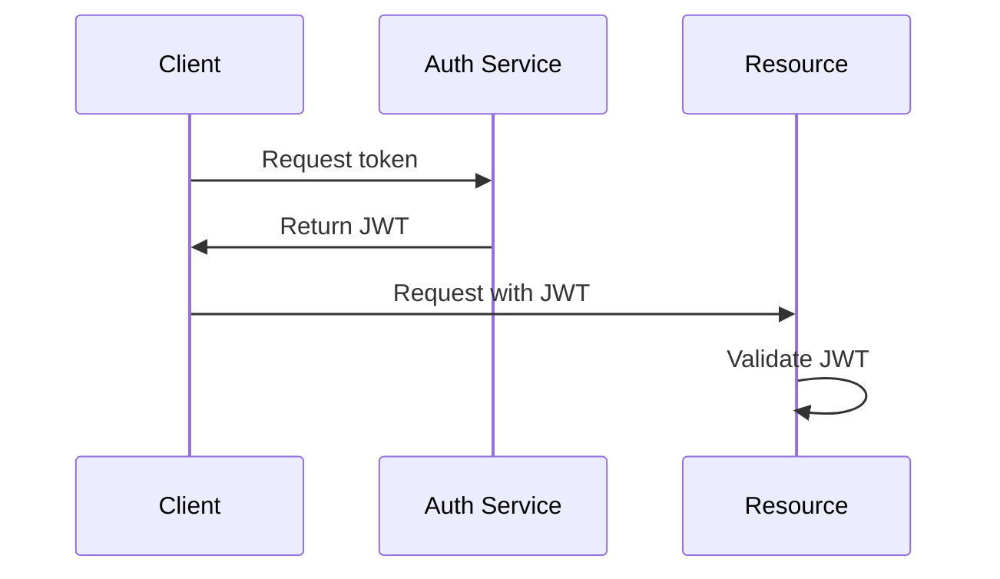

# Overview

Security in distributed systems involves protecting data and communications across services, including encryption, authentication, and authorization.

# STAR Summary

**Situation:** Exposed APIs led to unauthorized access.

**Task:** Secure inter-service communication.

**Action:** Implemented TLS, JWT, and RBAC.

**Result:** Zero breaches in 6 months, compliance achieved.

# Detailed Explanation

Key aspects:

- **Encryption:** TLS for transit, AES for rest.

- **Authentication:** Verify identity with tokens.

- **Authorization:** Access control with roles.

- **Secrets Management:** Secure key storage.

# Real-world Examples & Use Cases

- Banking: Secure transactions.

- Healthcare: Protect patient data.

- Cloud services: Multi-tenant isolation.

# Code Examples

Java JWT generation:

```java
import io.jsonwebtoken.Jwts;

String jwt = Jwts.builder()
    .setSubject("user")
    .signWith(SignatureAlgorithm.HS256, "secret")
    .compact();
```

Validation:

```java
Claims claims = Jwts.parser()
    .setSigningKey("secret")
    .parseClaimsJws(jwt)
    .getBody();
```

# Data Models / Message Formats

JWT:

```json
{
  "header": {"alg": "HS256", "typ": "JWT"},
  "payload": {"sub": "user", "exp": 1632520000},
  "signature": "signature"
}
```

# Journey / Sequence



# Common Pitfalls & Edge Cases

- Weak keys; rotate regularly.

- Man-in-the-middle; use certificates.

- Insider threats.

# Tools & Libraries

- HashiCorp Vault: Secrets management.

- Keycloak: Identity management.

- Spring Security: Java framework.

# Github-README Links & Related Topics

Related: [security-authz-authn-tokens](../security-authz-authn-tokens/), [api-gateway-patterns](../api-gateway-patterns/), [microservices-architecture](../microservices-architecture/)

# References

- https://tools.ietf.org/html/rfc7519

- https://www.keycloak.org/