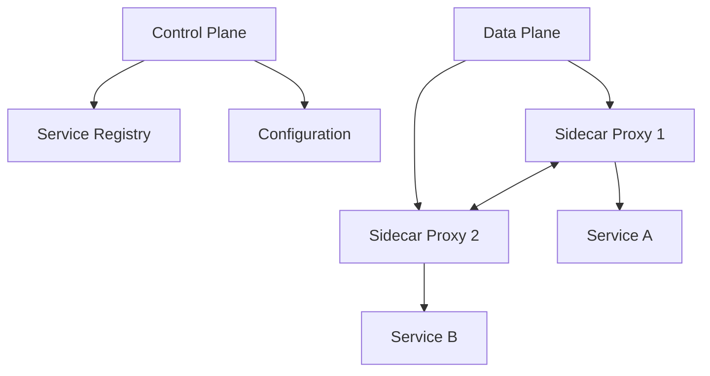
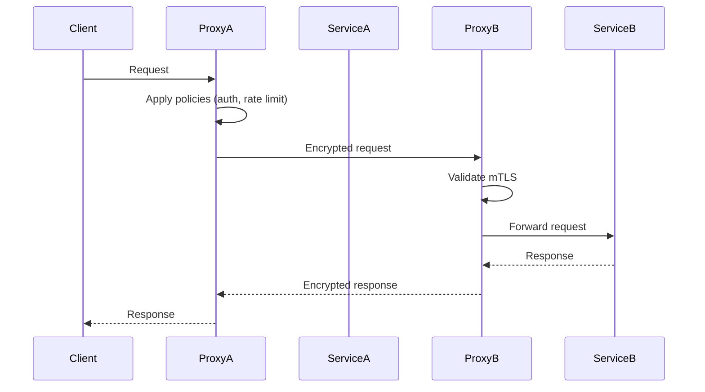

# Service Mesh Patterns

## Overview

Service mesh patterns refer to architectural and operational patterns implemented within a service mesh, a dedicated infrastructure layer that manages service-to-service communication in microservices architectures. A service mesh provides capabilities like traffic management, security, observability, and resilience without requiring changes to application code. Common implementations include Istio, Linkerd, and Consul, which use sidecar proxies to intercept and control inter-service traffic.

## Detailed Explanation

A service mesh consists of two primary components: the **data plane** and the **control plane**.

- **Data Plane**: Comprises sidecar proxies (e.g., Envoy) deployed alongside each service instance. These proxies handle all inbound and outbound traffic, implementing policies like load balancing, encryption, and circuit breaking.
- **Control Plane**: Manages the data plane, providing centralized configuration, service discovery, and telemetry collection.

Service mesh patterns leverage these components to address common distributed system challenges. Below are key patterns:

### 1. Sidecar Proxy Pattern
Each service instance runs a sidecar proxy that handles network communication. The proxy intercepts all traffic, allowing centralized control over routing, security, and monitoring.

**Benefits**: Decouples application logic from networking concerns, enables zero-trust security via mutual TLS (mTLS).

### 2. Traffic Management Patterns
- **Load Balancing**: Distributes requests across service instances using algorithms like round-robin or least connections.
- **Traffic Splitting**: Routes a percentage of traffic to different versions (e.g., for canary deployments).
- **Request Routing**: Directs traffic based on headers, paths, or weights for A/B testing or gradual rollouts.

### 3. Resilience Patterns
- **Circuit Breaker**: Prevents cascading failures by temporarily stopping requests to unhealthy services.
- **Retry and Timeout**: Automatically retries failed requests with configurable timeouts to handle transient failures.
- **Rate Limiting**: Controls request rates to prevent overload.

### 4. Security Patterns
- **Mutual TLS (mTLS)**: Encrypts and authenticates all service-to-service communication.
- **Authorization Policies**: Enforces fine-grained access control based on identities and contexts.

### 5. Observability Patterns
- **Distributed Tracing**: Tracks requests across services for end-to-end visibility.
- **Metrics Collection**: Gathers latency, error rates, and throughput data.
- **Logging**: Centralized logging for debugging and auditing.

### Architecture Diagram



This diagram illustrates the separation of control and data planes, with proxies mediating inter-service communication.

## Real-world Examples & Use Cases

- **Google and Lyft (Istio Origins)**: Istio was co-developed by Google and Lyft to manage microservices at scale. Google uses it for internal services, while Lyft adopted it for ride-sharing platform reliability.
- **E-commerce Platforms**: Companies like eBay use service meshes for traffic management during peak loads, enabling canary deployments to test new features without risking outages.
- **Financial Services**: Banks implement mTLS and circuit breakers to ensure secure, resilient transactions across distributed ledger systems.
- **Streaming Services**: Netflix leverages service mesh patterns for global content delivery, using traffic splitting to roll out updates incrementally.

| Use Case | Pattern Applied | Benefit |
|----------|-----------------|---------|
| Zero-downtime deployments | Traffic Splitting | Gradual rollout minimizes risk |
| Handling service failures | Circuit Breaker | Prevents system-wide crashes |
| Secure inter-service comms | mTLS | Protects data in transit |
| Performance monitoring | Distributed Tracing | Identifies bottlenecks quickly |

## Code Examples

### Istio VirtualService for Traffic Splitting (Canary Deployment)

```yaml
apiVersion: networking.istio.io/v1beta1
kind: VirtualService
metadata:
  name: my-service
spec:
  http:
  - route:
    - destination:
        host: my-service
        subset: v1
      weight: 90
    - destination:
        host: my-service
        subset: v2
      weight: 10
---
apiVersion: networking.istio.io/v1beta1
kind: DestinationRule
metadata:
  name: my-service
spec:
  host: my-service
  subsets:
  - name: v1
    labels:
      version: v1
  - name: v2
    labels:
      version: v2
```

This YAML routes 90% of traffic to version 1 and 10% to version 2, enabling safe testing of new releases.

### Enabling mTLS in Istio

```yaml
apiVersion: security.istio.io/v1beta1
kind: PeerAuthentication
metadata:
  name: default
  namespace: istio-system
spec:
  mtls:
    mode: STRICT
```

This enforces strict mTLS across the mesh.

### Linkerd CLI for Injecting Sidecar

```bash
linkerd inject deployment.yaml | kubectl apply -f -
```

Injects the Linkerd proxy into a Kubernetes deployment.

## Journey / Sequence

The following sequence diagram shows a typical service-to-service call in a service mesh:



## Common Pitfalls & Edge Cases

- **Performance Overhead**: Sidecar proxies add latency; optimize by tuning proxy configurations or using ambient mode in Istio 1.22+.
- **Configuration Complexity**: Misconfigured policies can block traffic; use GitOps for version control.
- **Integration Challenges**: Ensure compatibility with existing CI/CD pipelines and monitoring tools.
- **Edge Case: Multi-cluster Meshes**: Handling cross-cluster communication requires federation setups, increasing complexity.
- **Resource Consumption**: Proxies consume CPU/memory; monitor and scale accordingly.

## Tools & Libraries

- **Istio**: Feature-rich, Kubernetes-native service mesh with Envoy proxies.
- **Linkerd**: Lightweight, Rust-based, focuses on simplicity and performance.
- **Consul**: HashiCorp's mesh with service discovery and configuration management.
- **AWS App Mesh**: Managed service for AWS environments, integrates with ECS/EKS.
- **Envoy Proxy**: Standalone proxy used in many meshes for advanced routing.

## References

- [Istio: What is Istio?](https://istio.io/latest/docs/concepts/what-is-istio/)
- [AWS: What is a Service Mesh?](https://aws.amazon.com/what-is/service-mesh/)
- [Buoyant: Service Mesh Patterns](https://buoyant.io/service-mesh-patterns/)
- [NGINX: What is a Service Mesh?](https://www.nginx.com/blog/what-is-a-service-mesh/)
- [Linkerd: What is Linkerd?](https://linkerd.io/what-is-linkerd/)

## Github-README Links & Related Topics

- [Microservices Architecture](../microservices-architecture/)
- [Load Balancing and Strategies](../load-balancing-and-strategies/)
- [Security Best Practices in Java](../security-best-practices-in-java/) (for application-level security)
- [Distributed Systems](../cap-theorem-and-distributed-systems/)
- [Observability](../monitoring-and-logging/)