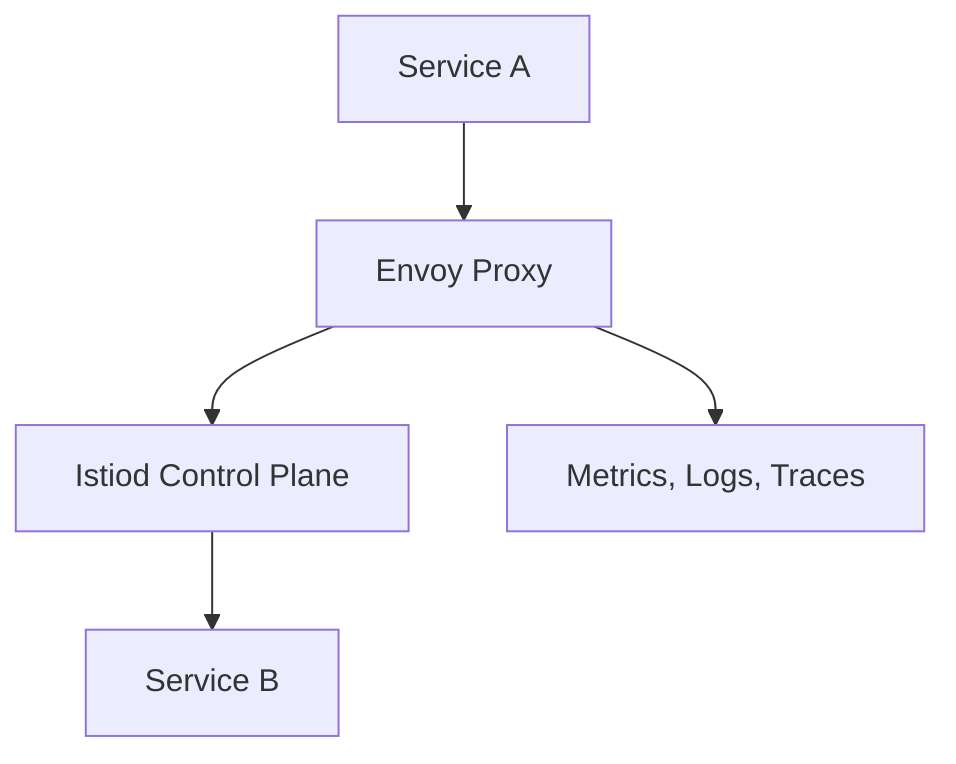
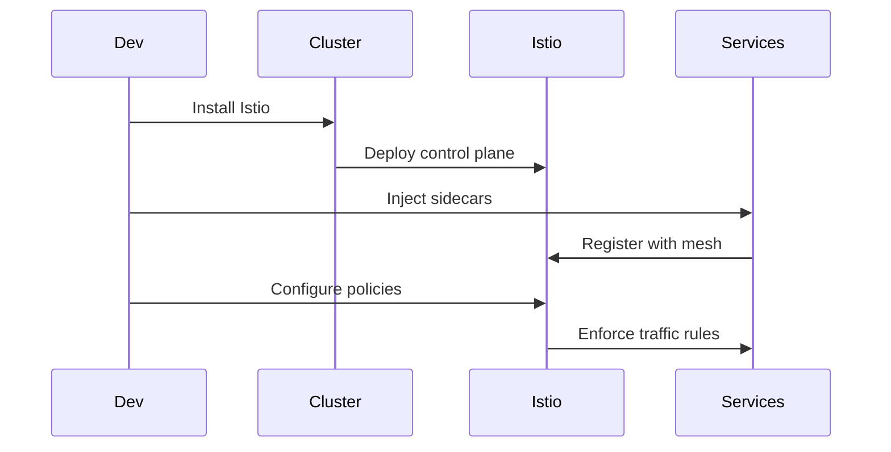

## Overview

Istio is an open-source service mesh that provides a uniform way to connect, secure, and observe microservices. It manages traffic, enforces policies, and collects telemetry without code changes.



## Detailed Explanation

A service mesh like Istio uses sidecar proxies (Envoy) to handle inter-service communication. It offers features like load balancing, circuit breaking, mTLS, and observability through metrics and tracing.

## Key Components
- **Data Plane**: Envoy proxies handling traffic.
- **Control Plane**: Istiod managing configuration.
- **Gateways**: Ingress/egress traffic control.

## Real-world Examples & Use Cases

- **E-commerce Platforms**: Manage traffic spikes and secure payments.
- **Financial Services**: Enforce compliance with mTLS.
- **Cloud-Native Apps**: Kubernetes deployments for observability.
- **Multi-Cloud**: Consistent policies across providers.

## Code Examples

## Istio YAML for Traffic Routing
```yaml
apiVersion: networking.istio.io/v1alpha3
kind: VirtualService
metadata:
  name: reviews-route
spec:
  http:
  - route:
    - destination:
        host: reviews
        subset: v1
      weight: 75
    - destination:
        host: reviews
        subset: v2
      weight: 25
```

## Java Microservice with Istio Annotations
```java
@RestController
public class ServiceController {
    @GetMapping("/api/data")
    public String getData() {
        // Istio handles retries, timeouts via config
        return callExternalService();
    }
}
```

## References

- [What is Istio?](https://istio.io/latest/docs/concepts/what-is-istio/)
- [Istio Documentation](https://istio.io/latest/docs/)
- [Service Mesh Patterns](https://www.oreilly.com/library/view/service-mesh-patterns/9781492086440/)
- [CNCF Istio Project](https://www.cncf.io/projects/istio/)

## Github-README Links & Related Topics

- [Microservices Architecture](../microservices-architecture/README.md)
- [Kubernetes Basics](../kubernetes-basics/README.md)
- [API Gateway Design](../api-gateway-design/README.md)
- [Kubernetes Networking](../kubernetes-networking/README.md)

## STAR Summary

- **Situation**: Complex microservices communication.
- **Task**: Simplify traffic management and security.
- **Action**: Deploy Istio service mesh.
- **Result**: Improved observability and reliability.

# Journey / Sequence



## Data Models / Message Formats

- **Telemetry Data**: {service, latency, error_rate}

# Common Pitfalls & Edge Cases

- **Resource Overhead**: Sidecar proxies consume CPU and memory.
- **Configuration Complexity**: Managing YAML configs for large meshes.
- **Legacy Compatibility**: Apps not designed for service mesh.
- **Network Latency**: Additional hop through proxies.
- **Debugging**: Tracing issues across mesh boundaries.

# Tools & Libraries

- **Istio**: Core service mesh.
- **Kiali**: Observability dashboard.
- **Envoy**: Proxy component.