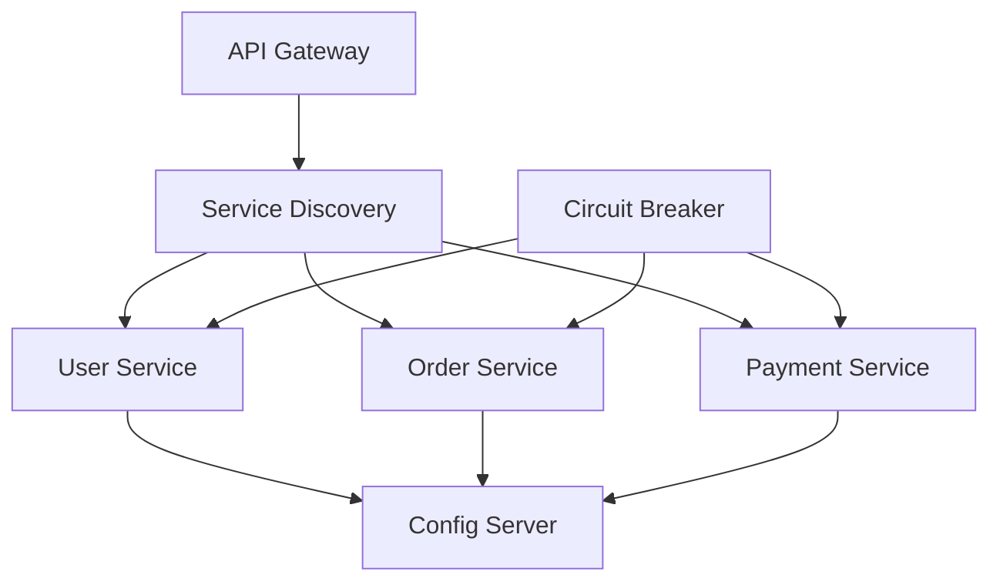
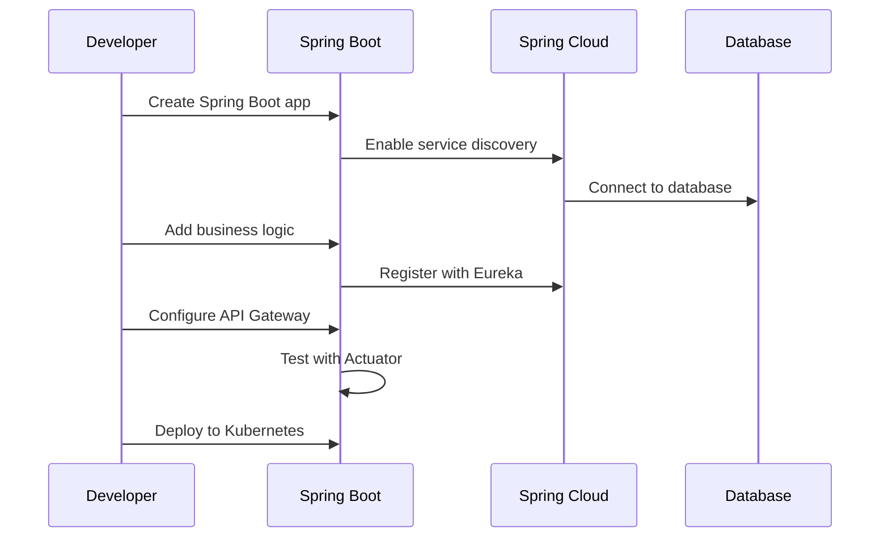

# Spring Boot Microservices

## Overview

Spring Boot simplifies the development of microservices by providing auto-configuration, embedded servers, and production-ready features. It integrates seamlessly with Spring Cloud for building distributed systems.

## Detailed Explanation

Spring Boot provides opinionated defaults and auto-configuration to simplify microservices development. Key components include:

| Component | Purpose | Example |
|-----------|---------|---------|
| Spring Boot Starters | Dependency management | spring-boot-starter-web |
| Auto-Configuration | Automatic bean setup | DataSource for JPA |
| Embedded Servers | No external server needed | Tomcat, Jetty, Undertow |
| Actuator | Production monitoring | /actuator/health endpoint |
| Spring Cloud | Distributed systems | Eureka, Config Server |

### Microservices Architecture with Spring Boot



Spring Boot integrates with Spring Cloud to provide:
- **Service Discovery**: Register and locate services dynamically.
- **Configuration Management**: Centralized config with Spring Cloud Config.
- **Circuit Breakers**: Fault tolerance with Resilience4j or Hystrix.
- **API Gateway**: Routing and filtering with Spring Cloud Gateway.

## Real-world Examples & Use Cases

- **E-commerce Platforms**: Separate services for inventory, orders, payments, and recommendations.
- **Social Media Apps**: User management, post feeds, notifications, and analytics services.
- **Financial Systems**: Account services, transaction processing, and compliance microservices.
- **IoT Platforms**: Device management, data ingestion, and analytics services.
- **Streaming Services**: Content delivery, user preferences, and billing microservices.

## Code Examples

### Simple Microservice

```java
@SpringBootApplication
@RestController
public class GreetingService {
    @GetMapping("/greeting")
    public String greeting() {
        return "Hello from Microservice!";
    }
}
```

### Service Discovery with Eureka

```java
@EnableEurekaClient
@SpringBootApplication
public class ServiceApplication {
    public static void main(String[] args) {
        SpringApplication.run(ServiceApplication.class, args);
    }
}
```

### Circuit Breaker with Resilience4j

```java
@RestController
public class OrderController {
    @CircuitBreaker(name = "orderService")
    @GetMapping("/orders")
    public List<Order> getOrders() {
        return orderService.getAllOrders();
    }
}
```

### Centralized Configuration

```yaml
# application.yml
spring:
  application:
    name: user-service
  cloud:
    config:
      uri: http://config-server:8888
```

### API Gateway Routing

```java
@Configuration
public class GatewayConfig {
    @Bean
    public RouteLocator customRouteLocator(RouteLocatorBuilder builder) {
        return builder.routes()
            .route("user-service", r -> r.path("/users/**")
                .uri("lb://user-service"))
            .build();
    }
}
```

## Journey / Sequence

Building a microservice with Spring Boot:



## Common Pitfalls & Edge Cases

- Over-configuring can lead to conflicts with auto-configuration.
- Ignoring health checks can cause cascading failures.
- Not handling service-to-service communication timeouts.
- Database connection pooling issues in containerized environments.
- Version mismatches between Spring Boot and Spring Cloud.

## Tools & Libraries

- **Spring Initializr**: https://start.spring.io for project setup
- **Spring Boot CLI**: Command-line tools for development
- **Spring Cloud**: Netflix OSS, Config, Gateway
- **Testing**: Spring Boot Test, Testcontainers
- **Monitoring**: Spring Boot Actuator, Micrometer
- **Deployment**: Docker, Kubernetes, Cloud Foundry

## References

- [Spring Boot Documentation](https://spring.io/projects/spring-boot)
- [Spring Cloud](https://spring.io/projects/spring-cloud)
- [Spring Boot Reference Guide](https://docs.spring.io/spring-boot/docs/current/reference/html/)
- [Building Microservices with Spring Boot](https://spring.io/guides/tutorials/spring-boot-oauth2/)

## Github-README Links & Related Topics

- [Microservices Architecture](./microservices-architecture/README.md)
- [Java](./java/README.md)
