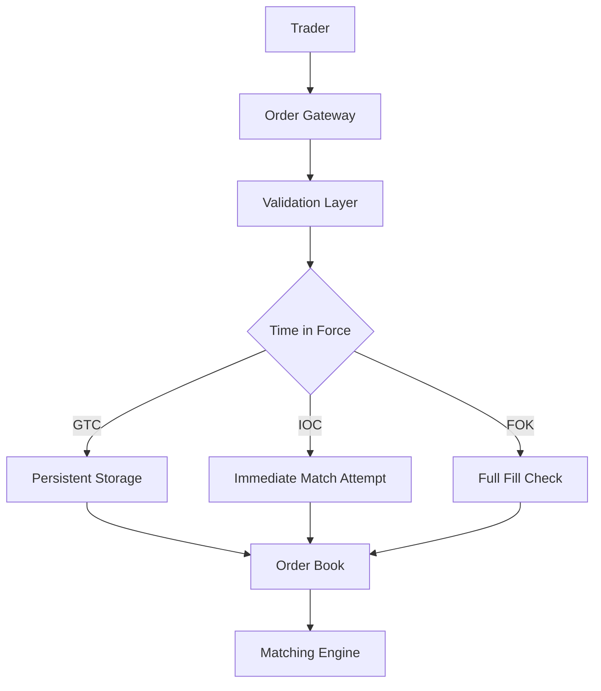
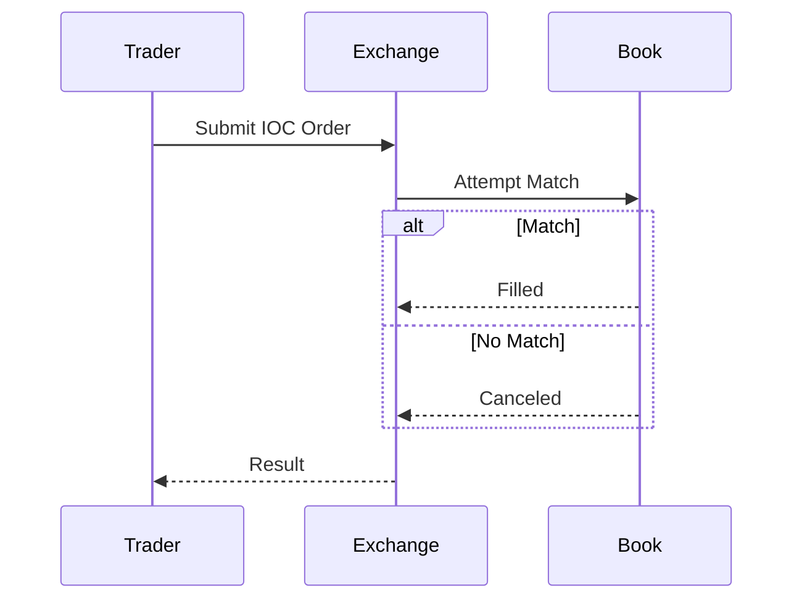

## Overview

Time-in-force semantics across exchanges: GTC, IOC, FOK, etc.

## STAR Summary

**Situation:** Implemented order types for trading platform.  
**Task:** Support various TIF for compliance.  
**Action:** Added TIF logic in order engine.  
**Result:** Passed regulatory audits.

## Detailed Explanation

### High-Level Design



### Capacity and Throughput Targets

- Handle 10k orders/second with TIF logic.
- Latency: <10ms for IOC/FOK validation.

### Tradeoffs

- GTC: Persistent but storage intensive.
- IOC/FOK: Immediate but may reject orders.
- Flexibility vs Simplicity: More TIF options increase complexity.

### API Design Examples

Order submission: `POST /orders` with `tif: "IOC"`

### Deployment Notes

Integrate TIF in order engine, use databases for GTC persistence.

## Real-world Examples & Use Cases

- **Stock Trading Platforms (e.g., Robinhood, E*TRADE):** Use IOC for day traders seeking immediate execution without slippage.
- **Cryptocurrency Exchanges (e.g., Kraken, Gemini):** Implement FOK for large orders to ensure full fill or cancellation.
- **Futures and Options Markets:** GTC orders for long-term positions, with expiration dates.
- **Algorithmic Trading:** IOC for high-frequency strategies to avoid holding positions overnight.

## Code Examples

```java
enum TimeInForce {
    GTC, IOC, FOK
}

class Order {
    TimeInForce tif;
    // logic based on tif
}
```

**Order Processing Logic:**

```java
public class OrderProcessor {
    public void processOrder(Order order) {
        switch (order.tif) {
            case GTC:
                // Persist to database
                break;
            case IOC:
                if (!tryMatch(order)) {
                    cancelOrder(order);
                }
                break;
            case FOK:
                if (!canFillFully(order)) {
                    cancelOrder(order);
                } else {
                    matchOrder(order);
                }
                break;
        }
    }
}
```

## Data Models / Message Formats

Order with TIF field.

## Journey / Sequence



## Common Pitfalls & Edge Cases

- Partial fills for IOC  
- Expiration handling

## Tools & Libraries

Exchange APIs.

## Github-README Links & Related Topics

- [Order Book Modeling](../../algorithms/order-book-modeling/README.md)
- [Matching Algorithms](../../algorithms/matching-algorithms/README.md)

## References

- https://www.investopedia.com/terms/t/timeinforce.asp