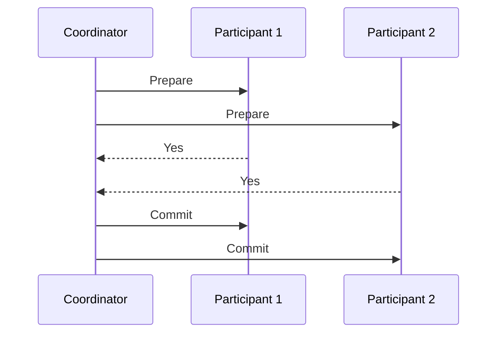

# Two-Phase Commit

## Overview

The Two-Phase Commit (2PC) protocol is a distributed algorithm used to ensure atomicity in distributed transactions. It coordinates multiple participants to either all commit or all abort a transaction, preventing partial commits that could lead to data inconsistency.

## Detailed Explanation

The 2PC protocol involves two phases: the prepare phase and the commit phase. It requires a coordinator and multiple participants.

### Phases

1. **Prepare Phase**: The coordinator sends a prepare message to all participants. Each participant prepares to commit by writing necessary logs and responds with "yes" or "no".

2. **Commit Phase**: If all respond "yes", the coordinator sends a commit message. If any "no" or timeout, sends abort.

### Sequence Diagram



## Real-world Examples & Use Cases

- Database systems like MySQL with XA transactions.
- Distributed databases such as CockroachDB.
- Enterprise applications requiring strong consistency across multiple services.

## Code Examples

### Pseudo Code

```java
class Coordinator {
    List<Participant> participants;

    void commit() {
        // Prepare phase
        for (Participant p : participants) {
            if (!p.prepare()) {
                abort();
                return;
            }
        }
        // Commit phase
        for (Participant p : participants) {
            p.commit();
        }
    }
}
```

## References

- [Wikipedia: Two-phase commit protocol](https://en.wikipedia.org/wiki/Two-phase_commit_protocol)
- [Distributed Systems: Concepts and Design](https://www.amazon.com/Distributed-Systems-Concepts-Design-5th/dp/0132143011)

## Github-README Links & Related Topics

- [Saga Pattern](../saga-pattern/README.md)
- [Distributed Transactions](../distributed-transactions/README.md)
- [CAP Theorem & Distributed Systems](../cap-theorem-and-distributed-systems/README.md)