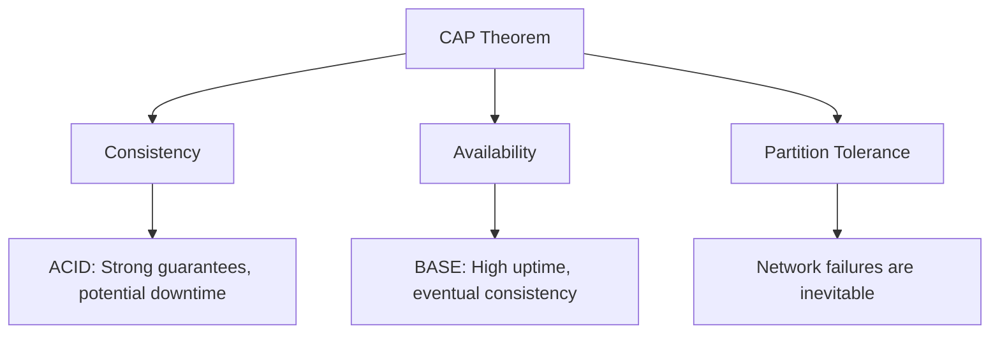

# ACID vs BASE Tradeoffs

## Overview

In distributed systems, data consistency models dictate how data is managed across multiple nodes, balancing reliability, performance, and scalability. ACID (Atomicity, Consistency, Isolation, Durability) and BASE (Basically Available, Soft-state, Eventually Consistent) represent opposing ends of the consistency spectrum, rooted in the CAP theorem. ACID prioritizes strong consistency and reliability, ideal for transactional systems, while BASE emphasizes availability and eventual consistency, suited for high-scale, distributed applications. Understanding their tradeoffs is crucial for engineering decisions in databases and systems design.

## Detailed Explanation

### ACID Properties

ACID defines properties for database transactions to ensure data integrity:

- **Atomicity**: Transactions are all-or-nothing; if any part fails, the entire transaction rolls back.
- **Consistency**: Transactions maintain database invariants, preventing invalid states.
- **Isolation**: Concurrent transactions do not interfere with each other.
- **Durability**: Committed changes persist despite failures.

ACID excels in single-node or tightly coupled systems but struggles with distributed environments due to latency and partition tolerance.

### BASE Properties

BASE is a model for distributed systems, contrasting ACID:

- **Basically Available**: The system remains operational despite failures, prioritizing uptime over strict consistency.
- **Soft-state**: Data may be in transient states, not always reflecting the latest updates.
- **Eventually Consistent**: Over time, all replicas converge to the same state, but not immediately.

BASE leverages eventual consistency to achieve high availability and partition tolerance, as per the CAP theorem, where you can only guarantee two out of Consistency, Availability, and Partition Tolerance.

### Tradeoffs

The CAP theorem illustrates the core tradeoff: in distributed systems, network partitions are inevitable, forcing a choice between consistency (ACID-like) and availability (BASE-like). ACID systems may sacrifice availability during partitions, while BASE systems allow temporary inconsistencies for continuous operation. This affects latency, complexity, and error handling.

| Aspect          | ACID                          | BASE                          |
|-----------------|-------------------------------|-------------------------------|
| Consistency    | Strong, immediate            | Eventual, soft-state         |
| Availability   | May degrade during partitions| High, even under partitions  |
| Partition Tolerance | Limited                     | Built-in                     |
| Use Case       | Financial transactions       | Social media, e-commerce     |
| Complexity     | High (locking, coordination) | Lower (asynchronous updates) |
| Performance    | Lower (synchronization)      | Higher (parallel operations) |



## Real-world Examples & Use Cases

- **E-commerce (e.g., Amazon)**: Uses BASE for product availability and recommendations, allowing temporary stock inconsistencies to ensure site uptime. Tradeoff: Users might see outdated inventory, but the system scales massively.
- **Social Media (e.g., Twitter, Facebook)**: BASE enables real-time feeds with eventual consistency, tolerating delays in follower counts or likes. Tradeoff: Inconsistencies like duplicate posts are resolved asynchronously.
- **Banking Systems**: ACID for transactions (e.g., fund transfers) ensures no double-spending. Tradeoff: Higher latency and potential unavailability during network issues.
- **Distributed Databases**: Cassandra (BASE) for IoT data ingestion vs. PostgreSQL (ACID) for OLTP workloads.

## Code Examples

### ACID Example (Java with JDBC)

```java
import java.sql.Connection;
import java.sql.DriverManager;
import java.sql.PreparedStatement;
import java.sql.SQLException;

public class AcidTransaction {
    public static void main(String[] args) {
        String url = "jdbc:postgresql://localhost:5432/mydb";
        try (Connection conn = DriverManager.getConnection(url, "user", "pass")) {
            conn.setAutoCommit(false); // Start transaction
            try {
                PreparedStatement stmt1 = conn.prepareStatement("UPDATE accounts SET balance = balance - 100 WHERE id = 1");
                stmt1.executeUpdate();
                PreparedStatement stmt2 = conn.prepareStatement("UPDATE accounts SET balance = balance + 100 WHERE id = 2");
                stmt2.executeUpdate();
                conn.commit(); // Atomic commit
            } catch (SQLException e) {
                conn.rollback(); // Rollback on failure
            }
        } catch (SQLException e) {
            e.printStackTrace();
        }
    }
}
```

This ensures atomicity and consistency; if the second update fails, both are rolled back.

### BASE Example (Pseudocode for Eventual Consistency)

```python
# Simplified eventual consistency in a distributed key-value store
def update_value(key, new_value):
    # Write to local replica
    local_store[key] = new_value
    # Asynchronously propagate to other replicas
    async_propagate_to_replicas(key, new_value)

def read_value(key):
    # Return local value, which may be stale
    return local_store.get(key, default_value)

# Conflict resolution (e.g., last-write-wins)
def resolve_conflict(key, values):
    return max(values, key=lambda v: v.timestamp)
```

Here, writes are fast and available, but reads may be inconsistent until propagation completes.

## Common Pitfalls & Edge Cases

- **Stale Reads in BASE**: Applications must handle outdated data, e.g., via client-side caching or user notifications.
- **Conflict Resolution**: BASE requires strategies like vector clocks or last-write-wins to merge divergent states.
- **ACID Overhead**: Overusing ACID in distributed systems can cause bottlenecks; hybrid approaches (e.g., ACID for critical ops, BASE for others) mitigate this.
- **Network Partitions**: ACID systems may fail entirely, while BASE tolerates but risks data loss if not designed for reconciliation.

## Tools & Libraries

- **ACID**: PostgreSQL, MySQL (InnoDB), Oracle; Libraries like Hibernate for ORM.
- **BASE**: Cassandra, DynamoDB, Riak; Frameworks like Apache Kafka for event-driven consistency.
- **Hybrid**: CockroachDB (ACID with BASE-like scaling), MongoDB (configurable consistency).

## References

- [ACID - Wikipedia](https://en.wikipedia.org/wiki/ACID)
- [Eventual Consistency - Wikipedia](https://en.wikipedia.org/wiki/Eventual_consistency)
- [Please Stop Calling Databases CP or AP - Martin Kleppmann](https://martin.kleppmann.com/2015/05/11/please-stop-calling-databases-cp-or-ap.html)
- [Brewer’s CAP Theorem - Julian Browne](https://www.julianbrowne.com/article/brewers-cap-theorem)

## Github-README Links & Related Topics

- [CAP Theorem and Distributed Systems](../cap-theorem-and-distributed-systems/)
- [Database Sharding Strategies](../database-sharding-strategies/)
- [Event-Driven Systems](../event-driven-systems/)
- [Microservices Architecture](../microservices-architecture/)