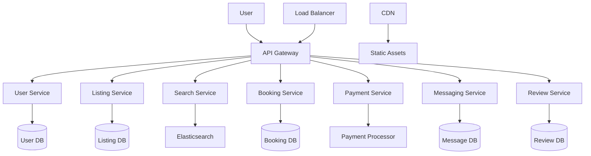

# Airbnb System Design

## Overview

Airbnb is a peer-to-peer marketplace connecting hosts who list their properties with travelers seeking accommodations. The system must handle millions of listings, bookings, payments, and user interactions while ensuring scalability, reliability, and trust. Key challenges include managing dynamic inventory, real-time availability, fraud prevention, and personalized recommendations.

The architecture follows a microservices pattern with components for user management, listings, search, booking, payments, messaging, and reviews. It leverages distributed databases, caching, load balancing, and event-driven systems to handle high traffic (e.g., 150 million users, 7 million listings).

### Key Requirements
- **Functional**: User registration, listing creation, search/filter, booking, payment processing, messaging, reviews.
- **Non-Functional**: High availability (99.9% uptime), low latency (<200ms for search), scalability (handle 10x traffic spikes), security (PCI compliance for payments), data consistency.

### High-Level Architecture


## Detailed Explanation

### Core Components

1. **User Service**: Manages user profiles, authentication (OAuth, JWT), and roles (host/guest). Uses relational DB like PostgreSQL for ACID transactions.

2. **Listing Service**: Handles property listings with photos, descriptions, pricing, and availability calendars. Employs NoSQL like Cassandra for scalability.

3. **Search Service**: Powers search and filtering using Elasticsearch for full-text search, geolocation (via GeoHash), and faceted filters. Includes recommendation engine using collaborative filtering.

4. **Booking Service**: Manages reservations, availability checks, and conflict resolution. Uses event sourcing for audit trails.

5. **Payment Service**: Integrates with Stripe/PayPal for secure transactions. Implements PCI DSS compliance, escrow for funds.

6. **Messaging Service**: Real-time chat between hosts and guests using WebSockets or MQTT.

7. **Review Service**: Collects and displays ratings/reviews, with moderation for spam.

### Scalability Strategies
- **Sharding**: Shard databases by region or user ID.
- **Caching**: Redis for session data, listings cache.
- **Load Balancing**: Nginx or AWS ELB for traffic distribution.
- **CDN**: Cloudflare for static content delivery.
- **Microservices**: Independent deployment, API versioning.

### Data Flow
1. User searches for listings.
2. Search Service queries Elasticsearch and filters results.
3. User selects listing, checks availability via Booking Service.
4. Booking initiated, payment processed.
5. Confirmation sent via email/messaging.

## STAR Summary

- **Situation**: Design a marketplace for vacation rentals with millions of users.
- **Task**: Build scalable system handling listings, bookings, payments.
- **Action**: Implement microservices, distributed DBs, caching, load balancing.
- **Result**: Achieves high availability, low latency, secure transactions.

## Journey / Sequence

1. **Requirements Gathering**: Define use cases, constraints (e.g., GDPR compliance).
2. **High-Level Design**: Sketch components, data flow.
3. **Detailed Design**: API specs, DB schemas, algorithms.
4. **Implementation**: Code services, integrate third-party APIs.
5. **Testing**: Load testing, security audits.
6. **Deployment**: CI/CD with Kubernetes, monitoring.

## Data Models / Message Formats

### Key Entities
| Entity | Fields | Storage |
|--------|--------|---------|
| User | id, name, email, role | PostgreSQL |
| Listing | id, host_id, title, location, price, availability | Cassandra |
| Booking | id, user_id, listing_id, dates, status | PostgreSQL |
| Payment | id, booking_id, amount, method | Encrypted DB |

### Message Formats (JSON)
```json
{
  "booking_request": {
    "user_id": "123",
    "listing_id": "456",
    "check_in": "2023-10-01",
    "check_out": "2023-10-05",
    "guests": 2
  }
}
```

## Real-world Examples & Use Cases

- **Peak Traffic Handling**: During holidays, system scales to 10x normal load using auto-scaling groups.
- **Fraud Detection**: Machine learning models flag suspicious bookings (e.g., bulk reservations).
- **Personalization**: Recommendations based on user history, similar to Netflix.
- **Global Expansion**: Localized search, multi-currency support.

## Code Examples

### Java: Booking Service Snippet
```java
@Service
public class BookingService {
    @Autowired
    private BookingRepository bookingRepo;

    public Booking createBooking(BookingRequest request) {
        // Check availability
        if (!isAvailable(request.getListingId(), request.getDates())) {
            throw new RuntimeException("Listing not available");
        }
        Booking booking = new Booking(request);
        return bookingRepo.save(booking);
    }

    private boolean isAvailable(String listingId, DateRange dates) {
        // Query DB for conflicts
        return true; // Simplified
    }
}
```

### Python: Search Filter
```python
def search_listings(query, filters):
    es_query = {
        "query": {
            "bool": {
                "must": [{"match": {"title": query}}],
                "filter": [{"range": {"price": {"gte": filters['min_price']}}}]
            }
        }
    }
    return elasticsearch.search(index="listings", body=es_query)
```

## Common Pitfalls & Edge Cases

- **Double Booking**: Use optimistic locking or distributed locks.
- **Currency Fluctuations**: Store prices in base currency, convert at runtime.
- **Host/Guest Disputes**: Mediation system with escrow holds.
- **Data Privacy**: Encrypt PII, comply with regulations.
- **Scalability Bottlenecks**: Monitor DB queries, optimize with indexes.

## Tools & Libraries

- **Frameworks**: Spring Boot (Java), Flask (Python).
- **Databases**: PostgreSQL, Cassandra, Elasticsearch.
- **Caching**: Redis.
- **Messaging**: Kafka for events.
- **Orchestration**: Kubernetes.
- **Monitoring**: Prometheus, Grafana.

## References

- [Alex Xu Blog: Airbnb System Design](https://www.alexxu.com/blog/airbnb-system-design/)
- [Educative: Grokking System Design Interview](https://www.educative.io/courses/grokking-the-system-design-interview)
- [GeeksforGeeks: System Design Interview Guide](https://www.geeksforgeeks.org/system-design-interview-guide/)
- [InterviewBit: Airbnb System Design](https://www.interviewbit.com/blog/airbnb-system-design/)

## Github-README Links & Related Topics

- [Microservices Architecture](../microservices-architecture/README.md)
- [API Design Principles](../api-design-principles/README.md)
- [Database Sharding Strategies](../database-sharding-strategies/README.md)
- [Load Balancing and Strategies](../load-balancing-and-strategies/README.md)
- [Distributed Caching](../caching/README.md)
- [Event-Driven Systems](../event-driven-systems/README.md)
- [Payment Systems](../payment-systems/README.md)