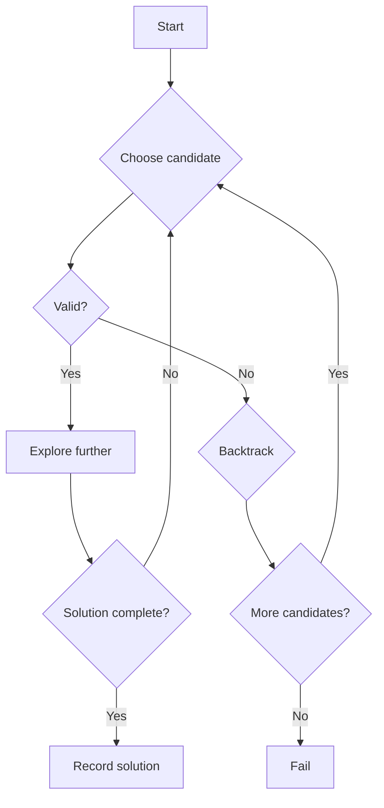

# Overview

Backtracking is a systematic algorithmic technique for solving combinatorial problems by incrementally building candidates for solutions and abandoning ("backtracking") those that fail to satisfy constraints. It explores the solution space depth-first, pruning invalid paths early to avoid exhaustive search. Essential for problems like N-Queens, Sudoku, and generating combinations with constraints, where brute force is inefficient.

In interviews, backtracking questions test recursion, state management, and optimization. Time complexity is often exponential (O(k^N)), but pruning can make it practical.

# Detailed Explanation

Backtracking operates by:
1. **Choosing**: Select a candidate from available options at the current step.
2. **Exploring**: Recurse to extend the partial solution.
3. **Unchoosing**: If the extension leads to an invalid state, backtrack by undoing the choice and trying alternatives.

Key concepts:
- **State Space Tree**: A tree representing all possible configurations; backtracking traverses it depth-first.
- **Pruning**: Use constraints to skip subtrees that cannot yield valid solutions.
- **vs. Brute Force**: Brute force enumerates all possibilities; backtracking stops early on failures.

For N-Queens: Place queens column by column, ensuring no attacks (same row, column, or diagonal). Backtrack if a placement conflicts.

For Sudoku: Fill cells row by row, checking row, column, and 3x3 box uniqueness.

Complexity: Worst-case exponential, but heuristics (e.g., most constrained variable) reduce it.



# Real-world Examples & Use Cases

- **Puzzle Solving**: Sudoku solvers, crossword generators, magic square fillers.
- **Combinatorial Optimization**: Traveling salesman (with pruning), knapsack with constraints.
- **Constraint Satisfaction**: Scheduling problems, resource allocation.
- **Game AI**: Chess move generation with alpha-beta pruning (extension of backtracking).
- **Compiler Parsing**: Expression evaluation with precedence.

| Problem | Description | Complexity |
|---------|-------------|------------|
| N-Queens | Place N queens on N×N board without attacks | O(N!) |
| Sudoku | Fill 9×9 grid with 1-9, no repeats in rows/cols/boxes | O(9^81) worst, pruned |
| Permutations | Generate all unique arrangements | O(N!) |
| Subsets | Find all subsets summing to target | O(2^N) |

# Code Examples

### N-Queens Problem (Java)
```java
import java.util.*;

public class NQueens {
    private List<List<String>> solutions;
    private int n;

    public NQueens(int n) {
        this.n = n;
        solutions = new ArrayList<>();
    }

    public List<List<String>> solveNQueens() {
        char[][] board = new char[n][n];
        for (char[] row : board) Arrays.fill(row, '.');
        backtrack(board, 0);
        return solutions;
    }

    private void backtrack(char[][] board, int row) {
        if (row == n) {
            solutions.add(construct(board));
            return;
        }
        for (int col = 0; col < n; col++) {
            if (isValid(board, row, col)) {
                board[row][col] = 'Q';
                backtrack(board, row + 1);
                board[row][col] = '.'; // backtrack
            }
        }
    }

    private boolean isValid(char[][] board, int row, int col) {
        for (int i = 0; i < row; i++) {
            if (board[i][col] == 'Q') return false;
            if (col - (row - i) >= 0 && board[i][col - (row - i)] == 'Q') return false;
            if (col + (row - i) < n && board[i][col + (row - i)] == 'Q') return false;
        }
        return true;
    }

    private List<String> construct(char[][] board) {
        List<String> res = new ArrayList<>();
        for (char[] r : board) res.add(new String(r));
        return res;
    }

    public static void main(String[] args) {
        NQueens q = new NQueens(4);
        List<List<String>> sols = q.solveNQueens();
        for (List<String> sol : sols) {
            for (String s : sol) System.out.println(s);
            System.out.println();
        }
    }
}
```

Compile and run: `javac NQueens.java && java NQueens`

### Sudoku Solver (Java)
```java
public class SudokuSolver {
    public void solveSudoku(char[][] board) {
        solve(board);
    }

    private boolean solve(char[][] board) {
        for (int i = 0; i < 9; i++) {
            for (int j = 0; j < 9; j++) {
                if (board[i][j] == '.') {
                    for (char c = '1'; c <= '9'; c++) {
                        if (isValid(board, i, j, c)) {
                            board[i][j] = c;
                            if (solve(board)) return true;
                            board[i][j] = '.'; // backtrack
                        }
                    }
                    return false;
                }
            }
        }
        return true;
    }

    private boolean isValid(char[][] board, int row, int col, char c) {
        for (int k = 0; k < 9; k++) {
            if (board[row][k] == c || board[k][col] == c) return false;
            int boxRow = (row / 3) * 3 + k / 3;
            int boxCol = (col / 3) * 3 + k % 3;
            if (board[boxRow][boxCol] == c) return false;
        }
        return true;
    }
}
```

### Generate Combinations (Java)
```java
import java.util.*;

public class CombinationSum {
    public List<List<Integer>> combinationSum(int[] candidates, int target) {
        List<List<Integer>> result = new ArrayList<>();
        Arrays.sort(candidates);
        backtrack(result, new ArrayList<>(), candidates, target, 0);
        return result;
    }

    private void backtrack(List<List<Integer>> result, List<Integer> temp, int[] candidates, int remain, int start) {
        if (remain < 0) return;
        if (remain == 0) {
            result.add(new ArrayList<>(temp));
            return;
        }
        for (int i = start; i < candidates.length; i++) {
            temp.add(candidates[i]);
            backtrack(result, temp, candidates, remain - candidates[i], i); // allow reuse
            temp.remove(temp.size() - 1);
        }
    }
}
```

# Common Pitfalls & Edge Cases

- **Infinite Loops**: Ensure progress; avoid cycles in state.
- **Stack Overflow**: For deep recursion (N>10), use iterative approach with stack.
- **Duplicates**: Sort input and skip duplicates in combinations.
- **Edge Cases**: Empty board, single cell, invalid inputs (e.g., N=0).
- **Pruning Missed**: Always validate constraints early.

# Tools & Libraries

- **Languages**: Java (recursion), Python (list comprehensions), C++ (vectors).
- **Libraries**: None specific; use standard containers.
- **Testing**: JUnit/Mockito for unit tests; assert solutions.
- **Visualization**: Draw state trees for debugging.

# References

- [Backtracking - Wikipedia](https://en.wikipedia.org/wiki/Backtracking)
- [Backtracking Algorithms - GeeksforGeeks](https://www.geeksforgeeks.org/backtracking-algorithms/)
- [LeetCode Backtracking Problems](https://leetcode.com/tag/backtracking/)
- "Introduction to Algorithms" by Cormen et al., Chapter 34 (Backtracking)
- [N-Queens Problem - Stanford CS](https://cs.stanford.edu/people/eroberts/courses/soco/projects/1999-00/combinatorial/prob1/index.html)

# Github-README Links & Related Topics

- [Backtracking Algorithms](algorithms/backtracking/README.md)
- [Dynamic Programming and Greedy](algorithms/dynamic-programming-and-greedy/README.md)
- [Graph Algorithms](algorithms/graph-algorithms/README.md)
- [Divide and Conquer](algorithms/divide-and-conquer/README.md)