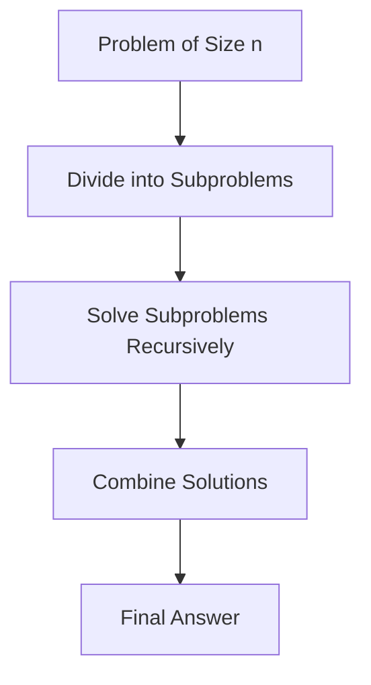

# Divide and Conquer Algorithms

## Overview

Divide and conquer is a fundamental algorithmic paradigm that solves complex problems by breaking them into smaller, more manageable subproblems, solving each recursively, and combining the results. This approach leverages recursion and parallelism, achieving efficient solutions for problems like sorting, searching, and matrix operations. Key examples include merge sort, quicksort, binary search, and Strassen's matrix multiplication. The paradigm reduces time complexity from brute-force methods, often yielding optimal or near-optimal algorithms.

## Detailed Explanation

### Core Principles
1. **Divide**: Split the problem into independent subproblems of the same type.
2. **Conquer**: Solve each subproblem recursively; base cases are trivial.
3. **Combine**: Merge subproblem solutions into the overall answer.

This recursion continues until base cases are reached, typically when the subproblem size is small (e.g., n ≤ 1).

### Time Complexity Analysis
- **Master Theorem**: For recurrence T(n) = aT(n/b) + f(n), where a subproblems of size n/b, plus f(n) work.
  - Case 1: f(n) = O(n^c) with c < log_b a → T(n) = Θ(n^log_b a)
  - Case 2: f(n) = Θ(n^log_b a log^k n) → T(n) = Θ(n^log_b a log^{k+1} n)
  - Case 3: f(n) = Ω(n^c) with c > log_b a → T(n) = Θ(f(n))

### Advantages
- **Efficiency**: Often achieves optimal complexity (e.g., O(n log n) for sorting).
- **Parallelism**: Subproblems can be solved concurrently.
- **Modularity**: Simplifies problem decomposition.

### Disadvantages
- **Recursion Overhead**: Stack space and function calls; iterative versions mitigate this.
- **Base Case Handling**: Incorrect base cases lead to infinite recursion or errors.
- **Memory Usage**: May require additional space for merging.



## Real-world Examples & Use Cases

- **Sorting**: Merge sort and quicksort for large datasets in databases and file systems.
- **Searching**: Binary search for lookups in sorted arrays, used in databases and search engines.
- **Matrix Operations**: Strassen's algorithm for fast matrix multiplication in graphics and AI.
- **Computational Geometry**: Closest pair of points for geographic data analysis.
- **Image Processing**: Divide images into quadrants for compression or feature extraction.
- **Big Data**: MapReduce (inspired by D&C) for distributed computing in Hadoop/Spark.

## Code Examples

### Merge Sort (Python)
```python
def merge_sort(arr):
    if len(arr) <= 1:
        return arr
    mid = len(arr) // 2
    left = merge_sort(arr[:mid])
    right = merge_sort(arr[mid:])
    return merge(left, right)

def merge(left, right):
    result = []
    i = j = 0
    while i < len(left) and j < len(right):
        if left[i] < right[j]:
            result.append(left[i])
            i += 1
        else:
            result.append(right[j])
            j += 1
    result.extend(left[i:])
    result.extend(right[j:])
    return result

# Usage
arr = [3, 1, 4, 1, 5]
print(merge_sort(arr))  # [1, 1, 3, 4, 5]
```

### Binary Search (Java)
```java
public class BinarySearch {
    public static int binarySearch(int[] arr, int target) {
        return binarySearchHelper(arr, target, 0, arr.length - 1);
    }

    private static int binarySearchHelper(int[] arr, int target, int low, int high) {
        if (low > high) return -1;
        int mid = low + (high - low) / 2;
        if (arr[mid] == target) return mid;
        else if (arr[mid] > target) return binarySearchHelper(arr, target, low, mid - 1);
        else return binarySearchHelper(arr, target, mid + 1, high);
    }

    public static void main(String[] args) {
        int[] arr = {1, 3, 5, 7, 9};
        System.out.println(binarySearch(arr, 5));  // 2
    }
}
```

### Strassen's Matrix Multiplication (Simplified Python)
```python
import numpy as np

def strassen_multiply(A, B):
    n = A.shape[0]
    if n == 1:
        return A * B
    mid = n // 2
    A11, A12, A21, A22 = A[:mid, :mid], A[:mid, mid:], A[mid:, :mid], A[mid:, mid:]
    B11, B12, B21, B22 = B[:mid, :mid], B[:mid, mid:], B[mid:, :mid], B[mid:, mid:]
    
    P1 = strassen_multiply(A11 + A22, B11 + B22)
    P2 = strassen_multiply(A21 + A22, B11)
    P3 = strassen_multiply(A11, B12 - B22)
    P4 = strassen_multiply(A22, B21 - B11)
    P5 = strassen_multiply(A11 + A12, B22)
    P6 = strassen_multiply(A21 - A11, B11 + B12)
    P7 = strassen_multiply(A12 - A22, B21 + B22)
    
    C11 = P1 + P4 - P5 + P7
    C12 = P3 + P5
    C21 = P2 + P4
    C22 = P1 - P2 + P3 + P6
    
    return np.vstack((np.hstack((C11, C12)), np.hstack((C21, C22))))

# Usage
A = np.array([[1, 2], [3, 4]])
B = np.array([[5, 6], [7, 8]])
print(strassen_multiply(A, B))
```

## Common Pitfalls & Edge Cases

- **Infinite Recursion**: Ensure base cases are correct; e.g., empty arrays in sorting.
- **Stack Overflow**: For large n, use iterative versions or increase stack size.
- **Uneven Division**: Subproblems of different sizes can lead to inefficiencies.
- **Combining Step**: Errors in merging (e.g., incorrect order in merge sort) corrupt results.
- **Edge Cases**: Single-element arrays, empty inputs, or non-power-of-two sizes in matrix ops.
- **Parallelism Issues**: Race conditions if not careful with shared state.

## Tools & Libraries

- **Languages**: Python (built-in recursion), Java (iterative alternatives).
- **Libraries**: NumPy for matrix ops, Java's Arrays.sort (uses D&C variants).
- **Frameworks**: Hadoop for distributed D&C, OpenMP for parallelization.

## References

- Cormen, T. H., et al. (2009). *Introduction to Algorithms* (3rd ed.). MIT Press. Chapter 4.
- [Divide and Conquer - Wikipedia](https://en.wikipedia.org/wiki/Divide-and-conquer_algorithm)
- [Master Theorem - GeeksforGeeks](https://www.geeksforgeeks.org/master-theorem/)
- Strassen, V. (1969). Gaussian elimination is not optimal. *Numerische Mathematik*, 13(4), 354-356.

## Github-README Links & Related Topics

- [Algorithms and Data Structures](../algorithms-and-data-structures/)
- [Sorting Algorithms](../algorithms-and-data-structures/sorting-algorithms/)
- [Recursion in Programming](../recursion/)
- [Parallel Algorithms](../parallel-algorithms/)