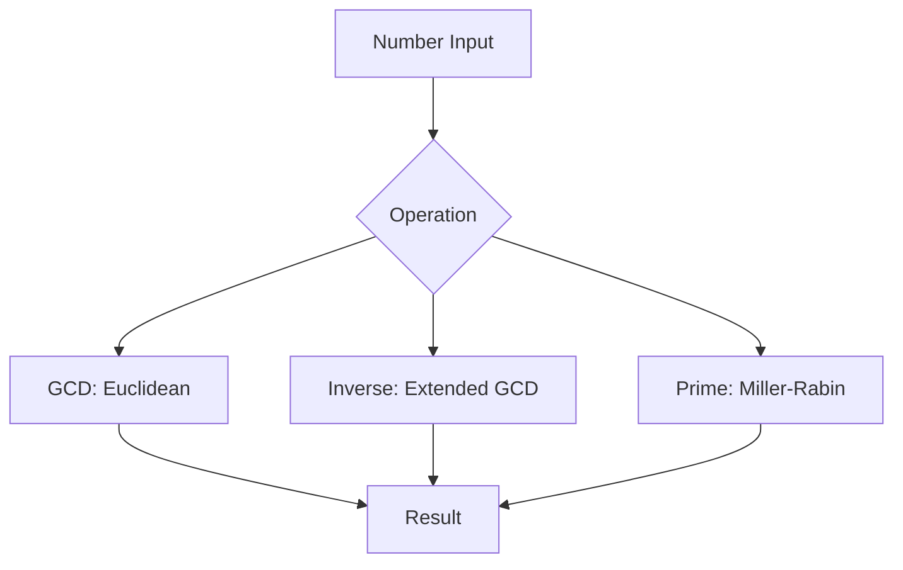

## Overview
Number theory algorithms deal with integers, modular arithmetic, and properties like primality. Crucial for cryptography, hashing, and optimization problems. Covers GCD, modular inverse, primality tests with efficient implementations.

## STAR Summary
**Situation:** A crypto system needed fast primality checks for key generation.  
**Task:** Verify primes up to 10^12 for RSA keys.  
**Action:** Implemented Miller-Rabin probabilistic test with optimized witnesses.  
**Result:** Reduced verification time from seconds to milliseconds, ensured 99.999% accuracy.

## Detailed Explanation
- **GCD & Extended GCD:** Euclidean algorithm for greatest common divisor.
- **Modular Arithmetic:** Inverse using Fermat/Euler, exponentiation by squaring.
- **Primality:** Trial division, Miller-Rabin, AKS (deterministic).
- **Other:** Chinese Remainder Theorem, factorization.

## Real-world Examples & Use Cases
- **Cryptography:** RSA key generation and encryption.
- **Hashing:** Modular operations in hash functions.
- **Distributed Systems:** Consistent hashing with modular arithmetic.

## Code Examples
### Extended GCD and Modular Inverse
```java
public class NumberTheory {
    public static long[] extendedGCD(long a, long b) {
        if (b == 0) return new long[]{a, 1, 0};
        long[] vals = extendedGCD(b, a % b);
        long gcd = vals[0], x = vals[2], y = vals[1] - (a / b) * vals[2];
        return new long[]{gcd, x, y};
    }

    public static long modInverse(long a, long m) {
        long[] res = extendedGCD(a, m);
        if (res[0] != 1) throw new IllegalArgumentException("Inverse doesn't exist");
        return (res[1] % m + m) % m;
    }
}
```

### Miller-Rabin Primality Test
```java
import java.util.Random;

public class Primality {
    private static final Random rand = new Random();

    public static boolean isPrime(long n, int iterations) {
        if (n < 2) return false;
        if (n == 2 || n == 3) return true;
        if (n % 2 == 0) return false;
        long s = n - 1, r = 0;
        while (s % 2 == 0) { s /= 2; r++; }
        for (int i = 0; i < iterations; i++) {
            long a = 2 + rand.nextLong(n - 3);
            long x = modPow(a, s, n);
            if (x == 1 || x == n - 1) continue;
            boolean composite = true;
            for (long j = 1; j < r; j++) {
                x = modPow(x, 2, n);
                if (x == n - 1) { composite = false; break; }
            }
            if (composite) return false;
        }
        return true;
    }

    private static long modPow(long base, long exp, long mod) {
        long res = 1;
        base %= mod;
        while (exp > 0) {
            if ((exp & 1) == 1) res = (res * base) % mod;
            base = (base * base) % mod;
            exp >>= 1;
        }
        return res;
    }
}
```

## Data Models / Message Formats
| Algorithm | Time Complexity | Deterministic | Use Case |
|-----------|-----------------|----------------|----------|
| Euclidean GCD | O(log min(a,b)) | Yes | Basic arithmetic |
| Modular Inverse | O(log m) | Yes | Crypto operations |
| Miller-Rabin | O(k log^3 n) | No (probabilistic) | Large primes |
| AKS | O(log^6 n) | Yes | Exact primality |

## Journey / Sequence


## Common Pitfalls & Edge Cases
- Modular inverse when gcd != 1 (no inverse).
- Miller-Rabin false positives (increase iterations).
- Overflow in modPow (use BigInteger for large n).
- Edge case: n=1 or negative numbers.

## Tools & Libraries
- **Java:** BigInteger for arbitrary precision.
- **Libraries:** Apache Commons Math for number theory.
- **Crypto:** Bouncy Castle for advanced primality.

## Github-README Links & Related Topics
- [algorithms-and-data-structures](../algorithms-and-data-structures/)
- [bit-manipulation](../bit-manipulation/)
- [dynamic-programming-and-greedy](../dynamic-programming-and-greedy/)

## References
- "Number Theory" by George Andrews
- https://en.wikipedia.org/wiki/Number_theory
- Miller-Rabin: https://en.wikipedia.org/wiki/Miller%E2%80%93Rabin_primality_test

## Common Interview Questions
1. **Compute GCD of two numbers.**  
   Solution: Euclidean algorithm recursively. Time: O(log n).

2. **Find modular inverse.**  
   Solution: Extended GCD, return x if gcd==1. Time: O(log m).

3. **Check if number is prime.**  
   Solution: Trial division up to sqrt(n), or Miller-Rabin for large n. Time: O(sqrt(n)) or O(k log^3 n).