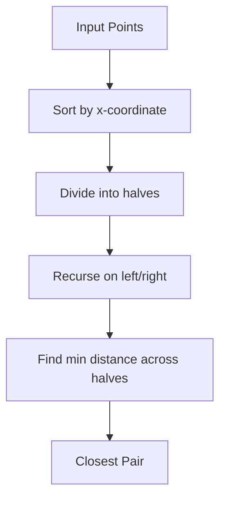

## Overview
Computational geometry involves designing and analyzing algorithms for solving geometric problems, such as determining relationships between points, lines, polygons, and other geometric objects. Core problems include convex hull computation, line segment intersection, closest pair of points, and point location queries.

## Detailed Explanation
- **Convex Hull**: The smallest convex polygon that encloses all points in a set. Algorithms like Graham scan (O(n log n)) and Jarvis march.
- **Line Intersection**: Detecting whether two line segments intersect, using orientation tests and bounding box checks.
- **Closest Pair**: Finding the minimum distance between any two points, using divide-and-conquer in O(n log n).
- **Sweep Line**: A technique for processing events in order, used in intersection detection.



## Real-world Examples & Use Cases
- **Geographic Information Systems (GIS)**: Spatial queries like finding nearest neighbors or containment.
- **Computer Graphics**: Collision detection in games, ray tracing.
- **Robotics**: Path planning and obstacle avoidance.
- **CAD Software**: Boolean operations on polygons.

## Code Examples
### Convex Hull (Graham Scan)
```java
import java.util.*;

class Point {
    int x, y;
    Point(int x, int y) { this.x = x; this.y = y; }
    // Compare for polar angle
}

public class ConvexHull {
    public static List<Point> grahamScan(List<Point> points) {
        if (points.size() <= 1) return points;
        // Sort points
        Collections.sort(points, (p1, p2) -> {
            int o = orientation(points.get(0), p1, p2);
            if (o == 0) return distSq(points.get(0), p1) < distSq(points.get(0), p2) ? -1 : 1;
            return o == 2 ? -1 : 1;
        });
        // Build hull
        Stack<Point> hull = new Stack<>();
        for (Point p : points) {
            while (hull.size() >= 2 && orientation(hull.get(hull.size()-2), hull.peek(), p) != 2)
                hull.pop();
            hull.push(p);
        }
        return new ArrayList<>(hull);
    }

    static int orientation(Point p, Point q, Point r) {
        long val = (long)(q.y - p.y) * (r.x - q.x) - (long)(q.x - p.x) * (r.y - q.y);
        if (val == 0) return 0;
        return val > 0 ? 1 : 2;
    }

    static long distSq(Point p1, Point p2) {
        return (long)(p1.x - p2.x)*(p1.x - p2.x) + (long)(p1.y - p2.y)*(p1.y - p2.y);
    }
}
```

### Line Segment Intersection
```java
class Point { double x, y; }
class Line { Point p1, q1; }

public class LineIntersection {
    static boolean onSegment(Point p, Point q, Point r) {
        return q.x <= Math.max(p.x, r.x) && q.x >= Math.min(p.x, r.x) &&
               q.y <= Math.max(p.y, r.y) && q.y >= Math.min(p.y, r.y);
    }

    static int orientation(Point p, Point q, Point r) {
        double val = (q.y - p.y) * (r.x - q.x) - (q.x - p.x) * (r.y - q.y);
        if (val == 0) return 0;
        return val > 0 ? 1 : 2;
    }

    static boolean doIntersect(Line l1, Line l2) {
        Point p1 = l1.p1, q1 = l1.q1, p2 = l2.p1, q2 = l2.q1;
        int o1 = orientation(p1, q1, p2);
        int o2 = orientation(p1, q1, q2);
        int o3 = orientation(p2, q2, p1);
        int o4 = orientation(p2, q2, q1);
        if (o1 != o2 && o3 != o4) return true;
        if (o1 == 0 && onSegment(p1, p2, q1)) return true;
        if (o2 == 0 && onSegment(p1, q2, q1)) return true;
        if (o3 == 0 && onSegment(p2, p1, q2)) return true;
        if (o4 == 0 && onSegment(p2, q1, q2)) return true;
        return false;
    }
}
```

## References
- https://en.wikipedia.org/wiki/Computational_geometry
- "Computational Geometry: Algorithms and Applications" by Mark de Berg et al.
- https://www.geeksforgeeks.org/convex-hull-set-1-jarviss-algorithm-or-wrapping/

## Github-README Links & Related Topics
[algorithms-and-data-structures](../algorithms-and-data-structures/README.md), [divide-and-conquer](../../divide-and-conquer/README.md), [sorting-algorithms](../../sorting-algorithms/README.md)