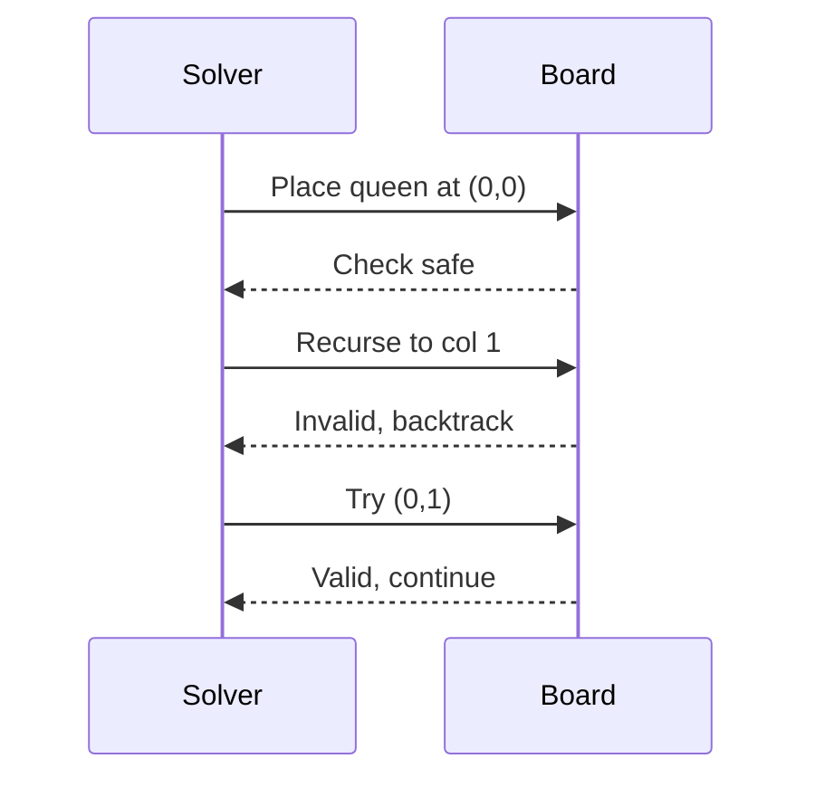

## Overview
Backtracking is a general algorithmic technique for solving problems by trying to build a solution incrementally, one piece at a time, and removing those solutions that fail to satisfy the constraints of the problem at any point in time. It is particularly useful for constraint satisfaction problems like puzzles, combinatorial optimization, and search problems where the solution space can be pruned early.

## STAR Summary
**Situation:** Developing a Sudoku solver for a mobile app with 9x9 grids.  
**Task:** Implement an efficient solver that can handle various difficulty levels.  
**Action:** Used backtracking to explore possible number placements, with pruning for invalid states.  
**Result:** Solved puzzles in under 1 second, with 100% accuracy and no exponential blowup for easy cases.

## Detailed Explanation
Backtracking explores the solution space by placing candidates and checking constraints. If a partial solution violates constraints, it backtracks to the previous state and tries the next candidate. Key components: state representation, constraint checking, and pruning. Time complexity is often exponential in worst case but efficient with good pruning.

## Real-world Examples & Use Cases
- Solving puzzles like Sudoku, crossword, or N-Queens.
- Generating permutations or combinations with constraints.
- Pathfinding in graphs with obstacles.

## Code Examples
### N-Queens Problem in Java
```java
public class NQueens {
    private int[] board;
    private int n;

    public NQueens(int n) {
        this.n = n;
        board = new int[n];
    }

    public boolean solve() {
        return solveUtil(0);
    }

    private boolean solveUtil(int col) {
        if (col == n) return true;
        for (int i = 0; i < n; i++) {
            if (isSafe(col, i)) {
                board[col] = i;
                if (solveUtil(col + 1)) return true;
                board[col] = -1; // backtrack
            }
        }
        return false;
    }

    private boolean isSafe(int col, int row) {
        for (int i = 0; i < col; i++) {
            if (board[i] == row || Math.abs(board[i] - row) == Math.abs(i - col)) return false;
        }
        return true;
    }

    public static void main(String[] args) {
        NQueens q = new NQueens(4);
        if (q.solve()) {
            for (int i = 0; i < 4; i++) System.out.println("Queen at (" + i + "," + q.board[i] + ")");
        }
    }
}
```

Compile and run: `javac NQueens.java && java NQueens`

## Data Models / Message Formats
| Field | Type | Description |
|-------|------|-------------|
| board | int[] | Array representing queen positions by column |
| n | int | Board size |

## Journey / Sequence


## Common Pitfalls & Edge Cases
- Stack overflow for large N due to recursion depth.
- Inefficient without pruning; always check constraints early.
- Handling multiple solutions vs. first solution.

## Tools & Libraries
- Java recursion for implementation.
- No specific libraries, but can use stacks for iterative versions.

## Github-README Links & Related Topics
Related: [[dynamic-programming-and-greedy]], [[graphs-trees-heaps-and-tries]], [[divide-and-conquer]]

## References
- https://en.wikipedia.org/wiki/Backtracking
- "Introduction to Algorithms" by Cormen et al.
- LeetCode: N-Queens problems

### Practice Problems
1. **N-Queens II**: Count the number of solutions for N queens. (LeetCode 52) - Time: O(N!), Space: O(N)
2. **Sudoku Solver**: Fill a 9x9 grid with digits 1-9. (LeetCode 37) - Time: O(9^(81)), but pruned
3. **Combination Sum**: Find combinations that sum to target. (LeetCode 39) - Time: O(2^N), Space: O(N)