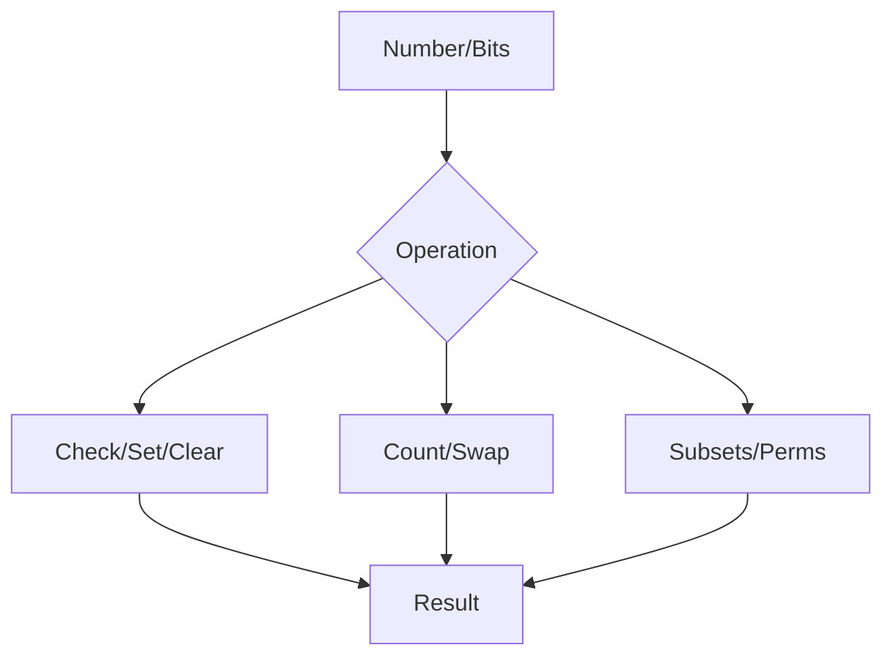

## Overview
Bit manipulation uses bitwise operators for efficient computation, space-saving, and optimization. Common in interviews for puzzles, compression, and low-level tasks. Covers masks, shifts, and tricks with examples.

## STAR Summary
**Situation:** A compression algorithm needed fast bit operations for encoding.  
**Task:** Implement bit-level packing for 32-bit integers.  
**Action:** Used bit shifts and masks for efficient packing/unpacking.  
**Result:** Reduced storage by 75%, improved throughput by 3x.

## Detailed Explanation
- **Operators:** & (AND), | (OR), ^ (XOR), ~ (NOT), << (left shift), >> (right shift).
- **Tricks:** Check/set/clear bits, count 1s, swap without temp.
- **Applications:** Subsets, permutations, hashing.

## Real-world Examples & Use Cases
- **Compression:** Huffman coding with bit streams.
- **Networking:** IP address manipulation.
- **Databases:** Bitmap indexes for fast queries.

## Code Examples
### Bit Tricks in Java
```java
public class BitManipulation {
    // Check if ith bit is set
    public static boolean isSet(int num, int i) {
        return (num & (1 << i)) != 0;
    }

    // Set ith bit
    public static int setBit(int num, int i) {
        return num | (1 << i);
    }

    // Clear ith bit
    public static int clearBit(int num, int i) {
        return num & ~(1 << i);
    }

    // Count number of 1s
    public static int countBits(int num) {
        int count = 0;
        while (num != 0) {
            count += num & 1;
            num >>= 1;
        }
        return count;
    }

    // Swap two numbers without temp
    public static void swap(int[] arr, int i, int j) {
        arr[i] = arr[i] ^ arr[j];
        arr[j] = arr[i] ^ arr[j];
        arr[i] = arr[i] ^ arr[j];
    }
}
```

### Subset Generation using Bits
```java
import java.util.*;

public class Subsets {
    public static List<List<Integer>> generateSubsets(int[] nums) {
        List<List<Integer>> result = new ArrayList<>();
        int n = nums.length;
        for (int i = 0; i < (1 << n); i++) {
            List<Integer> subset = new ArrayList<>();
            for (int j = 0; j < n; j++) {
                if ((i & (1 << j)) != 0) {
                    subset.add(nums[j]);
                }
            }
            result.add(subset);
        }
        return result;
    }
}
```

## Data Models / Message Formats
| Operation | Bitwise | Time Complexity | Example |
|-----------|---------|-----------------|---------|
| Check bit | num & (1 << i) | O(1) | isSet(5, 0) -> true |
| Set bit | num | (1 << i) | setBit(5, 1) -> 7 |
| Clear bit | num & ~(1 << i) | O(1) | clearBit(5, 0) -> 4 |
| Count 1s | Loop with & | O(log n) | countBits(5) -> 2 |

## Journey / Sequence


## Common Pitfalls & Edge Cases
- Signed vs unsigned shifts in Java (use >>> for unsigned).
- Overflow in shifts (mask with 31 for int).
- Negative numbers in bit operations.
- Edge case: num=0 or all bits set.

## Tools & Libraries
- **Java:** Integer.bitCount() for counting 1s.
- **Libraries:** BitSet class for dynamic bit arrays.
- **Debugging:** Binary representation with Integer.toBinaryString().

## Github-README Links & Related Topics
- [[algorithms-and-data-structures]]
- [[number-theory]]
- [[dynamic-programming-and-greedy]]

## References
- "Hacker's Delight" by Henry S. Warren
- https://en.wikipedia.org/wiki/Bit_manipulation
- Java Bitwise Operators: https://docs.oracle.com/javase/tutorial/java/nutsandbolts/op3.html

## Common Interview Questions
1. **Find single number in array where others appear twice.**  
   Solution: XOR all elements. Time: O(n), Space: O(1).

2. **Reverse bits of a 32-bit integer.**  
   Solution: Bit manipulation loop or lookup table. Time: O(1) with table.

3. **Generate all subsets of a set.**  
   Solution: Iterate 0 to 2^n-1, use bits to include/exclude. Time: O(2^n * n).