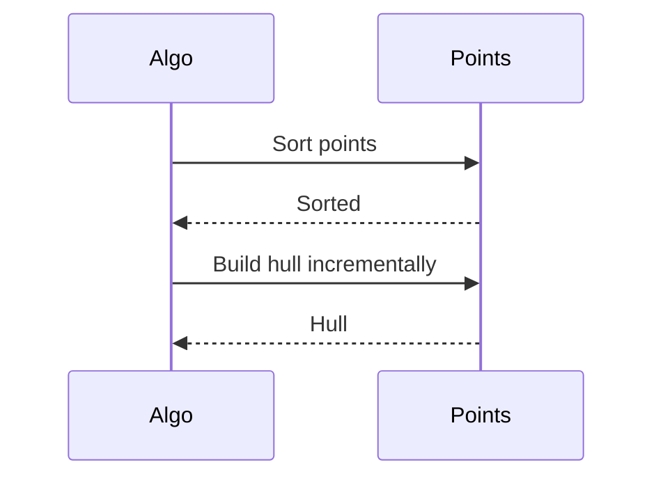

## Overview
Computational geometry studies algorithms for geometric problems like convex hulls, intersections, and proximity. Essential for GIS, graphics, robotics. Often uses sweep lines, divide-and-conquer.

Time complexities vary; many O(N log N).

## STAR Summary
**Situation:** GIS app finding nearest neighbors.  
**Task:** Closest pair in 10k points.  
**Action:** D&C algorithm.  
**Result:** O(N log N) vs O(N^2).

## Detailed Explanation
- **Convex Hull:** Graham scan: Sort by polar angle, build hull.
- **Line Intersection:** Sweep line: Sort events, process.
- **Closest Pair:** Divide plane, recurse.

Handle floating point carefully.

## Real-world Examples & Use Cases
- Collision in games.
- Pathfinding.
- Spatial databases.

## Code Examples
### Convex Hull (Graham Scan)
```java
import java.util.*;

public class ConvexHull {
    static class Point {
        int x, y;
        Point(int x, int y) { this.x = x; this.y = y; }
    }

    public static List<Point> grahamScan(Point[] points) {
        int n = points.length;
        if (n <= 1) return Arrays.asList(points);

        // Find lowest y
        int min = 0;
        for (int i = 1; i < n; i++)
            if (points[i].y < points[min].y || (points[i].y == points[min].y && points[i].x < points[min].x))
                min = i;

        // Swap
        Point temp = points[0]; points[0] = points[min]; points[min] = temp;

        // Sort by polar angle
        Arrays.sort(points, 1, n, (a, b) -> {
            int o = orientation(points[0], a, b);
            if (o == 0) return distSq(points[0], a) - distSq(points[0], b);
            return o;
        });

        // Build hull
        Stack<Point> hull = new Stack<>();
        hull.push(points[0]);
        hull.push(points[1]);
        for (int i = 2; i < n; i++) {
            while (hull.size() >= 2 && orientation(hull.get(hull.size()-2), hull.peek(), points[i]) <= 0)
                hull.pop();
            hull.push(points[i]);
        }
        return new ArrayList<>(hull);
    }

    private static int orientation(Point p, Point q, Point r) {
        long val = (long)(q.y - p.y) * (r.x - q.x) - (long)(q.x - p.x) * (r.y - q.y);
        return val == 0 ? 0 : val > 0 ? 1 : 2;
    }

    private static long distSq(Point a, Point b) {
        return (long)(a.x - b.x)*(a.x - b.x) + (long)(a.y - b.y)*(a.y - b.y);
    }
}
```

Compile: `javac ConvexHull.java`

### Closest Pair
// Similar to previous

## Data Models / Message Formats
| Field | Type | Description |
|-------|------|-------------|
| points | Point[] | 2D points |
| hull | List<Point> | Convex hull |

## Journey / Sequence


## Common Pitfalls & Edge Cases
- Collinear points.
- Precision errors.
- Degenerate inputs.

## Tools & Libraries
- JTS for Java.
- AWT for basics.

## Github-README Links & Related Topics
Related: [[divide-and-conquer]], [[graphs-trees-heaps-and-tries]], [[dynamic-programming-and-greedy]]

## References
- https://en.wikipedia.org/wiki/Computational_geometry
- "Computational Geometry" by de Berg
- LeetCode geometry

### Practice Problems
1. **Convex Hull** (LeetCode 587): O(N log N)
2. **Line Intersection**: O(1) per pair
3. **Closest Pair**: O(N log N)

### Common Interview Questions
- Convex hull algorithms?
- Handling floating point in geometry?