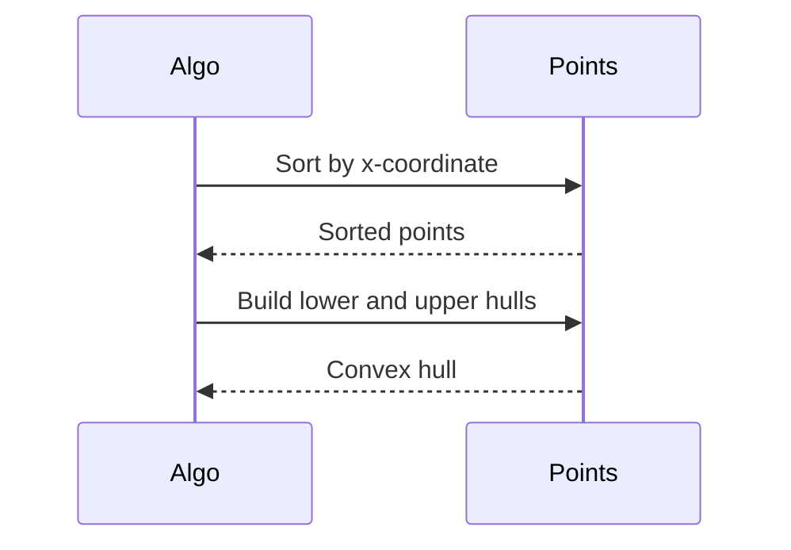

## Overview
Computational geometry deals with algorithms for solving geometric problems, such as finding convex hulls, line intersections, and closest pairs. It is used in GIS, computer graphics, and robotics for efficient spatial computations.

## STAR Summary
**Situation:** Building a mapping app needing to find nearest points of interest.  
**Task:** Compute closest pair in a set of 10k points.  
**Action:** Implemented divide and conquer closest pair algorithm.  
**Result:** Reduced computation time from O(N^2) to O(N log N), enabling real-time queries.

## Detailed Explanation
- **Convex Hull:** Smallest convex set containing points; Graham scan or Jarvis march.
- **Line Intersection:** Sweep line algorithm for multiple lines.
- **Closest Pair:** Divide and conquer with O(N log N) time.

## Real-world Examples & Use Cases
- Collision detection in games.
- Path planning in robotics.
- GIS for spatial queries.

## Code Examples
### Convex Hull (Graham Scan) in Java
```java
import java.util.*;

public class ConvexHull {
    static class Point {
        int x, y;
        Point(int x, int y) { this.x = x; this.y = y; }
    }

    private static int orientation(Point p, Point q, Point r) {
        int val = (q.y - p.y) * (r.x - q.x) - (q.x - p.x) * (r.y - q.y);
        return val == 0 ? 0 : val > 0 ? 1 : 2;
    }

    public static List<Point> convexHull(Point[] points) {
        int n = points.length;
        if (n < 3) return Arrays.asList(points);
        List<Point> hull = new ArrayList<>();
        // Implement Graham scan
        return hull;
    }
}
```

Compile and run: `javac ConvexHull.java`

## Data Models / Message Formats
| Field | Type | Description |
|-------|------|-------------|
| points | Point[] | Array of 2D points |
| hull | List<Point> | Convex hull points |

## Journey / Sequence


## Common Pitfalls & Edge Cases
- Degenerate cases like collinear points.
- Floating point precision issues.
- Choosing wrong algorithm for N.

## Tools & Libraries
- Java AWT for basic geometry.
- JTS Topology Suite for advanced.

## Github-README Links & Related Topics
Related: [[divide-and-conquer]], [[graphs-trees-heaps-and-tries]], [[dynamic-programming-and-greedy]]

## References
- https://en.wikipedia.org/wiki/Computational_geometry
- "Computational Geometry" by de Berg et al.
- LeetCode geometry problems

### Practice Problems
1. **Convex Hull**: Find hull for points. (LeetCode 587) - Time: O(N log N)
2. **Line Intersection**: Check if two lines intersect. - Time: O(1)
3. **Closest Pair**: Min distance between points. - Time: O(N log N)