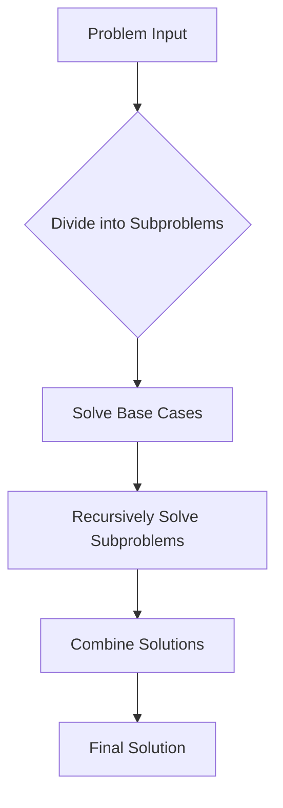

## Overview

Divide and conquer is a fundamental algorithmic paradigm that breaks down complex problems into smaller, more manageable subproblems, solves them recursively, and combines their solutions to address the original problem. This approach is particularly effective for problems that can be decomposed naturally, such as sorting and searching. Key algorithms include merge sort, quicksort, and the closest pair of points problem, which exemplify efficient recursive decomposition in computational geometry and data processing.

## Detailed Explanation

The divide-and-conquer strategy consists of three main steps:

1. **Divide**: Split the problem into smaller subproblems of the same type.
2. **Conquer**: Solve the subproblems recursively. Base cases are solved directly.
3. **Combine**: Merge the solutions of the subproblems to form the solution to the original problem.

This paradigm often leads to efficient algorithms with time complexities like O(n log n), leveraging the power of recursion and parallelism.

### Merge Sort
Merge sort recursively divides the array into halves until single elements remain, then merges sorted subarrays. It achieves stable sorting with O(n log n) time and O(n) space.

### Quicksort
Quicksort selects a pivot, partitions the array into elements less than and greater than the pivot, and recursively sorts the partitions. It has average O(n log n) time but worst-case O(n²), mitigated by good pivot selection.

### Closest Pair of Points
This geometric problem finds the minimum distance between any two points in a set. Using divide and conquer, it sorts points by x-coordinate, divides into halves, recursively finds closest pairs in each half, and checks points near the dividing line.

## Real-world Examples & Use Cases

- **Sorting Large Datasets**: Merge sort and quicksort are used in databases and file systems for efficient sorting of millions of records.
- **Computational Geometry**: Closest pair algorithms apply to collision detection in graphics, clustering in data mining, and nearest neighbor searches in GIS.
- **Parallel Computing**: Divide-and-conquer algorithms parallelize well, used in multi-core processors for tasks like image processing and scientific simulations.
- **External Sorting**: Merge sort variants handle data larger than memory in big data frameworks like Hadoop.

## Code Examples

### Merge Sort in Java
```java
public class MergeSort {
    public static void mergeSort(int[] arr) {
        if (arr.length < 2) return;
        int mid = arr.length / 2;
        int[] left = Arrays.copyOfRange(arr, 0, mid);
        int[] right = Arrays.copyOfRange(arr, mid, arr.length);
        mergeSort(left);
        mergeSort(right);
        merge(arr, left, right);
    }

    private static void merge(int[] arr, int[] left, int[] right) {
        int i = 0, j = 0, k = 0;
        while (i < left.length && j < right.length) {
            if (left[i] <= right[j]) {
                arr[k++] = left[i++];
            } else {
                arr[k++] = right[j++];
            }
        }
        while (i < left.length) arr[k++] = left[i++];
        while (j < right.length) arr[k++] = right[j++];
    }
}
```

### Quicksort in Java
```java
public class QuickSort {
    public static void quickSort(int[] arr, int low, int high) {
        if (low < high) {
            int pi = partition(arr, low, high);
            quickSort(arr, low, pi - 1);
            quickSort(arr, pi + 1, high);
        }
    }

    private static int partition(int[] arr, int low, int high) {
        int pivot = arr[high];
        int i = low - 1;
        for (int j = low; j < high; j++) {
            if (arr[j] < pivot) {
                i++;
                swap(arr, i, j);
            }
        }
        swap(arr, i + 1, high);
        return i + 1;
    }

    private static void swap(int[] arr, int i, int j) {
        int temp = arr[i];
        arr[i] = arr[j];
        arr[j] = temp;
    }
}
```

### Closest Pair of Points in Java
```java
import java.util.Arrays;

public class ClosestPair {
    static class Point {
        double x, y;
        Point(double x, double y) { this.x = x; this.y = y; }
    }

    public static double closestPair(Point[] points) {
        Arrays.sort(points, (a, b) -> Double.compare(a.x, b.x));
        return closestUtil(points, 0, points.length - 1);
    }

    private static double closestUtil(Point[] points, int left, int right) {
        if (right - left <= 3) return bruteForce(points, left, right);
        int mid = (left + right) / 2;
        Point midPoint = points[mid];
        double dl = closestUtil(points, left, mid);
        double dr = closestUtil(points, mid + 1, right);
        double d = Math.min(dl, dr);
        return Math.min(d, stripClosest(points, left, right, mid, d));
    }

    private static double bruteForce(Point[] points, int left, int right) {
        double min = Double.MAX_VALUE;
        for (int i = left; i <= right; i++) {
            for (int j = i + 1; j <= right; j++) {
                min = Math.min(min, dist(points[i], points[j]));
            }
        }
        return min;
    }

    private static double stripClosest(Point[] points, int left, int right, int mid, double d) {
        Point midPoint = points[mid];
        Point[] strip = new Point[right - left + 1];
        int j = 0;
        for (int i = left; i <= right; i++) {
            if (Math.abs(points[i].x - midPoint.x) < d) {
                strip[j++] = points[i];
            }
        }
        Arrays.sort(strip, 0, j, (a, b) -> Double.compare(a.y, b.y));
        double min = d;
        for (int i = 0; i < j; i++) {
            for (int k = i + 1; k < j && (strip[k].y - strip[i].y) < min; k++) {
                min = Math.min(min, dist(strip[i], strip[k]));
            }
        }
        return min;
    }

    private static double dist(Point a, Point b) {
        return Math.sqrt((a.x - b.x) * (a.x - b.x) + (a.y - b.y) * (a.y - b.y));
    }
}
```

## Data Models / Message Formats

| Algorithm          | Time Complexity | Space Complexity | Stability | Notes |
|--------------------|-----------------|------------------|-----------|-------|
| Merge Sort        | O(n log n)      | O(n)            | Yes      | Stable, used in external sorting |
| Quicksort         | O(n log n) avg, O(n²) worst | O(log n) | No       | Fast in practice, in-place |
| Closest Pair      | O(n log n)      | O(n)            | N/A      | Geometric, divide-and-conquer |

## Journey / Sequence



## Common Pitfalls & Edge Cases

- **Quicksort Worst Case**: Occurs with sorted input; use randomized pivot or median-of-three.
- **Merge Sort Space**: Requires O(n) extra space; in-place variants exist but are complex.
- **Closest Pair Degeneracy**: Handle collinear points carefully in the strip check.
- **Recursion Depth**: For large n, iterative versions or increased stack size may be needed.
- **Floating Point Precision**: In closest pair, use epsilon for distance comparisons.

## Tools & Libraries

- **Java**: Arrays.sort() uses Timsort (hybrid of merge and insertion sort).
- **C++**: std::sort() is introsort (hybrid of quicksort, heapsort, insertion sort).
- **Python**: sorted() uses Timsort.
- **Libraries**: Apache Commons for Java utilities; Boost for C++.

## Github-README Links & Related Topics

- [[sorting-algorithms]]
- [[dynamic-programming-and-greedy]]
- [[graphs-trees-heaps-and-tries]]

## References

- Cormen, T. H., Leiserson, C. E., Rivest, R. L., & Stein, C. (2009). Introduction to Algorithms. MIT Press.
- https://en.wikipedia.org/wiki/Divide-and-conquer_algorithm
- https://en.wikipedia.org/wiki/Merge_sort
- https://en.wikipedia.org/wiki/Quicksort
- https://en.wikipedia.org/wiki/Closest_pair_of_points_problem
- Bentley, J. L., & McIlroy, M. D. (1993). Engineering a sort function. Software: Practice and Experience.