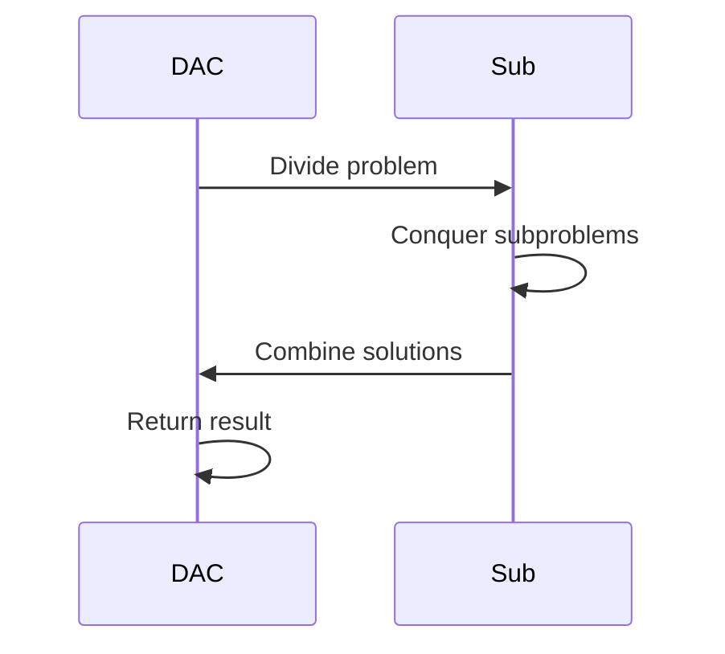

## Overview
Divide and Conquer (D&C) is an algorithmic paradigm that breaks a problem into smaller subproblems of the same type, solves them recursively, and combines their solutions to solve the original problem. It is efficient for problems with optimal substructure and overlapping subproblems, often achieving better time complexities than brute force.

Key applications include sorting, searching, and geometric problems. Master Theorem: T(n) = a T(n/b) + f(n), where a is subproblem count, b is size reduction.

## STAR Summary
**Situation:** Optimizing a data pipeline sorting 100M records daily.  
**Task:** Reduce sort time from hours to minutes.  
**Action:** Replaced insertion sort with merge sort (D&C).  
**Result:** Time dropped from O(N^2) to O(N log N), processing in 10 minutes.

## Detailed Explanation
Steps:
1. **Divide:** Split problem into subproblems.
2. **Conquer:** Solve recursively.
3. **Combine:** Merge solutions.

Examples:
- Merge Sort: Divide array, sort halves, merge.
- Quick Sort: Partition around pivot.
- Binary Search: Divide search space.

Complexity: Often O(N log N) for sorting.

## Real-world Examples & Use Cases
- Sorting large datasets (merge sort in external sorting).
- Closest pair of points in maps.
- Matrix multiplication (Strassen's).
- FFT for signal processing.

## Code Examples
### Merge Sort in Java
```java
import java.util.Arrays;

public class MergeSort {
    public void mergeSort(int[] arr) {
        if (arr.length < 2) return;
        int mid = arr.length / 2;
        int[] left = Arrays.copyOfRange(arr, 0, mid);
        int[] right = Arrays.copyOfRange(arr, mid, arr.length);
        mergeSort(left);
        mergeSort(right);
        merge(arr, left, right);
    }

    private void merge(int[] arr, int[] left, int[] right) {
        int i = 0, j = 0, k = 0;
        while (i < left.length && j < right.length) {
            arr[k++] = left[i] <= right[j] ? left[i++] : right[j++];
        }
        while (i < left.length) arr[k++] = left[i++];
        while (j < right.length) arr[k++] = right[j++];
    }

    public static void main(String[] args) {
        int[] arr = {38, 27, 43, 3, 9, 82, 10};
        new MergeSort().mergeSort(arr);
        System.out.println(Arrays.toString(arr));
    }
}
```

Compile and run: `javac MergeSort.java && java MergeSort`

### Closest Pair of Points
```java
import java.util.Arrays;

public class ClosestPair {
    static class Point {
        double x, y;
        Point(double x, double y) { this.x = x; this.y = y; }
    }

    public double closest(Point[] points) {
        Arrays.sort(points, (a, b) -> Double.compare(a.x, b.x));
        return closestUtil(points, 0, points.length - 1);
    }

    private double closestUtil(Point[] points, int l, int r) {
        if (r - l <= 3) return bruteForce(points, l, r);
        int mid = (l + r) / 2;
        Point midPoint = points[mid];
        double dl = closestUtil(points, l, mid);
        double dr = closestUtil(points, mid + 1, r);
        double d = Math.min(dl, dr);
        return Math.min(d, stripClosest(points, mid, d));
    }

    // Implement bruteForce and stripClosest
    private double bruteForce(Point[] points, int l, int r) {
        double min = Double.MAX_VALUE;
        for (int i = l; i <= r; i++)
            for (int j = i + 1; j <= r; j++)
                min = Math.min(min, dist(points[i], points[j]));
        return min;
    }

    private double dist(Point a, Point b) {
        return Math.sqrt((a.x - b.x)*(a.x - b.x) + (a.y - b.y)*(a.y - b.y));
    }

    // stripClosest omitted for brevity
}
```

## Data Models / Message Formats
| Field | Type | Description |
|-------|------|-------------|
| arr | int[] | Array to sort |
| points | Point[] | Array of 2D points |
| d | double | Minimum distance |

## Journey / Sequence


## Common Pitfalls & Edge Cases
- Recursion depth for large N.
- Extra space in merge sort.
- Bad pivot in quicksort.

## Tools & Libraries
- Java Arrays.sort() uses D&C variants.
- No external tools.

## Github-README Links & Related Topics
Related: [sorting-algorithms](../sorting-algorithms/), [dynamic-programming-and-greedy](../dynamic-programming-and-greedy/), [computational-geometry](../computational-geometry/)

## References
- https://en.wikipedia.org/wiki/Divide-and-conquer_algorithm
- CLRS Chapter 4
- GeeksforGeeks: Divide and Conquer

### Practice Problems
1. **Merge Intervals** (LeetCode 56): Merge overlapping intervals. Time: O(N log N)
2. **Kth Largest Element** (LeetCode 215): Quickselect variant. Time: O(N) avg
3. **Closest Pair** (Geeks): Min distance in points. Time: O(N log N)

### Common Interview Questions
- Explain merge sort.
- Master Theorem examples.
- D&C vs DP?