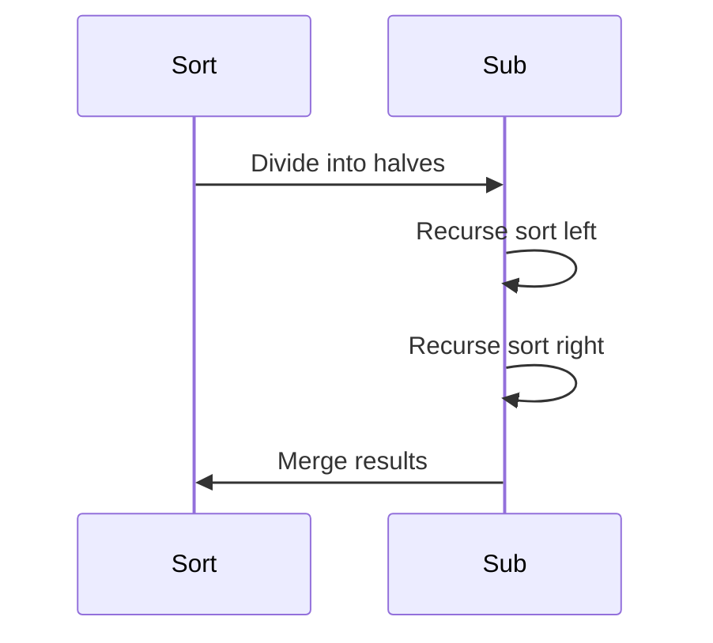

## Overview
Divide and Conquer is a algorithmic paradigm that solves a problem by breaking it into smaller subproblems of the same type, solving them recursively, and combining their solutions. It is efficient for problems with optimal substructure and is foundational for sorting, searching, and geometric algorithms.

## STAR Summary
**Situation:** Implementing a fast sorting algorithm for large datasets in a data processing pipeline.  
**Task:** Sort arrays of up to 1M elements efficiently.  
**Action:** Used merge sort (divide and conquer) instead of bubble sort.  
**Result:** Reduced time complexity from O(N^2) to O(N log N), handling datasets in seconds.

## Detailed Explanation
Steps: Divide the problem into subproblems, conquer (solve recursively), combine solutions. Examples: Merge sort, quicksort, binary search. Time complexity often T(N) = a T(N/b) + f(N), solvable by master theorem.

## Real-world Examples & Use Cases
- Sorting algorithms (merge sort, quicksort).
- Closest pair of points in computational geometry.
- Matrix multiplication (Strassen's algorithm).

## Code Examples
### Merge Sort in Java
```java
public class MergeSort {
    public void sort(int[] arr, int l, int r) {
        if (l < r) {
            int m = l + (r - l) / 2;
            sort(arr, l, m);
            sort(arr, m + 1, r);
            merge(arr, l, m, r);
        }
    }

    private void merge(int[] arr, int l, int m, int r) {
        int n1 = m - l + 1, n2 = r - m;
        int[] L = new int[n1], R = new int[n2];
        System.arraycopy(arr, l, L, 0, n1);
        System.arraycopy(arr, m + 1, R, 0, n2);
        int i = 0, j = 0, k = l;
        while (i < n1 && j < n2) arr[k++] = L[i] <= R[j] ? L[i++] : R[j++];
        while (i < n1) arr[k++] = L[i++];
        while (j < n2) arr[k++] = R[j++];
    }

    public static void main(String[] args) {
        int[] arr = {12, 11, 13, 5, 6, 7};
        new MergeSort().sort(arr, 0, arr.length - 1);
        System.out.println(Arrays.toString(arr));
    }
}
```

Compile and run: `javac MergeSort.java && java MergeSort`

## Data Models / Message Formats
| Field | Type | Description |
|-------|------|-------------|
| arr | int[] | Array to sort |
| l, r | int | Left and right indices |

## Journey / Sequence


## Common Pitfalls & Edge Cases
- Recursion depth limits for large N.
- Choosing bad pivot in quicksort leading to O(N^2).
- Extra space in merge sort.

## Tools & Libraries
- Java Arrays.sort() uses dual-pivot quicksort.
- No external tools.

## Github-README Links & Related Topics
Related: [[sorting-algorithms]], [[dynamic-programming-and-greedy]], [[graphs-trees-heaps-and-tries]]

## References
- https://en.wikipedia.org/wiki/Divide-and-conquer_algorithm
- CLRS Chapter 4
- GeeksforGeeks: Divide and Conquer

### Practice Problems
1. **Merge Two Sorted Arrays**: Merge without extra space. (LeetCode 88) - Time: O(M+N), Space: O(1)
2. **Kth Largest Element**: Find kth in unsorted array. (LeetCode 215) - Time: O(N log N) avg
3. **Closest Pair of Points**: Find min distance in 2D. (LeetCode 973 variant) - Time: O(N log N)