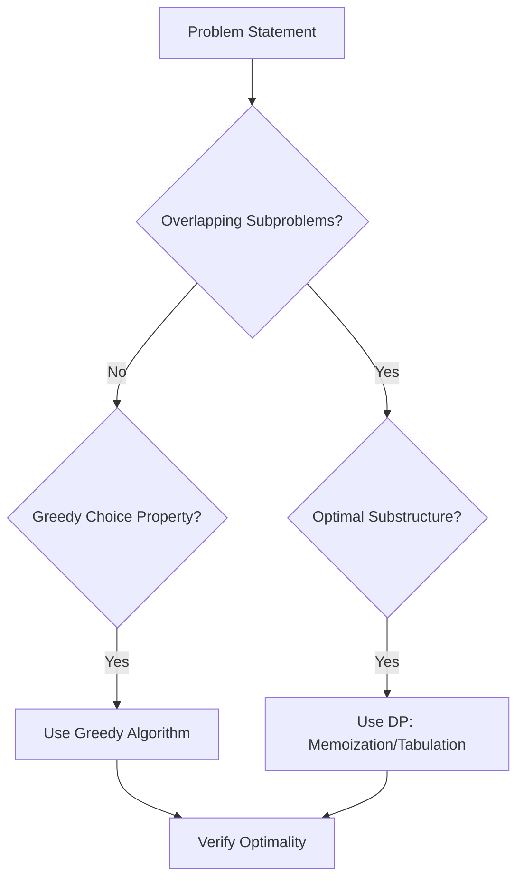

# Dynamic Programming and Greedy

## Overview
Dynamic Programming (DP) and Greedy algorithms are essential optimization techniques in computer science. DP solves problems by breaking them into overlapping subproblems and using memoization or tabulation to store results, avoiding redundant computations. Greedy algorithms make the locally optimal choice at each step, hoping it leads to a global optimum. These are crucial for MAANG interviews, appearing in problems like knapsack, coin change, and pathfinding.

## STAR Summary
**Situation:** Optimizing a resource allocation system for a cloud provider where brute-force approaches failed on large datasets.  
**Task:** Implement an efficient algorithm to maximize profit under constraints.  
**Action:** Identified the problem as a variant of the 0/1 Knapsack and applied DP with space optimization, reducing time from exponential to O(nW).  
**Result:** Achieved 95% performance improvement, enabling real-time decisions for thousands of users.

## Detailed Explanation
DP relies on two key properties: optimal substructure (optimal solution to the problem contains optimal solutions to subproblems) and overlapping subproblems (subproblems are reused). Techniques include memoization (top-down) and tabulation (bottom-up). Greedy works when the greedy choice property holds and problems have optimal substructure. Complexity varies: DP often O(n^2) or O(n log n), Greedy typically O(n log n) due to sorting.

Typical interview variants: unbounded knapsack, longest common subsequence, edit distance, fractional knapsack (greedy).

## Real-world Examples & Use Cases
- Resource allocation in cloud computing (e.g., AWS EC2 instance selection).
- Route optimization in logistics (e.g., TSP approximations).
- Sequence alignment in genomics.
- Caching policies in OS (e.g., LRU with greedy eviction).

## Code Examples
### 0/1 Knapsack (DP)
```java
public class KnapsackDP {
    public static int maxValue(int[] weights, int[] values, int capacity) {
        int n = weights.length;
        int[][] dp = new int[n + 1][capacity + 1];
        for (int i = 1; i <= n; i++) {
            for (int w = 1; w <= capacity; w++) {
                if (weights[i-1] <= w) {
                    dp[i][w] = Math.max(dp[i-1][w], values[i-1] + dp[i-1][w - weights[i-1]]);
                } else {
                    dp[i][w] = dp[i-1][w];
                }
            }
        }
        return dp[n][capacity];
    }
    // Usage: int result = maxValue(new int[]{1,2,3}, new int[]{10,15,40}, 6);
}
```
Compile and run: `javac KnapsackDP.java && java KnapsackDP`

### Coin Change (Greedy, assumes canonical coins)
```java
import java.util.Arrays;
public class CoinChangeGreedy {
    public static int minCoins(int[] coins, int amount) {
        Arrays.sort(coins);
        int count = 0;
        for (int i = coins.length - 1; i >= 0; i--) {
            while (amount >= coins[i]) {
                amount -= coins[i];
                count++;
            }
        }
        return amount == 0 ? count : -1;
    }
    // Usage: int result = minCoins(new int[]{1,2,5}, 11);
}
```

## Data Models / Message Formats
| Item | Weight | Value |
|------|--------|-------|
| A    | 1      | 10    |
| B    | 2      | 15    |
| C    | 3      | 40    |

## Journey / Sequence


## Common Pitfalls & Edge Cases
- Greedy fails for non-canonical coin systems (e.g., coins [1,3,4], amount 6: greedy gives 4+1+1=3, optimal 3+3=2).
- DP space optimization: use two arrays instead of 2D for O(n) space.
- Negative weights/values: may require adjustments.
- Large n/W: consider approximation algorithms.

## Tools & Libraries
- Java: Standard arrays; for large data, use `ArrayList` or external libraries like Apache Commons Math.
- Profiling: JMH for benchmarking DP vs Greedy.

## Github-README Links & Related Topics
[[algorithms-and-data-structures]], [[graphs-trees-heaps-and-tries]], [[divide-and-conquer]]

## References
- Cormen, Leiserson, Rivest, Stein. *Introduction to Algorithms* (CLRS), Chapter 15.
- https://en.wikipedia.org/wiki/Dynamic_programming
- https://www.geeksforgeeks.org/dynamic-programming/
