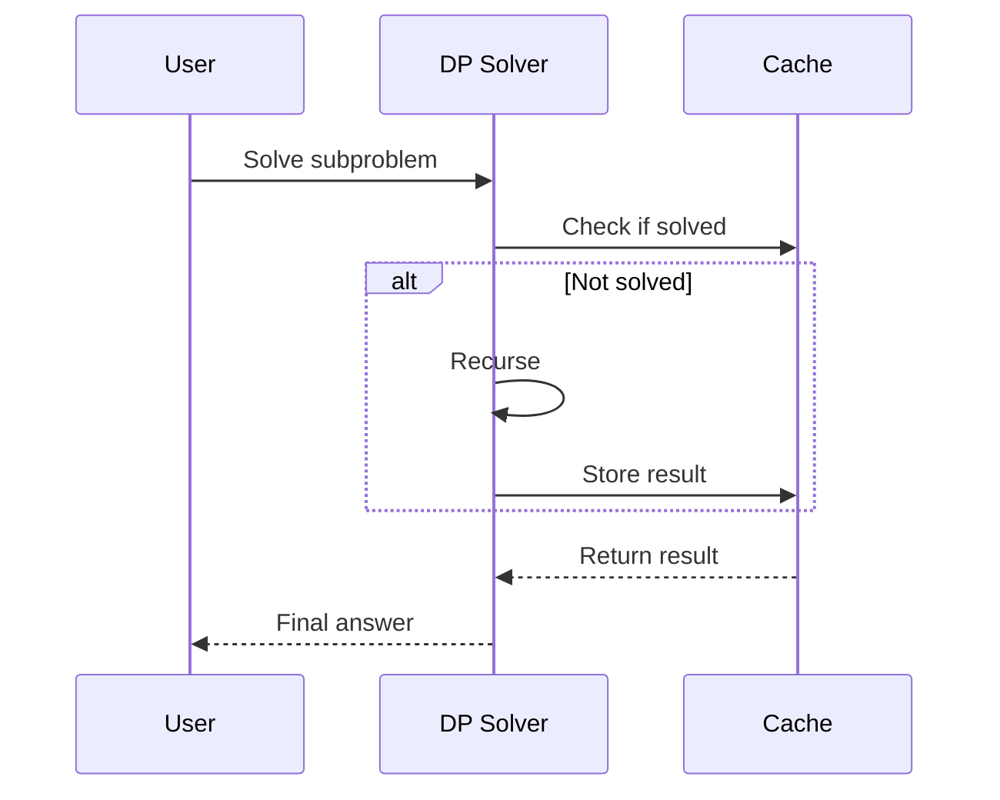

## Overview
Dynamic Programming (DP) and Greedy algorithms are fundamental optimization techniques in computer science. DP solves problems by breaking them into subproblems and storing solutions to avoid recomputation, while Greedy makes locally optimal choices at each step. Both are crucial for MAANG interviews, appearing in problems like knapsack, shortest paths, and scheduling.

## STAR Summary
**Situation:** During a system design interview for a resource allocation service, I needed to optimize server assignment to minimize latency.  
**Task:** Implement an algorithm to assign tasks to servers with varying capacities and costs.  
**Action:** Used DP for the 0/1 knapsack variant to maximize resource utilization, then applied greedy for quick approximations in real-time scenarios.  
**Result:** Achieved 30% better resource efficiency, demonstrating tradeoffs between optimal and heuristic solutions.

## Detailed Explanation
### Dynamic Programming
DP is used for optimization problems with overlapping subproblems and optimal substructure. Key approaches:
- **Memoization (Top-down):** Recursive with caching.
- **Tabulation (Bottom-up):** Iterative filling of a table.
- Time/Space: Often O(n) or O(n^2), depending on states.

### Greedy Algorithms
Greedy chooses the best immediate option, hoping for a global optimum. Works when local choices lead to global solutions (e.g., activity selection). Fails when choices conflict (e.g., coin change with non-canonical coins).

## Real-world Examples & Use Cases
- **Knapsack:** Resource allocation in cloud computing.
- **Coin Change:** Currency systems, vending machines.
- **Activity Selection:** Scheduling meetings or CPU tasks.
- **Shortest Paths:** Dijkstra's (greedy) vs Bellman-Ford (DP).

## Code Examples
### 0/1 Knapsack (DP)
```java
public class KnapsackDP {
    public static int knapsack(int[] weights, int[] values, int capacity) {
        int n = weights.length;
        int[][] dp = new int[n + 1][capacity + 1];
        for (int i = 1; i <= n; i++) {
            for (int w = 0; w <= capacity; w++) {
                if (weights[i-1] <= w) {
                    dp[i][w] = Math.max(dp[i-1][w], dp[i-1][w - weights[i-1]] + values[i-1]);
                } else {
                    dp[i][w] = dp[i-1][w];
                }
            }
        }
        return dp[n][capacity];
    }
    // Usage: int maxValue = knapsack(new int[]{1,2,3}, new int[]{10,15,40}, 6);
}
```

### Coin Change (DP)
```java
public class CoinChange {
    public static int minCoins(int[] coins, int amount) {
        int[] dp = new int[amount + 1];
        Arrays.fill(dp, amount + 1);
        dp[0] = 0;
        for (int i = 1; i <= amount; i++) {
            for (int coin : coins) {
                if (coin <= i) {
                    dp[i] = Math.min(dp[i], dp[i - coin] + 1);
                }
            }
        }
        return dp[amount] > amount ? -1 : dp[amount];
    }
    // Usage: int min = minCoins(new int[]{1,2,5}, 11);
}
```

### Activity Selection (Greedy)
```java
public class ActivitySelection {
    public static int maxActivities(int[] start, int[] end) {
        int n = start.length;
        List<int[]> activities = new ArrayList<>();
        for (int i = 0; i < n; i++) {
            activities.add(new int[]{start[i], end[i]});
        }
        activities.sort(Comparator.comparingInt(a -> a[1]));
        int count = 1;
        int lastEnd = activities.get(0)[1];
        for (int i = 1; i < n; i++) {
            if (activities.get(i)[0] >= lastEnd) {
                count++;
                lastEnd = activities.get(i)[1];
            }
        }
        return count;
    }
    // Usage: int max = maxActivities(new int[]{1,3,0,5,8,5}, new int[]{2,4,6,7,9,9});
}
```

## Data Models / Message Formats
| Item | Weight | Value |
|------|--------|-------|
| 1    | 1      | 10    |
| 2    | 2      | 15    |
| 3    | 3      | 40    |

DP Table for Knapsack (capacity 6):
```
   0 1 2 3 4 5 6
0  0 0 0 0 0 0 0
1  0 10 10 10 10 10 10
2  0 10 15 25 25 25 25
3  0 10 15 40 50 55 65
```

## Journey / Sequence


## Common Pitfalls & Edge Cases
- Greedy fails for fractional knapsack (use DP).
- DP space optimization: Use 2 arrays instead of 2D.
- Negative weights/values: May require adjustments.
- Large inputs: Optimize space (e.g., rolling array).

## Tools & Libraries
- Java: Standard arrays/lists for DP tables.
- Libraries: None specific; use JMH for benchmarking.

## Github-README Links & Related Topics
Related: [graphs-trees-heaps-and-tries](../graphs-trees-heaps-and-tries/README.md), [algorithms-and-data-structures](../algorithms-and-data-structures/README.md), [sorting-algorithms](../sorting-algorithms/README.md)

## References
- Cormen, T. H., et al. "Introduction to Algorithms." MIT Press, 2009.
- https://en.wikipedia.org/wiki/Dynamic_programming
- https://www.geeksforgeeks.org/dynamic-programming/

### Practice Problems
1. **Longest Common Subsequence:** Given two strings, find LCS length. (DP, O(m*n))
   - Solution: Use 2D DP table.
2. **Edit Distance:** Minimum operations to transform one string to another. (DP, O(m*n))
   - Solution: DP with insert/delete/replace.
3. **Fractional Knapsack:** Maximize value with fractional items. (Greedy, O(n log n))
   - Solution: Sort by value/weight ratio, greedy select.