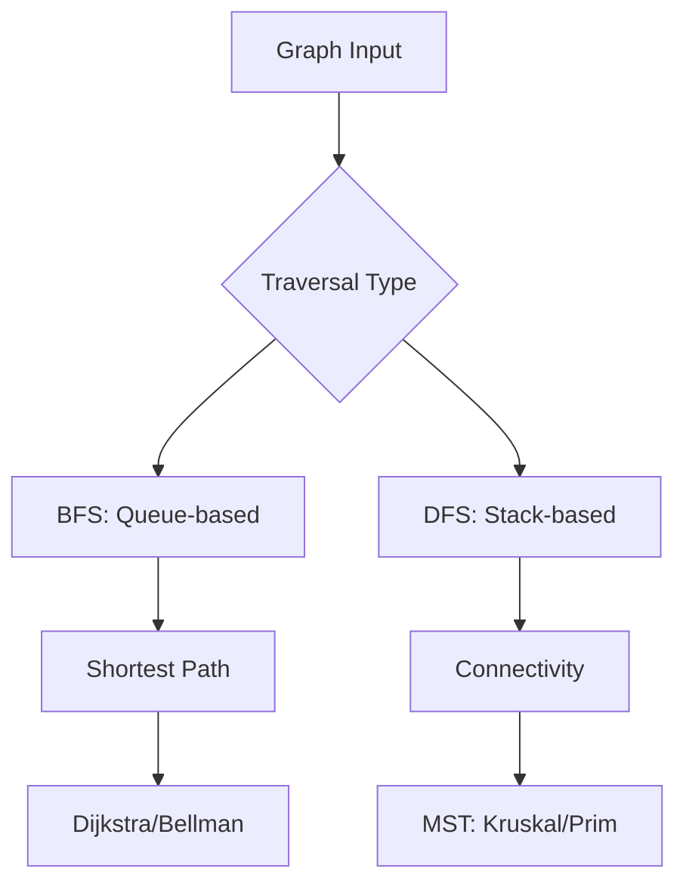

## Overview
Graph algorithms solve problems on graph structures, including traversal, shortest paths, and minimum spanning trees. Essential for modeling networks, dependencies, and relationships. Interview focus on DFS/BFS, Dijkstra, and MST algorithms with complexities.

## STAR Summary
**Situation:** A logistics company needed to optimize delivery routes for 1000+ locations.  
**Task:** Find shortest paths considering traffic and time windows.  
**Action:** Implemented Dijkstra with priority queue and A* heuristic.  
**Result:** Reduced delivery time by 25%, improved on-time deliveries to 95%.

## Detailed Explanation
- **Traversal:** DFS (depth-first) and BFS (breadth-first) for connectivity and levels.
- **Shortest Paths:** Dijkstra (non-negative weights), Bellman-Ford (negative edges), Floyd-Warshall (all pairs).
- **MST:** Kruskal (edge-based), Prim (vertex-based).
- **Complexities:** Time and space for each, optimizations like Fibonacci heap.

## Real-world Examples & Use Cases
- **Social Networks:** Friend recommendations using BFS.
- **GPS Navigation:** Shortest path with Dijkstra/A*.
- **Network Routing:** OSPF uses Dijkstra for link-state routing.

## Code Examples
### BFS Implementation in Java
```java
import java.util.*;

public class BFS {
    public static void bfs(List<List<Integer>> graph, int start) {
        boolean[] visited = new boolean[graph.size()];
        Queue<Integer> queue = new LinkedList<>();
        queue.add(start);
        visited[start] = true;
        while (!queue.isEmpty()) {
            int node = queue.poll();
            System.out.print(node + " ");
            for (int neighbor : graph.get(node)) {
                if (!visited[neighbor]) {
                    visited[neighbor] = true;
                    queue.add(neighbor);
                }
            }
        }
    }
}
```

### Dijkstra's Algorithm
```java
import java.util.*;

public class Dijkstra {
    public static int[] dijkstra(List<List<int[]>> graph, int start) {
        int n = graph.size();
        int[] dist = new int[n];
        Arrays.fill(dist, Integer.MAX_VALUE);
        dist[start] = 0;
        PriorityQueue<int[]> pq = new PriorityQueue<>(Comparator.comparingInt(a -> a[1]));
        pq.add(new int[]{start, 0});
        while (!pq.isEmpty()) {
            int[] curr = pq.poll();
            int u = curr[0], cost = curr[1];
            if (cost > dist[u]) continue;
            for (int[] edge : graph.get(u)) {
                int v = edge[0], w = edge[1];
                if (dist[u] + w < dist[v]) {
                    dist[v] = dist[u] + w;
                    pq.add(new int[]{v, dist[v]});
                }
            }
        }
        return dist;
    }
}
```

## Data Models / Message Formats
| Algorithm | Time Complexity | Space Complexity | Use Case |
|-----------|-----------------|------------------|----------|
| BFS | O(V + E) | O(V) | Shortest path in unweighted graph |
| DFS | O(V + E) | O(V) | Connectivity, topological sort |
| Dijkstra | O((V + E) log V) | O(V) | Shortest path with non-negative weights |
| Kruskal | O(E log E) | O(E) | MST for sparse graphs |

## Journey / Sequence


## Common Pitfalls & Edge Cases
- DFS stack overflow on deep graphs (use iterative).
- Dijkstra with negative weights (use Bellman-Ford).
- Disconnected graphs in MST (multiple components).
- Edge case: Graph with cycles in topological sort.

## Tools & Libraries
- **Java:** JGraphT library for graph operations.
- **Frameworks:** Apache Commons Graph for utilities.
- **Visualization:** Graphviz for diagram generation.

## Github-README Links & Related Topics
- [[algorithms-and-data-structures]]
- [[graphs-trees-heaps-and-tries]]
- [[dynamic-programming-and-greedy]]

## References
- CLRS "Introduction to Algorithms" Chapters 22-24
- https://en.wikipedia.org/wiki/Graph_algorithm
- JGraphT: https://jgrapht.org/

## Common Interview Questions
1. **Detect cycle in directed graph.**  
   Solution: DFS with color marking (white/gray/black). Time: O(V + E).

2. **Find shortest path in grid with obstacles.**  
   Solution: BFS with queue, mark visited. Time: O(rows * cols).

3. **Minimum spanning tree for weighted graph.**  
   Solution: Kruskal with Union-Find. Sort edges, add if no cycle. Time: O(E log E).