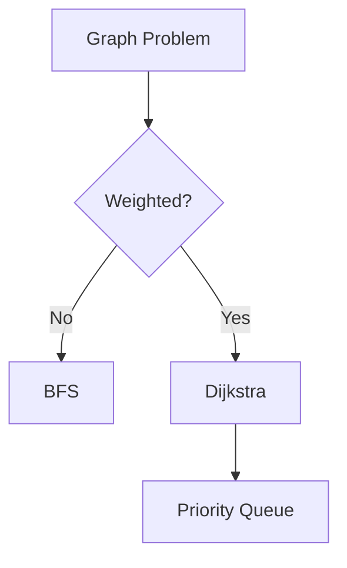

# Graphs Trees Heaps and Tries

## Overview

Advanced data structures like graphs, trees, heaps, and tries are key for complex problems. This covers representations, algorithms, and applications.

## STAR Summary

**Situation:** Routing algorithm was slow for large networks.

**Task:** Implement efficient shortest path.

**Action:** Used Dijkstra with priority queue (heap).

**Result:** Performance improved from O(n^2) to O((V+E) log V).

## Detailed Explanation

### Graphs

- Representations: Adjacency list (space-efficient), matrix (dense).
- Algorithms: BFS (unweighted shortest path), DFS (traversal), Dijkstra (weighted), Bellman-Ford (negative weights).

### Trees

- Binary Tree: Traversals (inorder, preorder).
- BST: O(log n) insert/search.
- Balanced: AVL, Red-Black.

### Heaps

- Max/Min heap: Complete binary tree.
- Operations: Insert O(log n), extract max O(log n).
- Heap sort: O(n log n).

### Tries

- Prefix tree for strings.
- Insert/search O(m), m = key length.

## Real-world Examples & Use Cases

- Social networks: Graph for friends.
- File systems: Tries for autocomplete.
- Scheduling: Heaps for priority queues.

## Code Examples

### Dijkstra

```java
import java.util.*;

public class Dijkstra {
    public int[] shortestPath(int[][] graph, int src) {
        int n = graph.length;
        int[] dist = new int[n];
        Arrays.fill(dist, Integer.MAX_VALUE);
        dist[src] = 0;
        PriorityQueue<int[]> pq = new PriorityQueue<>((a,b)->a[1]-b[1]);
        pq.add(new int[]{src, 0});
        while (!pq.isEmpty()) {
            int[] curr = pq.poll();
            int u = curr[0], d = curr[1];
            if (d > dist[u]) continue;
            for (int v = 0; v < n; v++) {
                if (graph[u][v] > 0 && dist[u] + graph[u][v] < dist[v]) {
                    dist[v] = dist[u] + graph[u][v];
                    pq.add(new int[]{v, dist[v]});
                }
            }
        }
        return dist;
    }
}
```

## Data Models / Message Formats

Graph:

```java
class Graph {
    List<List<Integer>> adj;
    Graph(int n) { adj = new ArrayList<>(); for(int i=0;i<n;i++) adj.add(new ArrayList<>()); }
    void addEdge(int u, int v) { adj.get(u).add(v); }
}
```

## Journey / Sequence



## Common Pitfalls & Edge Cases

- Negative cycles in graphs.
- Unbalanced BST leading to O(n) worst case.
- Heap underflow.

## Tools & Libraries

- Java: PriorityQueue for heaps.

## Github-README Links & Related Topics

[[algorithms-and-data-structures]], [[dynamic-programming-and-greedy]]

## References

- https://en.wikipedia.org/wiki/Dijkstra%27s_algorithm

### Common Interview Questions

1. Shortest Path in Graph: Dijkstra, O((V+E) log V).

2. Valid BST: Inorder traversal should be sorted.

3. Heapify: Build heap in O(n).
</content>
</xai:function_call name="edit">
<parameter name="filePath">README.md