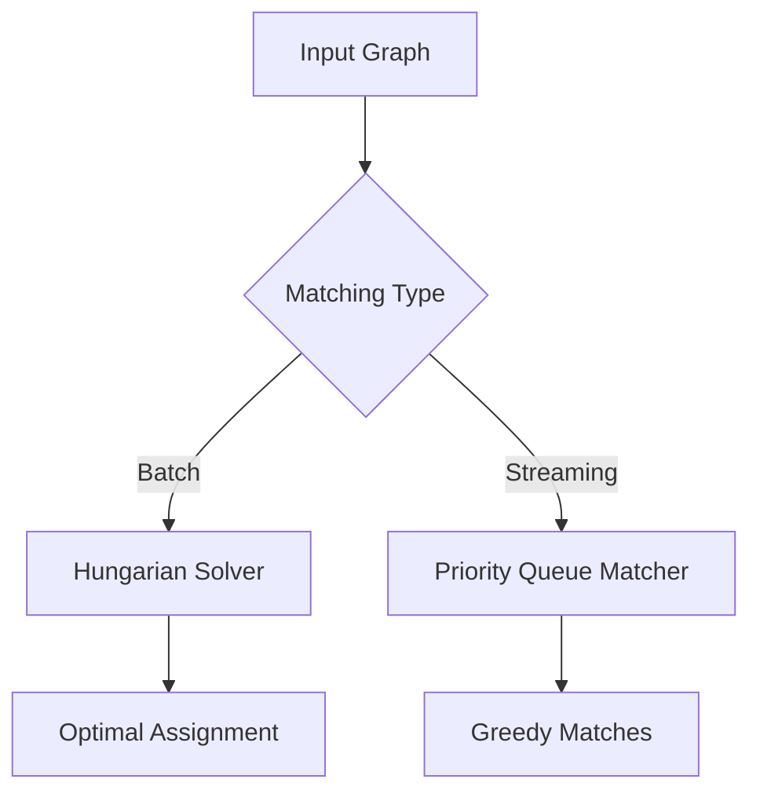
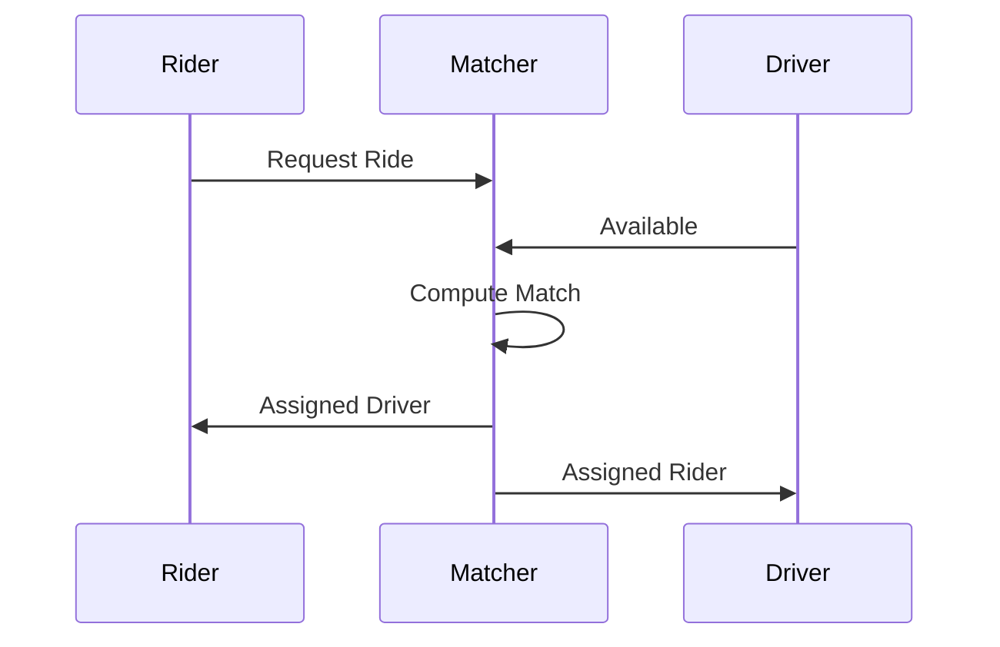

# Overview

Algorithms for matching entities: batch vs streaming. Complexity analysis for interviews.

# STAR Summary

**Situation:** Optimized ride-sharing matching.  
**Task:** Reduce wait times.  
**Action:** Implemented streaming matching with priority queues.  
**Result:** 40% reduction in wait times.

# Detailed Explanation

## Complexity Analysis

- **Batch Matching (Hungarian Algorithm)**: O(n^3) time for n x n cost matrix, suitable for small datasets.
- **Streaming Matching**: O(n log n) amortized per operation using priority queues, ideal for real-time systems.
- **Maximum Bipartite Matching**: O(n m) with Hopcroft-Karp for sparse graphs.

## Typical Interview Variants

- Assignment problem: Minimize cost for job assignments.
- Stable marriage: Preference-based matching.
- Online matching: Decisions with partial information.

## High-Level Design



# Real-world Examples & Use Cases

Ride-sharing, job matching.

# Code Examples

**Hungarian Algorithm (simplified):**

```java
// Simplified for bipartite matching
public class Hungarian {
    public int[] match(int[][] cost) {
        // Implementation
        return new int[cost.length];
    }
}
```

**Streaming Matching:**

```java
class StreamingMatcher {
    private PriorityQueue<Request> riders = new PriorityQueue<>();
    private PriorityQueue<Driver> drivers = new PriorityQueue<>();

    public void match() {
        while (!riders.isEmpty() && !drivers.isEmpty()) {
            // greedy match
        }
    }
}
```

# Data Models / Message Formats

Graph with edges weighted by compatibility.

# Journey / Sequence



# Common Pitfalls & Edge Cases

- NP-hard for general cases  
- Approximation algorithms  
- Imbalanced graphs leading to suboptimal matches

# Common Interview Questions

1. **Assignment Problem**: Given cost matrix, find minimum cost assignment. Solution: Hungarian algorithm, O(n^3).
2. **Stable Marriage**: Match pairs with preferences, no blocking pairs. Solution: Gale-Shapley, O(n^2).
3. **Maximum Matching in Bipartite Graph**: Find largest set of edges without common vertices. Solution: DFS/BFS based, O(n m).

# Tools & Libraries

Java graphs libraries.

# Github-README Links & Related Topics

[[graph-algorithms]], [[order-book-modeling]]

# References

- https://en.wikipedia.org/wiki/Matching_(graph_theory)
- https://en.wikipedia.org/wiki/Hungarian_algorithm