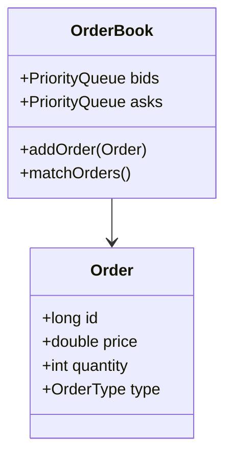
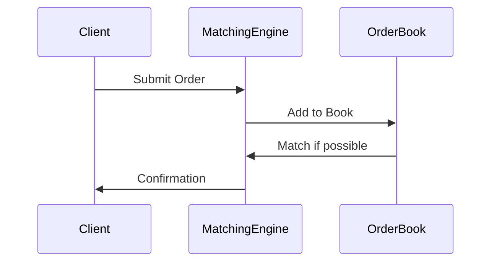

# Overview

Order book models for financial trading systems. In-memory data structures for bids/asks, persistence strategies.

# STAR Summary

**Situation:** Built matching engine for crypto exchange.  
**Task:** Handle high-frequency orders with low latency.  
**Action:** Implemented priority queues for order book.  
**Result:** Processed 10k orders/sec with <1ms latency.

# Detailed Explanation

## Complexity Analysis

- Insertion/Deletion: O(log n) with priority queues or balanced trees.
- Matching: O(n) in worst case for full traversal, but optimized with heaps.
- Persistence: O(log n) for updates in LSM trees or B-trees.

## Typical Interview Variants

- Limit orders: Price-specific.
- Market orders: Immediate execution.
- Stop orders: Triggered at price levels.

## High-Level Design



# Real-world Examples & Use Cases

- **Stock Exchanges (e.g., NYSE, NASDAQ):** Maintain centralized order books for equities, handling millions of orders daily with price-time priority to ensure fair execution.
- **Cryptocurrency Platforms (e.g., Binance, Coinbase):** Use order books for spot and futures trading, supporting high-frequency trading with sub-millisecond matching.
- **Options Trading:** Complex order books for derivatives, incorporating strike prices and expiration dates.
- **Dark Pools:** Private order books for institutional trading to minimize market impact.

# Code Examples

**Java Order Book with PriorityQueue:**

```java
import java.util.*;

class OrderBook {
    private PriorityQueue<Order> bids = new PriorityQueue<>((a,b) -> Double.compare(b.price, a.price));
    private PriorityQueue<Order> asks = new PriorityQueue<>(Comparator.comparingDouble(a -> a.price));

    public void addOrder(Order order) {
        if (order.type == OrderType.BUY) {
            bids.add(order);
        } else {
            asks.add(order);
        }
    }

    public void match() {
        while (!bids.isEmpty() && !asks.isEmpty() && bids.peek().price >= asks.peek().price) {
            // match logic
        }
    }
}
```

**Python Order Book with heapq:**

```python
import heapq

class OrderBook:
    def __init__(self):
        self.bids = []  # max-heap for bids (use negative prices)
        self.asks = []  # min-heap for asks

    def add_bid(self, price, qty):
        heapq.heappush(self.bids, (-price, qty))

    def add_ask(self, price, qty):
        heapq.heappush(self.asks, (price, qty))

    def match(self):
        while self.bids and self.asks and -self.bids[0][0] >= self.asks[0][0]:
            bid_price, bid_qty = heapq.heappop(self.bids)
            ask_price, ask_qty = heapq.heappop(self.asks)
            # match logic
```

# Data Models / Message Formats

| Field | Type | Description |
|-------|------|-------------|
| id | long | Order ID |
| price | double | Price |
| quantity | int | Quantity |
| type | enum | BUY/SELL |

# Journey / Sequence



# Common Pitfalls & Edge Cases

- Price-time priority  
- Partial fills  
- Market orders  
- High-frequency updates causing contention

# Common Interview Questions

1. **Implement Order Book**: Use two heaps for bids/asks, handle add/match. Test with sample orders.
2. **Matching Engine**: Process orders, handle partial fills, update quantities.
3. **Persistence Strategy**: Design for crash recovery, use WAL and snapshots.

# Tools & Libraries

Java PriorityQueue, custom heaps.

# Github-README Links & Related Topics

- [Graphs Trees Heaps and Tries](algorithms/graphs-trees-heaps-and-tries/README.md)
- [Matching Algorithms](algorithms/matching-algorithms/README.md)

# References

- https://en.wikipedia.org/wiki/Order_book
- https://www.investopedia.com/terms/o/order-book.asp