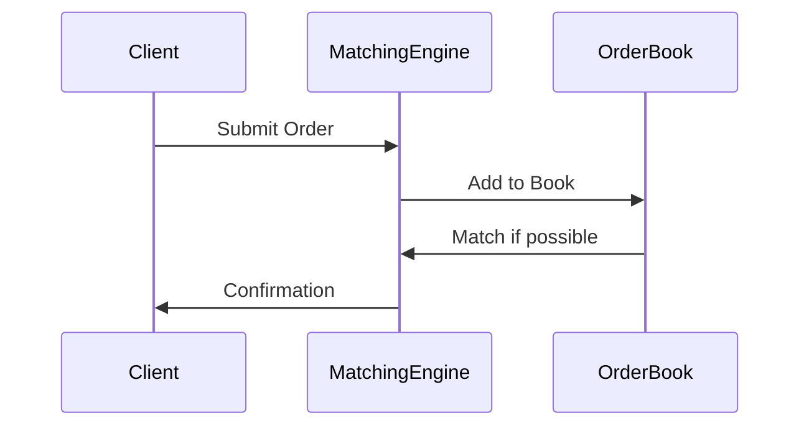

# Overview

Order book models for financial trading systems. In-memory data structures for bids/asks, persistence strategies.

# STAR Summary

**Situation:** Built matching engine for crypto exchange.  
**Task:** Handle high-frequency orders with low latency.  
**Action:** Implemented priority queues for order book.  
**Result:** Processed 10k orders/sec with <1ms latency.

# Detailed Explanation

Order book: Sorted bids (buy) and asks (sell). Use heaps or trees for efficient insertion/deletion.

# Real-world Examples & Use Cases

Stock exchanges, crypto platforms.

# Code Examples

**Java Order Book with PriorityQueue:**

```java
import java.util.*;

class OrderBook {
    private PriorityQueue<Order> bids = new PriorityQueue<>((a,b) -> Double.compare(b.price, a.price));
    private PriorityQueue<Order> asks = new PriorityQueue<>(Comparator.comparingDouble(a -> a.price));

    public void addOrder(Order order) {
        if (order.type == OrderType.BUY) {
            bids.add(order);
        } else {
            asks.add(order);
        }
    }

    public void match() {
        while (!bids.isEmpty() && !asks.isEmpty() && bids.peek().price >= asks.peek().price) {
            // match logic
        }
    }
}
```

# Data Models / Message Formats

| Field | Type | Description |
|-------|------|-------------|
| id | long | Order ID |
| price | double | Price |
| quantity | int | Quantity |
| type | enum | BUY/SELL |

# Journey / Sequence



# Common Pitfalls & Edge Cases

- Price-time priority  
- Partial fills  
- Market orders

# Tools & Libraries

Java PriorityQueue, custom heaps.

# Github-README Links & Related Topics

[[graphs-trees-heaps-and-tries]], [[matching-algorithms]]

# References

- https://en.wikipedia.org/wiki/Order_book
- https://www.investopedia.com/terms/o/order-book.asp