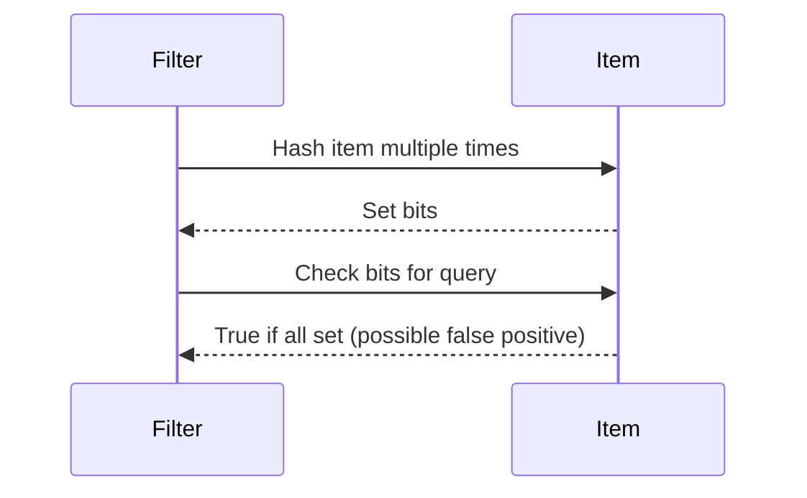

## Overview
Probabilistic algorithms use randomness to achieve efficiency or simplicity, often with high probability of correctness. They include Monte Carlo (may be wrong) and Las Vegas (always correct, variable time). Common in data structures like Bloom filters for space-efficient membership testing.

## STAR Summary
**Situation:** Checking membership in a large set (1B items) with limited memory.  
**Task:** Implement fast lookups with low false positives.  
**Action:** Used Bloom filter, a probabilistic data structure.  
**Result:** 99% accuracy with 10x less memory than a hash set.

## Detailed Explanation
- **Bloom Filter:** Space-efficient set with false positives; uses hash functions and bit array.
- **Skip List:** Probabilistic balanced BST with expected O(log N) operations.
- **Randomized Quickselect:** Expected linear time for selection.

## Real-world Examples & Use Cases
- Bloom filters in databases for cache checks.
- Skip lists in Redis sorted sets.
- Randomized algorithms in cryptography.

## Code Examples
### Simple Bloom Filter in Java
```java
import java.util.BitSet;

public class BloomFilter {
    private BitSet bits;
    private int size;
    private int[] hashes;

    public BloomFilter(int size, int hashCount) {
        this.size = size;
        bits = new BitSet(size);
        hashes = new int[hashCount];
        // Initialize hashes
    }

    public void add(String item) {
        for (int i = 0; i < hashes.length; i++) {
            int hash = (item.hashCode() + i * 31) % size;
            bits.set(hash);
        }
    }

    public boolean mightContain(String item) {
        for (int i = 0; i < hashes.length; i++) {
            int hash = (item.hashCode() + i * 31) % size;
            if (!bits.get(hash)) return false;
        }
        return true;
    }
}
```

Compile and run: `javac BloomFilter.java`

## Data Models / Message Formats
| Field | Type | Description |
|-------|------|-------------|
| bits | BitSet | Bit array for storage |
| size | int | Filter size |
| hashes | int[] | Number of hash functions |

## Journey / Sequence


## Common Pitfalls & Edge Cases
- False positives; tune hash count and size.
- No deletions in basic Bloom filter.
- Memory vs accuracy trade-off.

## Tools & Libraries
- Guava BloomFilter in Java.
- Redis for skip lists.

## Github-README Links & Related Topics
Related: [[data-structures-advanced]], [[bit-manipulation]], [[caching-strategies]]

## References
- https://en.wikipedia.org/wiki/Bloom_filter
- "Probabilistic Data Structures" articles
- MIT OCW: Randomized Algorithms

### Practice Problems
1. **Implement Bloom Filter**: Add and check membership. - Space: O(M), Time: O(K)
2. **Skip List Insertion**: Insert into skip list. (LeetCode variant) - Expected O(log N)
3. **Randomized Select**: Find kth element. (LeetCode 215) - Expected O(N)