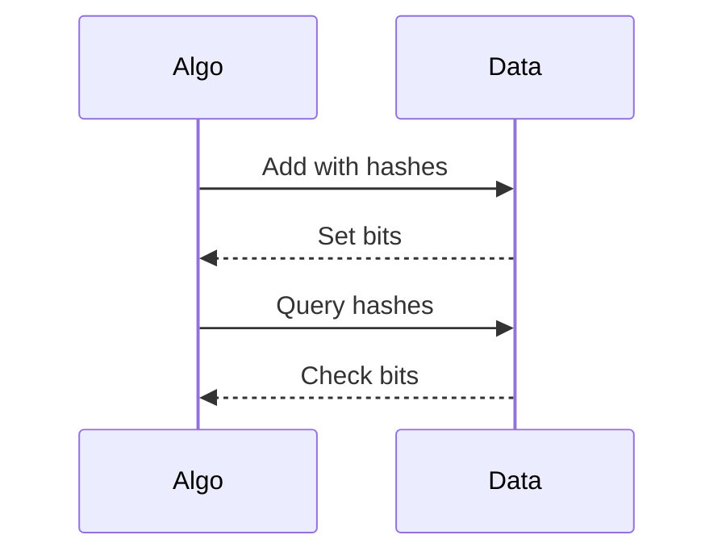

# Overview
Probabilistic algorithms use randomness to solve problems efficiently, often with high probability of correctness. Types: Monte Carlo (fast but may err), Las Vegas (correct but variable time). Key structures: Bloom filters for membership, skip lists for ordered data.

Used when deterministic algorithms are too slow or space-intensive.

# STAR Summary
**Situation:** Database with 1B URLs, need fast duplicate checks.  
**Task:** Check membership with <1GB memory.  
**Action:** Implemented Bloom filter.  
**Result:** 1% false positives, 10x space savings.

# Detailed Explanation
- **Bloom Filter:** Bit array + hash functions. Add: set bits; Check: if all set (may false positive).
- **Skip List:** Linked list with levels, random promotions. Expected O(log N) ops.
- **Randomized Select:** Quickselect with random pivot.

Probability: Tune for desired error rates.

## Real-world Examples & Use Cases
- Bloom filters in Chrome for malware checks.
- Skip lists in ConcurrentSkipListMap.
- Randomized in cryptography.

## Code Examples
### Bloom Filter
```java
import java.util.BitSet;
import java.util.Random;

public class BloomFilter {
    private BitSet bits;
    private int size;
    private int hashCount;
    private Random rand = new Random();

    public BloomFilter(int expectedItems, double falsePositiveRate) {
        size = (int) (-expectedItems * Math.log(falsePositiveRate) / (Math.log(2) * Math.log(2)));
        hashCount = (int) (size * Math.log(2) / expectedItems);
        bits = new BitSet(size);
    }

    public void add(String item) {
        for (int i = 0; i < hashCount; i++) {
            int hash = hash(item, i);
            bits.set(hash);
        }
    }

    public boolean mightContain(String item) {
        for (int i = 0; i < hashCount; i++) {
            int hash = hash(item, i);
            if (!bits.get(hash)) return false;
        }
        return true;
    }

    private int hash(String item, int seed) {
        return Math.abs((item.hashCode() + seed * 31) % size);
    }
}
```

Compile: `javac BloomFilter.java`

### Skip List
```java
import java.util.Random;

public class SkipList {
    private Node head;
    private int maxLevel;
    private Random rand = new Random();

    static class Node {
        int val;
        Node[] next;
        Node(int val, int level) { this.val = val; next = new Node[level]; }
    }

    public SkipList() {
        head = new Node(Integer.MIN_VALUE, 16);
        maxLevel = 16;
    }

    public void insert(int val) {
        Node[] update = new Node[maxLevel];
        Node curr = head;
        for (int i = maxLevel - 1; i >= 0; i--) {
            while (curr.next[i] != null && curr.next[i].val < val) curr = curr.next[i];
            update[i] = curr;
        }
        int level = randomLevel();
        Node newNode = new Node(val, level);
        for (int i = 0; i < level; i++) {
            newNode.next[i] = update[i].next[i];
            update[i].next[i] = newNode;
        }
    }

    private int randomLevel() {
        int level = 1;
        while (rand.nextDouble() < 0.5 && level < maxLevel) level++;
        return level;
    }
}
```

# Data Models / Message Formats
| Field | Type | Description |
|-------|------|-------------|
| bits | BitSet | Bit array |
| head | Node | Skip list head |
| level | int | Node level |

## Journey / Sequence


## Common Pitfalls & Edge Cases
- False positives in Bloom.
- No deletions.
- Tune parameters.

# Tools & Libraries
- Guava BloomFilter.
- Java ConcurrentSkipListMap.

## Github-README Links & Related Topics
Related: [data-structures-advanced](../data-structures-advanced/), [bit-manipulation](../bit-manipulation/), [caching-patterns](../../system-design/caching-patterns/)

## References
- https://en.wikipedia.org/wiki/Bloom_filter
- "Probabilistic Data Structures" by Durand and Flajolet
- MIT OCW

### Practice Problems
1. **Bloom Filter Implementation**: Add/check. Space: O(M)
2. **Skip List Search**: Find element. Expected O(log N)
3. **Randomized Quickselect**: Kth element. Expected O(N)

### Common Interview Questions
- How does Bloom filter work?
- Trade-offs in probabilistic structures?