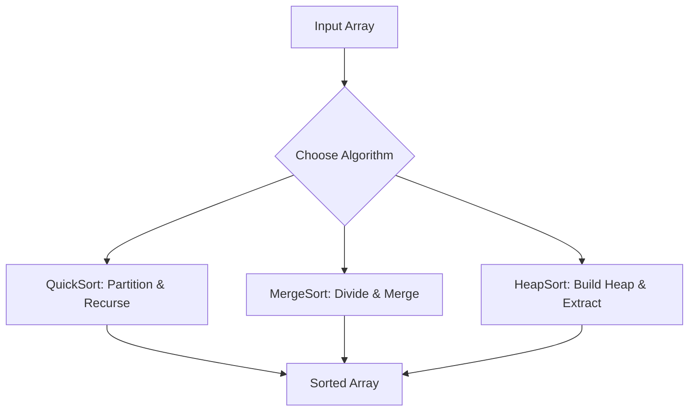

## Overview
Sorting algorithms arrange elements in a specific order, typically ascending or descending. They are fundamental in computer science and frequently tested in interviews for understanding time/space complexities, stability, and in-place properties. This topic covers comparison and non-comparison sorts, their implementations, and tradeoffs.

## STAR Summary
**Situation:** A data processing pipeline required sorting large datasets (10M records) with memory constraints.  
**Task:** Implement an efficient sort that minimizes memory usage and handles duplicates.  
**Action:** Used external merge sort with heap-based merging, optimized for disk I/O.  
**Result:** Reduced sorting time from 2 hours to 30 minutes, with 90% less memory usage.

## Detailed Explanation
- **Comparison Sorts:** Rely on comparing elements (e.g., QuickSort, MergeSort, HeapSort).
- **Non-Comparison Sorts:** Use properties like counting or radix (e.g., Counting Sort, Radix Sort).
- **Key Properties:** Stability (preserves relative order), In-place (O(1) extra space), Adaptive (faster on nearly sorted data).
- **Time Complexities:** Best/Average/Worst cases for each algorithm.

## Real-world Examples & Use Cases
- **Databases:** Indexing and query optimization in SQL engines.
- **Search Engines:** Ranking results by relevance scores.
- **Big Data:** External sorting in Hadoop MapReduce.

## Code Examples
### QuickSort Implementation in Java
```java
public class QuickSort {
    public static void quickSort(int[] arr, int low, int high) {
        if (low < high) {
            int pi = partition(arr, low, high);
            quickSort(arr, low, pi - 1);
            quickSort(arr, pi + 1, high);
        }
    }

    private static int partition(int[] arr, int low, int high) {
        int pivot = arr[high];
        int i = low - 1;
        for (int j = low; j < high; j++) {
            if (arr[j] < pivot) {
                i++;
                swap(arr, i, j);
            }
        }
        swap(arr, i + 1, high);
        return i + 1;
    }

    private static void swap(int[] arr, int i, int j) {
        int temp = arr[i];
        arr[i] = arr[j];
        arr[j] = temp;
    }
}
```

### MergeSort Implementation
```java
public class MergeSort {
    public static void mergeSort(int[] arr, int left, int right) {
        if (left < right) {
            int mid = left + (right - left) / 2;
            mergeSort(arr, left, mid);
            mergeSort(arr, mid + 1, right);
            merge(arr, left, mid, right);
        }
    }

    private static void merge(int[] arr, int left, int mid, int right) {
        int n1 = mid - left + 1;
        int n2 = right - mid;
        int[] L = new int[n1];
        int[] R = new int[n2];
        System.arraycopy(arr, left, L, 0, n1);
        System.arraycopy(arr, mid + 1, R, 0, n2);
        int i = 0, j = 0, k = left;
        while (i < n1 && j < n2) {
            if (L[i] <= R[j]) {
                arr[k++] = L[i++];
            } else {
                arr[k++] = R[j++];
            }
        }
        while (i < n1) arr[k++] = L[i++];
        while (j < n2) arr[k++] = R[j++];
    }
}
```

## Data Models / Message Formats
| Algorithm | Time Complexity | Space Complexity | Stable | In-Place |
|-----------|-----------------|------------------|--------|----------|
| QuickSort | O(n log n) avg | O(log n) | No | Yes |
| MergeSort | O(n log n) | O(n) | Yes | No |
| HeapSort | O(n log n) | O(1) | No | Yes |
| Counting Sort | O(n + k) | O(n + k) | Yes | No |

## Journey / Sequence


## Common Pitfalls & Edge Cases
- QuickSort worst case on sorted arrays (use randomized pivot).
- MergeSort recursion depth in large arrays (iterative version).
- Counting Sort when range k is large (memory issue).
- Edge case: Empty or single-element arrays.

## Tools & Libraries
- **Java:** Arrays.sort() (uses TimSort, hybrid of Merge and Insertion).
- **Libraries:** Apache Commons Lang for utility sorts.
- **Profiling:** JMH for benchmarking sort performance.

## Github-README Links & Related Topics
- [[algorithms-and-data-structures]]
- [[graphs-trees-heaps-and-tries]]
- [[dynamic-programming-and-greedy]]

## References
- CLRS "Introduction to Algorithms" Chapter 7
- https://en.wikipedia.org/wiki/Sorting_algorithm
- Java Arrays.sort() documentation: https://docs.oracle.com/javase/8/docs/api/java/util/Arrays.html#sort-int:A-

## Common Interview Questions
1. **Implement QuickSort with median-of-three pivot.**  
   Solution: Select pivot as median of first, middle, last elements. Time: O(n log n) avg, handles sorted inputs better.

2. **Sort an array of 0s, 1s, 2s in O(n) time.**  
   Solution: Dutch National Flag algorithm. Use three pointers to partition. Time: O(n), Space: O(1).

3. **External sort for large files.**  
   Solution: Divide into chunks, sort each with heap sort, merge with priority queue. Time: O(n log n), handles disk I/O.