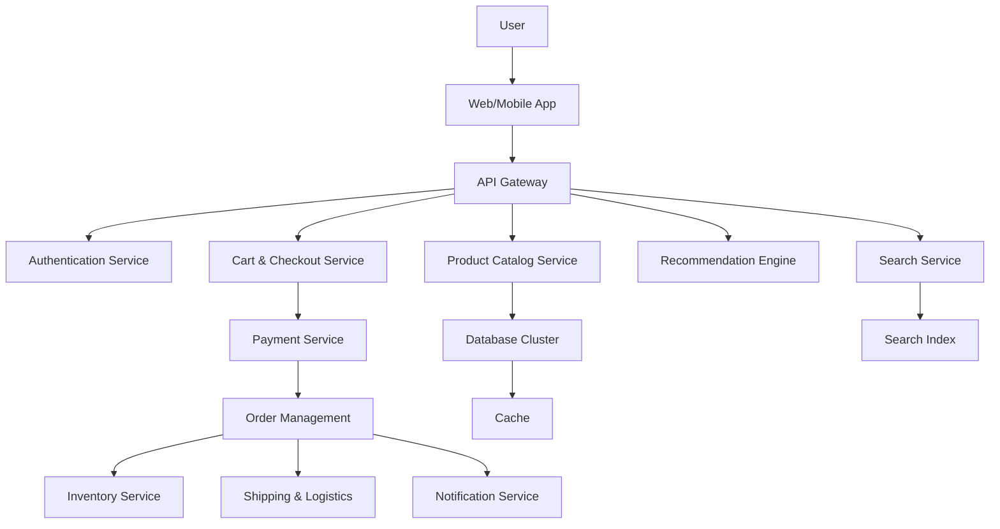

# Amazon E-commerce Platform System Design

## Overview

Amazon's e-commerce platform handles millions of products, orders, and users daily. This design covers product catalog management, order processing, recommendation systems, and payment integration for a large-scale online retail system.

## Detailed Explanation

### Architecture



### Components

| Component | Description | Technology |
|-----------|-------------|------------|
| API Gateway | Request routing, rate limiting | AWS API Gateway, Kong |
| Authentication | User login, sessions | Cognito, JWT |
| Product Catalog | Product details, categories | DynamoDB, Elasticsearch |
| Search Service | Full-text search, filters | Elasticsearch, Solr |
| Recommendation | Personalized suggestions | ML models, TensorFlow |
| Cart & Checkout | Shopping cart, order creation | Redis, PostgreSQL |
| Payment Service | Secure payments | Stripe, PCI compliant |
| Order Management | Order tracking, status | Microservices, Saga pattern |
| Inventory | Stock levels, reservations | Cassandra |
| Shipping & Logistics | Fulfillment, tracking | Custom logistics software |
| Notification | Emails, SMS | SES, SNS |
| Database | Product/user data | Aurora, DynamoDB |
| Cache | Hot data | Redis, Memcached |

### Data Models

#### Product
```json
{
  "productId": "B08N5WRWNW",
  "title": "Wireless Headphones",
  "description": "Noise-cancelling wireless headphones",
  "price": 199.99,
  "category": "Electronics",
  "inventory": 1000,
  "reviews": [
    {"userId": "123", "rating": 5, "comment": "Great sound!"}
  ],
  "images": ["url1.jpg", "url2.jpg"]
}
```

#### Order
```json
{
  "orderId": "123-456-789",
  "userId": "user123",
  "items": [
    {"productId": "B08N5WRWNW", "quantity": 1, "price": 199.99}
  ],
  "total": 199.99,
  "status": "confirmed",
  "shippingAddress": {"street": "123 Main St", "city": "Anytown"},
  "createdAt": "2023-09-25T10:00:00Z"
}
```

## Real-world Examples & Use Cases

- **Product Browsing**: Search and filter millions of items.
- **Personalized Shopping**: Recommendations based on history.
- **Order Fulfillment**: Fast shipping with tracking.
- **Marketplace**: Third-party sellers integration.
- **Prime Services**: Subscription benefits like free shipping.

## Code Examples

### Product Search (Elasticsearch)

```java
// Elasticsearch client
RestHighLevelClient client = new RestHighLevelClient(
    RestClient.builder(new HttpHost("localhost", 9200, "http")));

// Search request
SearchRequest searchRequest = new SearchRequest("products");
SearchSourceBuilder searchSourceBuilder = new SearchSourceBuilder();
searchSourceBuilder.query(QueryBuilders.matchQuery("title", "wireless headphones"));
searchRequest.source(searchSourceBuilder);

// Execute search
SearchResponse searchResponse = client.search(searchRequest, RequestOptions.DEFAULT);
SearchHits hits = searchResponse.getHits();
for (SearchHit hit : hits) {
    System.out.println(hit.getSourceAsString());
}
```

### Order Processing (Saga Pattern)

```java
public class OrderSaga {
    public void processOrder(Order order) {
        // Step 1: Reserve inventory
        if (!inventoryService.reserveItems(order.getItems())) {
            throw new RuntimeException("Inventory unavailable");
        }
        
        try {
            // Step 2: Process payment
            paymentService.charge(order.getTotal(), order.getUserId());
            
            // Step 3: Create shipment
            shippingService.createShipment(order);
            
            // Step 4: Send confirmation
            notificationService.sendOrderConfirmation(order);
            
        } catch (Exception e) {
            // Compensate: release inventory, refund
            inventoryService.releaseItems(order.getItems());
            paymentService.refund(order.getUserId());
            throw e;
        }
    }
}
```

## Journey / Sequence

1. **User Registration**: Account creation with preferences.
2. **Product Discovery**: Browse, search, recommendations.
3. **Purchase Flow**: Add to cart, checkout, payment.
4. **Order Processing**: Inventory check, payment, fulfillment.
5. **Delivery**: Shipping, tracking, customer service.

## Common Pitfalls & Edge Cases

- **Inventory Race Conditions**: Concurrent purchases depleting stock.
- **Payment Failures**: Handle timeouts, chargebacks.
- **Scalability**: Black Friday traffic spikes.
- **Fraud Detection**: Prevent fake orders.
- **International Shipping**: Customs, taxes.

## Tools & Libraries

- **AWS Services**: EC2, S3, Lambda for serverless.
- **Spring Boot**: Microservices framework.
- **Kafka**: Event-driven architecture.
- **Redis**: Session and cart storage.

## References

- [Amazon Architecture](https://aws.amazon.com/architecture/)
- [Microservices Patterns](https://microservices.io/patterns/)
- [E-commerce Best Practices](https://www.shopify.com/blog/ecommerce)

## Github-README Links & Related Topics

- [Microservices Architecture](system-design/microservices-architecture/README.md)
- [Database Sharding](system-design/database-sharding-strategies/README.md)
- [Recommendation Systems](system-design/recommendation-systems/README.md)
- [Payment Systems](system-design/payment-systems/README.md)
- [Search Engines](system-design/search-engines/README.md)