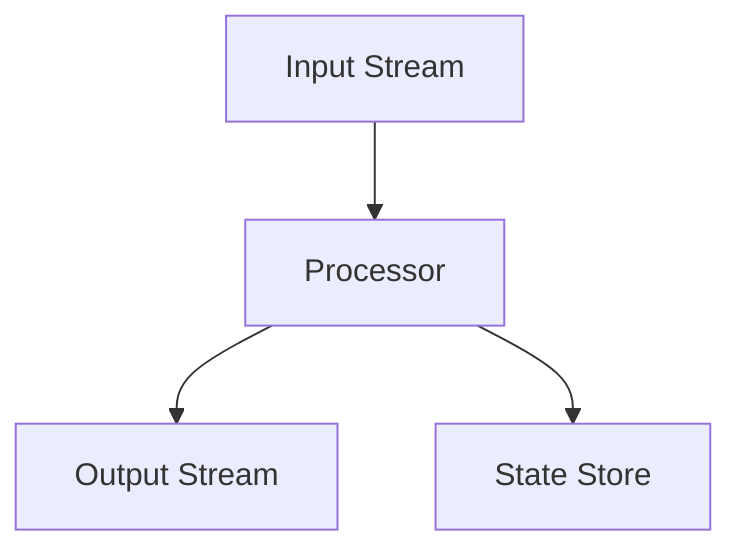

# Overview

Kafka Streams is a client library for building applications and microservices, where the input and output data are stored in Kafka clusters. It combines the simplicity of writing and deploying standard Java and Scala applications on the client side with the benefits of Kafka's server-side cluster technology.

# Detailed Explanation

Kafka Streams simplifies application development by building on the Kafka producer and consumer libraries and leveraging Kafka's native capabilities. It allows for stateful and stateless processing of streams. Key concepts:

- **Stream**: Sequence of records
- **Topology**: Graph of stream processors
- **KTable**: Table representation of streams
- **State Stores**: Local storage for stateful operations

## Stream Processing Topology



# Real-world Examples & Use Cases

- **Real-time Analytics**: Aggregate user events
- **Fraud Detection**: Monitor transactions in real-time
- **Data Enrichment**: Join streams with tables
- **ETL Pipelines**: Transform and load data
- **Event-driven Applications**: React to events

# Code Examples

## Word Count Example

```java
import org.apache.kafka.streams.KafkaStreams;
import org.apache.kafka.streams.StreamsBuilder;
import org.apache.kafka.streams.kstream.KStream;

StreamsBuilder builder = new StreamsBuilder();
KStream<String, String> textLines = builder.stream("TextLinesTopic");
KTable<String, Long> wordCounts = textLines
    .flatMapValues(textLine -> Arrays.asList(textLine.toLowerCase().split("\\W+")))
    .groupBy((key, word) -> word)
    .count();
wordCounts.toStream().to("WordsWithCountsTopic");

KafkaStreams streams = new KafkaStreams(builder.build(), props);
streams.start();
```

## Aggregation Example

```java
KStream<String, Double> sales = builder.stream("sales");
KTable<String, Double> totalSales = sales
    .groupByKey()
    .reduce((aggValue, newValue) -> aggValue + newValue);
```

# References

- [Kafka Streams Documentation](https://kafka.apache.org/documentation/streams/)
- [Kafka Streams Developer Guide](https://kafka.apache.org/documentation/streams/developer-guide/)
- [Java API](https://kafka.apache.org/documentation/streams/javadocs/)

# Github-README Links & Related Topics

- [Apache Kafka GitHub](https://github.com/apache/kafka)
- [Kafka Connect](kafka-connect/)
- [Stream Processing](stream-processing/)