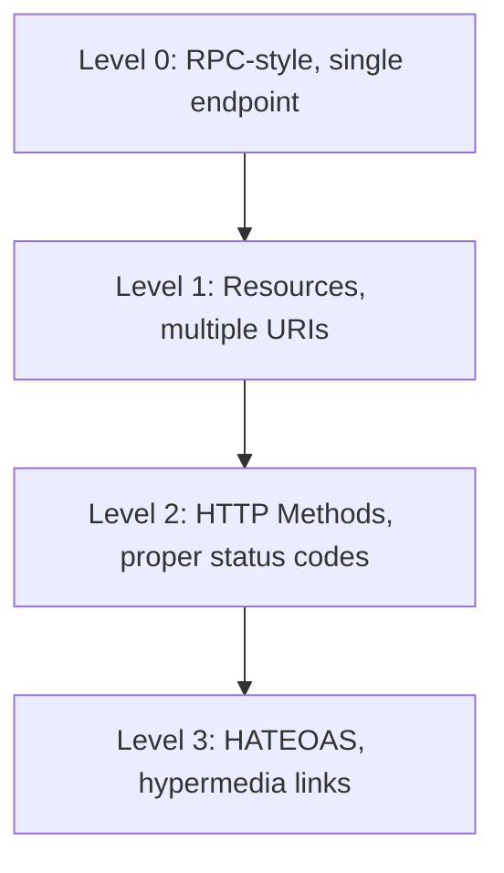

# Overview

API design best practices focus on creating intuitive, scalable, and maintainable interfaces that follow REST principles. Key aspects include resource modeling, consistent URI structures, proper HTTP method usage, versioning strategies, and ensuring security, performance, and developer experience. Effective API design minimizes misuse, supports evolution, and adheres to standards like OpenAPI for documentation.

# Detailed Explanation

## Core Principles

- **Resource-Oriented Design**: Model APIs around resources (nouns) rather than actions. Use hierarchical URIs to represent relationships, e.g., `/users/{id}/posts`.
- **HTTP Methods**: Leverage standard methods for CRUD operations:
  - GET: Retrieve resources
  - POST: Create resources
  - PUT: Update entire resources (idempotent)
  - PATCH: Partial updates
  - DELETE: Remove resources
- **Statelessness**: Each request should contain all necessary information; avoid server-side sessions.
- **Uniform Interface**: Consistent use of URIs, HTTP methods, and representations (e.g., JSON/XML).
- **HATEOAS (Hypermedia as the Engine of Application State)**: Include links in responses to guide clients through API interactions.

## Key Best Practices

| Aspect | Best Practice | Example |
|--------|---------------|---------|
| URIs | Use nouns, plural for collections, avoid verbs | `/orders` (good), `/create-order` (bad) |
| Versioning | Use URI versioning for clarity, e.g., `/v1/users` | Supports backward compatibility |
| Error Handling | Use HTTP status codes (200 OK, 404 Not Found, 500 Internal Server Error); provide descriptive messages | `{"error": "User not found", "code": 404}` |
| Pagination & Filtering | Implement query parameters like `?limit=10&offset=20` for large datasets | Prevents performance issues |
| Security | Use HTTPS, authentication (OAuth, JWT), rate limiting | Avoid exposing sensitive data |
| Documentation | Adopt OpenAPI/Swagger for machine-readable specs | Enables auto-generation of client SDKs |

## API Maturity Model

APIs evolve through maturity levels (Richardson Maturity Model):



Aim for Level 3 for fully RESTful APIs.

## Additional Considerations

- **Performance**: Support caching with headers (ETag, Cache-Control); use compression.
- **Multitenancy**: Handle tenant isolation via headers or paths.
- **Async Operations**: For long-running tasks, return 202 Accepted with status endpoints.
- **Content Negotiation**: Support multiple formats via Accept headers.

# Real-world Examples & Use Cases

- **E-commerce Platform**: `/products/{id}` for product details, `/orders` for order management. Use pagination for product listings to handle large catalogs.
- **Social Media API**: `/users/{id}/posts` for user posts, `/posts/{id}/comments` for nested resources. Implement filtering by date or popularity.
- **IoT Device Management**: `/devices/{id}/configurations` for device configs. Use PUT for updates to ensure idempotency in unreliable networks.
- **Banking API**: Strict versioning (`/v2/accounts`) for regulatory compliance; HATEOAS for secure navigation through account operations.

# Code Examples

## JSON Response Example

```json
{
  "orderId": 123,
  "customerId": 456,
  "items": [
    {"productId": 789, "quantity": 2}
  ],
  "total": 99.99,
  "links": [
    {"rel": "self", "href": "/orders/123"},
    {"rel": "customer", "href": "/customers/456"}
  ]
}
```

## OpenAPI Specification Snippet

```yaml
openapi: 3.0.0
info:
  title: Sample API
  version: 1.0.0
paths:
  /users:
    get:
      summary: Get all users
      parameters:
        - name: limit
          in: query
          schema:
            type: integer
      responses:
        '200':
          description: Successful response
          content:
            application/json:
              schema:
                type: array
                items:
                  $ref: '#/components/schemas/User'
components:
  schemas:
    User:
      type: object
      properties:
        id:
          type: integer
        name:
          type: string
```

# References

- [Google API Design Guide](https://developers.google.com/api-design-guide/)
- [Microsoft Azure API Design Best Practices](https://learn.microsoft.com/en-us/azure/architecture/best-practices/api-design)
- [Swagger Best Practices in API Design](https://swagger.io/resources/articles/best-practices-in-api-design/)
- [REST API Design Tutorial](https://restfulapi.net/rest-api-design-tutorial-with-example/)

# Github-README Links & Related Topics

- [API Design Principles](./api-design-principles/)
- [API Gateway Design](./api-gateway-design/)
- [API Security Best Practices](./api-security-best-practices/)
- [API Versioning Strategies](./api-versioning-strategies/)
- [REST API Best Practices](./rest-api-best-practices/)