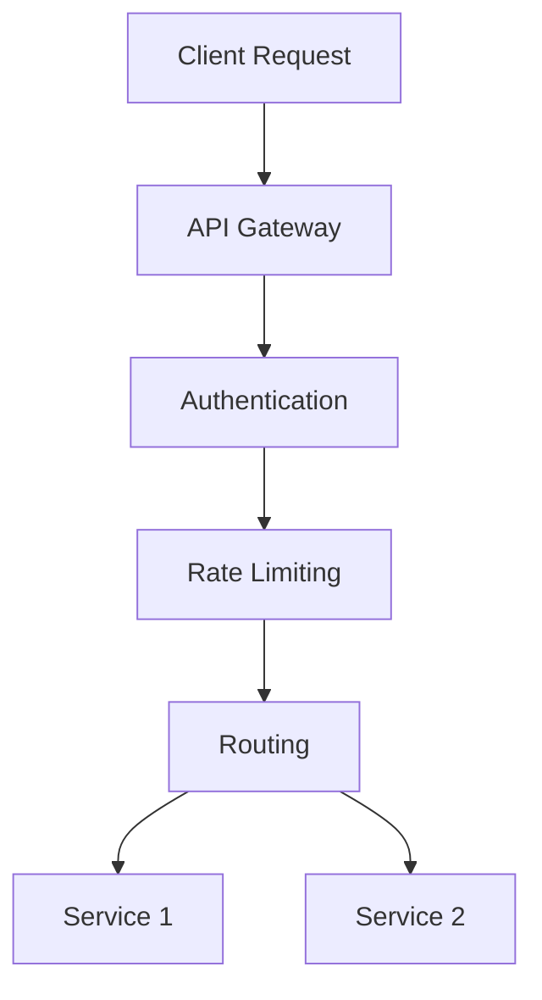

# API Gateway Implementation

## Overview

API Gateway implementation involves deploying a centralized entry point for managing, securing, and routing API requests in microservices architectures.

## Detailed Explanation

### Routing and Load Balancing

Route requests to appropriate services and distribute load.

### Authentication and Authorization

Implement OAuth, JWT for secure access.

### Rate Limiting and Throttling

Control request rates to prevent abuse.

### Caching and Transformation

Cache responses and transform data formats.

### Monitoring and Logging

Track performance and errors.

## Real-world Examples & Use Cases

- E-commerce platforms using API gateways for payment processing.
- Social media apps routing user requests.
- IoT systems aggregating device data.

## Code Examples

```java
// Spring Cloud Gateway example
@Configuration
public class GatewayConfig {
    @Bean
    public RouteLocator customRouteLocator(RouteLocatorBuilder builder) {
        return builder.routes()
            .route("service1", r -> r.path("/service1/**")
                .filters(f -> f.stripPrefix(1))
                .uri("lb://service1"))
            .build();
    }
}
```

## References

- [Spring Cloud Gateway](https://spring.io/projects/spring-cloud-gateway)
- [Kong API Gateway](https://konghq.com/kong/)

## Github-README Links & Related Topics

- [API Gateway Design](./api-gateway-design/README.md)
- [Microservices Architecture](./microservices-architecture/README.md)
- [API Security Best Practices](./api-security-best-practices/README.md)

