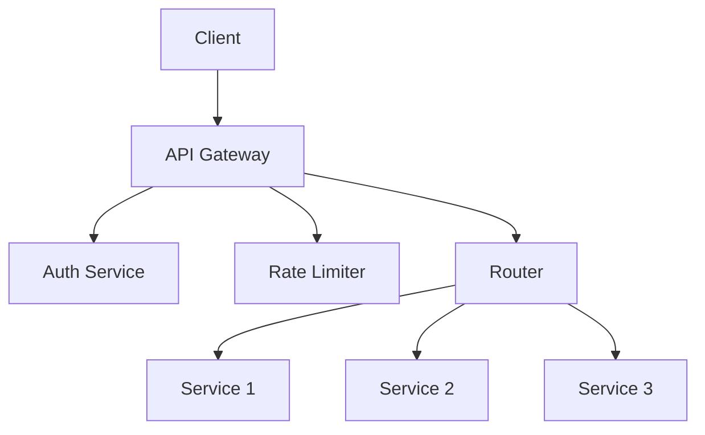

# API Gateway Implementation

## Overview

An API Gateway is a server that acts as an API front-end, receiving API requests, enforcing throttling and security policies, passing requests to the back-end service, and then passing the response back to the requester. It provides a single entry point for all clients, simplifying the architecture and improving security, scalability, and observability.

## Detailed Explanation

API Gateways handle cross-cutting concerns such as authentication, authorization, rate limiting, logging, and request/response transformation. They can route requests to different services based on URL paths, headers, or other criteria. Common implementations include Kong, Apigee, AWS API Gateway, and NGINX.

### Key Components

- **Routing**: Directs requests to appropriate microservices.
- **Authentication & Authorization**: Validates tokens, API keys, etc.
- **Rate Limiting**: Prevents abuse by limiting request rates.
- **Load Balancing**: Distributes traffic across service instances.
- **Caching**: Stores responses to reduce backend load.
- **Transformation**: Modifies requests/responses (e.g., protocol translation).

### Architecture Diagram



## Real-world Examples & Use Cases

- **Netflix**: Uses Zuul as API Gateway for routing, load balancing, and security.
- **Amazon**: API Gateway manages millions of API calls, handling authentication and throttling.
- **E-commerce Platforms**: Gateways route to payment, inventory, and user services.

## Code Examples

### Simple NGINX Configuration

```nginx
server {
    listen 80;
    location /api/v1/users {
        proxy_pass http://user-service:8080;
    }
    location /api/v1/orders {
        proxy_pass http://order-service:8080;
    }
}
```

### Spring Cloud Gateway Example

```java
@Configuration
public class GatewayConfig {
    @Bean
    public RouteLocator customRouteLocator(RouteLocatorBuilder builder) {
        return builder.routes()
            .route("user-service", r -> r.path("/api/users/**")
                .uri("lb://user-service"))
            .route("order-service", r -> r.path("/api/orders/**")
                .uri("lb://order-service"))
            .build();
    }
}
```

## References

- [AWS API Gateway Documentation](https://docs.aws.amazon.com/apigateway/)
- [Kong API Gateway](https://konghq.com/kong/)
- [Spring Cloud Gateway](https://spring.io/projects/spring-cloud-gateway)

## Github-README Links & Related Topics

- [API Gateway Design](api-gateway-design/README.md)
- [API Gateway Patterns](api-gateway-patterns/README.md)
- [Microservices Architecture](microservices-architecture/README.md)
- [Load Balancing and Strategies](load-balancing-and-strategies/README.md)