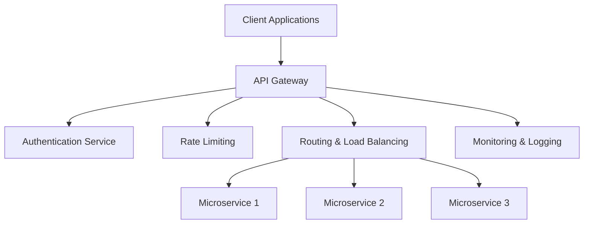

# API Gateway Implementations

## Overview

API Gateway Implementations refer to the practical deployment, configuration, and management of API gateways in distributed systems. These gateways serve as centralized entry points that handle API requests, providing features like routing, authentication, rate limiting, and monitoring for backend services.



## Detailed Explanation

### Core Components

1. **Request Routing**: Directs incoming requests to appropriate backend services based on URL paths, headers, or other criteria.

2. **Authentication & Authorization**: Validates user credentials and enforces access control policies.

3. **Rate Limiting & Throttling**: Controls request rates to prevent abuse and ensure fair resource allocation.

4. **Load Balancing**: Distributes traffic across multiple instances of services.

5. **Caching**: Stores frequently accessed data to reduce backend load and improve response times.

6. **Monitoring & Analytics**: Tracks API usage, performance metrics, and error rates.

### Implementation Patterns

- **Edge Gateway**: Single entry point for all external traffic
- **Service Mesh Integration**: Works with service meshes like Istio for internal traffic
- **Multi-Gateway Architecture**: Multiple gateways for different zones or purposes

### Popular Implementations

- **Kong**: Open-source API gateway built on Nginx
- **AWS API Gateway**: Managed service with serverless integration
- **Apigee**: Enterprise API management platform
- **Spring Cloud Gateway**: Java-based gateway for microservices
- **Netflix Zuul**: Gateway solution for microservices architectures

## Real-world Examples & Use Cases

### E-commerce Platform

```yaml
# Kong Gateway Configuration
services:
  - name: product-service
    url: http://product-service:8080
    routes:
      - name: product-route
        paths:
          - /api/products
        methods: [GET, POST, PUT, DELETE]

  - name: order-service
    url: http://order-service:8080
    routes:
      - name: order-route
        paths:
          - /api/orders
        methods: [GET, POST]

plugins:
  - name: rate-limiting
    service: product-service
    config:
      minute: 100
      hour: 1000

  - name: key-auth
    service: product-service
```

### Microservices Architecture with Spring Cloud Gateway

```java
@Configuration
public class GatewayConfig {

    @Bean
    public RouteLocator customRouteLocator(RouteLocatorBuilder builder) {
        return builder.routes()
            .route("user-service", r -> r.path("/api/users/**")
                .filters(f -> f.addRequestHeader("X-Request-Source", "gateway"))
                .uri("lb://user-service"))
            .route("product-service", r -> r.path("/api/products/**")
                .filters(f -> f
                    .rewritePath("/api/products/(?<segment>.*)", "/${segment}")
                    .addRequestHeader("X-Request-Source", "gateway"))
                .uri("lb://product-service"))
            .build();
    }
}
```

### AWS API Gateway for Serverless

```yaml
# serverless.yml
service: my-api

provider:
  name: aws
  runtime: nodejs18.x

functions:
  createUser:
    handler: handler.createUser
    events:
      - http:
          path: users
          method: post
          cors: true
          authorizer: aws_iam

  getUser:
    handler: handler.getUser
    events:
      - http:
          path: users/{id}
          method: get
          cors: true
          authorizer: aws_iam

resources:
  Resources:
    ApiGatewayRestApi:
      Type: AWS::ApiGateway::RestApi
      Properties:
        Name: MyAPI
        Description: API Gateway for serverless functions
```

## Code Examples

### Kong Gateway with Lua Plugin

```lua
-- Custom authentication plugin
local plugin = {
  PRIORITY = 1000,
  VERSION = "0.1.0",
}

function plugin:access(conf)
  -- Custom authentication logic
  local token = kong.request.get_header("Authorization")
  if not token then
    return kong.response.exit(401, { message = "No token provided" })
  end

  -- Validate token (simplified)
  local valid = validate_token(token)
  if not valid then
    return kong.response.exit(401, { message = "Invalid token" })
  end
end

return plugin
```

### Netflix Zuul Filter

```java
@Component
public class PreFilter extends ZuulFilter {

    @Override
    public String filterType() {
        return "pre";
    }

    @Override
    public int filterOrder() {
        return 1;
    }

    @Override
    public boolean shouldFilter() {
        return true;
    }

    @Override
    public Object run() {
        RequestContext ctx = RequestContext.getCurrentContext();
        HttpServletRequest request = ctx.getRequest();

        // Add custom header
        ctx.addZuulRequestHeader("X-Gateway", "Zuul");

        // Log request
        System.out.println("Request: " + request.getMethod() + " " + request.getRequestURI());

        return null;
    }
}
```

### Apigee API Proxy Configuration

```xml
<?xml version="1.0" encoding="UTF-8"?>
<APIProxy name="my-api-proxy">
  <Description>My API Proxy</Description>
  <BasePaths>/v1/myapi</BasePaths>
  <Resources>
    <Resource>/users</Resource>
    <Resource>/products</Resource>
  </Resources>
  <Policies>
    <Policy>VerifyAPIKey</Policy>
    <Policy>SpikeArrest</Policy>
    <Policy>Quota</Policy>
  </Policies>
  <TargetEndpoints>
    <TargetEndpoint>default</TargetEndpoint>
  </TargetEndpoints>
</APIProxy>
```

## Common Pitfalls & Edge Cases

- **Single Point of Failure**: Implement high availability and failover mechanisms
- **Performance Bottlenecks**: Monitor latency and optimize routing logic
- **Security Vulnerabilities**: Keep gateways updated and configure proper TLS
- **Configuration Drift**: Use infrastructure as code for gateway configurations
- **Rate Limiting Abuse**: Implement distributed rate limiting for multi-instance deployments
- **API Versioning**: Handle multiple API versions gracefully
- **CORS Issues**: Configure cross-origin resource sharing properly

## Tools & Libraries

- **Kong**: Open-source API gateway
- **AWS API Gateway**: Cloud-managed gateway service
- **Apigee**: Enterprise API management
- **Spring Cloud Gateway**: Java-based gateway
- **Netflix Zuul**: Gateway for microservices
- **Traefik**: Modern HTTP reverse proxy and load balancer
- **NGINX Plus**: Commercial version with API gateway features

## References

- [Kong Documentation](https://docs.konghq.com/)
- [AWS API Gateway Developer Guide](https://docs.aws.amazon.com/apigateway/)
- [Apigee Documentation](https://cloud.google.com/apigee/docs)
- [Spring Cloud Gateway Reference](https://docs.spring.io/spring-cloud-gateway/docs/current/reference/html/)
- [Netflix Zuul Wiki](https://github.com/Netflix/zuul/wiki)

## Github-README Links & Related Topics

- [API Gateway Design](../api-gateway-design/README.md)
- [API Gateway Patterns](../api-gateway-patterns/README.md)
- [API Gateway vs Load Balancer](../api-gateway-vs-load-balancer/README.md)
- [API Gateway vs Service Mesh](../api-gateway-vs-service-mesh/README.md)
- [Microservices Architecture](../microservices-architecture/README.md)
- [Service Mesh with Istio](../service-mesh-with-istio/README.md)