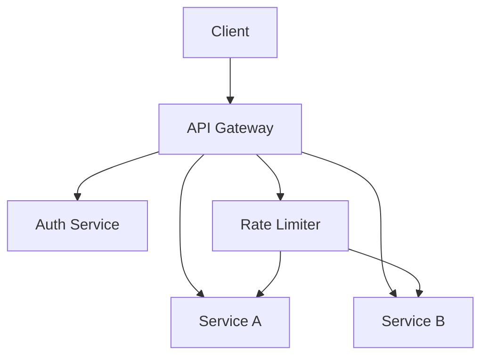
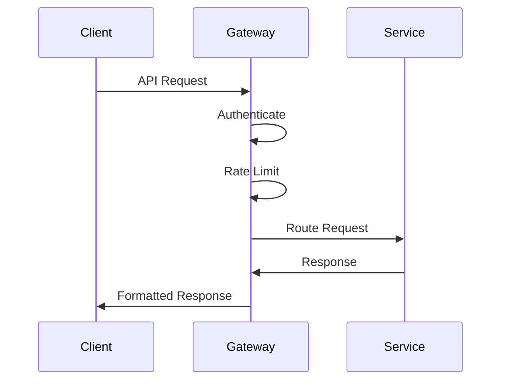

# API Gateway Patterns

## Overview

API Gateway patterns provide architectural solutions for managing, securing, and optimizing API interactions in distributed systems, particularly microservices architectures. They act as a single entry point for client requests, abstracting the complexity of backend services.



## Detailed Explanation

### Core Patterns

1. **Single Entry Point**: All client requests go through the gateway, which routes them to appropriate services.

2. **Request Routing**: Intelligent routing based on URL paths, headers, or other criteria.

3. **Protocol Translation**: Converting between different protocols (HTTP, WebSocket, gRPC).

4. **Authentication & Authorization**: Centralized auth handling with JWT, OAuth, API keys.

5. **Rate Limiting & Throttling**: Protecting backend services from overload.

6. **Caching**: Response caching to improve performance.

7. **Load Balancing**: Distributing requests across multiple instances.

8. **Circuit Breaker**: Preventing cascade failures.

### Implementation Approaches

- **Edge Gateway**: Deployed at the network edge
- **Service Mesh Integration**: Working with service meshes like Istio
- **Sidecar Pattern**: Gateway as a sidecar container

## Journey / Sequence



## Real-world Examples & Use Cases

### E-commerce Platform
- Product catalog API routing
- User authentication for checkout
- Rate limiting for search endpoints
- Response aggregation for product details page

### Mobile Application Backend
- API versioning handling
- Device-specific response formatting
- Push notification routing
- Offline data synchronization

### IoT Platform
- Device authentication and authorization
- Protocol translation (MQTT to HTTP)
- Message filtering and transformation
- Real-time data streaming

## Code Examples

### Spring Cloud Gateway Configuration
```java
@Configuration
public class GatewayConfig {
    
    @Bean
    public RouteLocator customRouteLocator(RouteLocatorBuilder builder) {
        return builder.routes()
            .route("user-service", r -> r.path("/api/users/**")
                .filters(f -> f.stripPrefix(1))
                .uri("lb://user-service"))
            .route("order-service", r -> r.path("/api/orders/**")
                .filters(f -> f.stripPrefix(1))
                .uri("lb://order-service"))
            .build();
    }
}
```

### Rate Limiting with Redis
```java
@Component
public class RateLimitFilter implements GlobalFilter, Ordered {
    
    @Autowired
    private RedisTemplate<String, String> redisTemplate;
    
    @Override
    public Mono<Void> filter(ServerWebExchange exchange, GatewayFilterChain chain) {
        String clientId = getClientId(exchange);
        String key = "rate_limit:" + clientId;
        
        Long current = redisTemplate.opsForValue().increment(key);
        if (current == 1) {
            redisTemplate.expire(key, 1, TimeUnit.MINUTES);
        }
        
        if (current > 100) { // 100 requests per minute
            exchange.getResponse().setStatusCode(HttpStatus.TOO_MANY_REQUESTS);
            return exchange.getResponse().setComplete();
        }
        
        return chain.filter(exchange);
    }
}
```

### Authentication Filter
```java
@Component
public class AuthFilter implements GlobalFilter, Ordered {
    
    @Override
    public Mono<Void> filter(ServerWebExchange exchange, GatewayFilterChain chain) {
        String token = exchange.getRequest().getHeaders().getFirst("Authorization");
        
        if (token == null || !validateToken(token)) {
            exchange.getResponse().setStatusCode(HttpStatus.UNAUTHORIZED);
            return exchange.getResponse().setComplete();
        }
        
        return chain.filter(exchange);
    }
    
    private boolean validateToken(String token) {
        // JWT validation logic
        return true; // Simplified
    }
}
```

## Common Pitfalls & Edge Cases

- **Single Point of Failure**: Ensure HA and scalability.
- **Performance Bottlenecks**: Optimize routing and caching.
- **Configuration Complexity**: Manage routing rules.
- **Auth Scheme Handling**: Support multiple protocols.
- **API Versioning**: Backward compatibility.

## Tools & Libraries

- **Spring Cloud Gateway**: Java-based API gateway
- **Kong**: Open-source API gateway
- **NGINX Plus**: High-performance API gateway
- **AWS API Gateway**: Managed cloud service
- **Istio**: Service mesh with gateway capabilities

## References

- [API Gateway Pattern](https://microservices.io/patterns/apigateway.html)
- [Spring Cloud Gateway](https://spring.io/projects/spring-cloud-gateway)
- [Kong Documentation](https://docs.konghq.com/)
- [AWS API Gateway](https://aws.amazon.com/api-gateway/)

## Github-README Links & Related Topics

- [API Gateway Design](../api-gateway-design/README.md)
- [API Gateway vs Load Balancer](../api-gateway-vs-load-balancer/README.md)
- [API Gateway vs Service Mesh](../api-gateway-vs-service-mesh/README.md)
- [Microservices Architecture](../microservices-architecture/README.md)