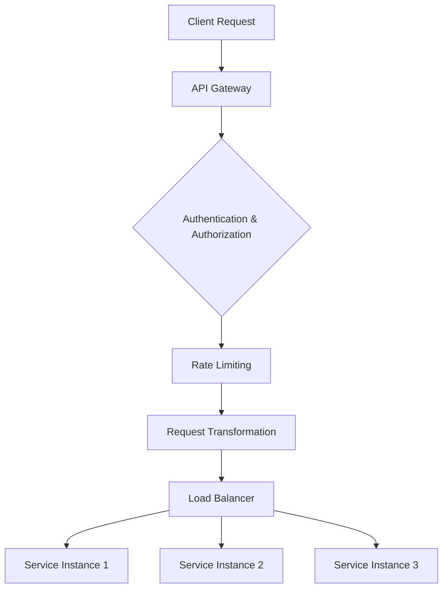

## Overview

API Gateways and Load Balancers are both essential components in modern distributed systems, but they serve different purposes. An API Gateway acts as a single entry point for API requests, handling routing, authentication, rate limiting, and protocol translation. A Load Balancer distributes incoming traffic across multiple servers to ensure high availability and scalability. Understanding their differences helps in designing robust microservices architectures.

## Detailed Explanation

### API Gateway
- **Functionality**: Manages API requests, performs authentication, authorization, rate limiting, caching, and protocol conversion (e.g., REST to GraphQL).
- **Placement**: Typically sits at the edge of the system, before microservices.
- **Features**: Request/response transformation, API versioning, monitoring, and analytics.
- **Examples**: AWS API Gateway, Kong, Apigee.

### Load Balancer
- **Functionality**: Distributes traffic across multiple instances of an application to prevent overload on any single server.
- **Types**: Layer 4 (transport layer, e.g., TCP/UDP) and Layer 7 (application layer, e.g., HTTP).
- **Algorithms**: Round-robin, least connections, IP hash.
- **Examples**: NGINX, HAProxy, AWS ELB/ALB.

### Key Differences
| Aspect | API Gateway | Load Balancer |
|--------|-------------|---------------|
| Layer | Application (Layer 7) | Transport (Layer 4) or Application (Layer 7) |
| Routing | API-specific routing based on paths/methods | Server-based load distribution |
| Features | Authentication, rate limiting, caching | Health checks, session persistence |
| Use Case | Microservices orchestration | Traffic distribution for scalability |



## Real-world Examples & Use Cases

- **E-commerce Platform**: Use an API Gateway to handle user authentication and API versioning, while a Load Balancer distributes traffic to product catalog microservices.
- **Streaming Service (e.g., Netflix)**: API Gateway manages API calls for recommendations, while Load Balancers handle video streaming requests across CDN edges.
- **Banking Application**: API Gateway enforces security policies and rate limits, Load Balancer ensures high availability for transaction processing servers.

## Code Examples

### NGINX Load Balancer Configuration
```nginx
upstream backend {
    server backend1.example.com;
    server backend2.example.com;
}

server {
    listen 80;
    location / {
        proxy_pass http://backend;
    }
}
```

### AWS API Gateway with Lambda
```json
{
  "swagger": "2.0",
  "info": {
    "title": "My API"
  },
  "paths": {
    "/hello": {
      "get": {
        "x-amazon-apigateway-integration": {
          "type": "aws_proxy",
          "httpMethod": "POST",
          "uri": "arn:aws:apigateway:us-east-1:lambda:path/2015-03-31/functions/arn:aws:lambda:us-east-1:123456789012:function:my-function/invocations"
        }
      }
    }
  }
}
```

## Common Pitfalls & Edge Cases

- **Overlapping Responsibilities**: Avoid using API Gateway for simple load balancing; use dedicated Load Balancers for that.
- **Latency**: API Gateways can add latency due to processing; monitor and optimize.
- **Scalability**: Ensure Load Balancers can handle sudden traffic spikes.

## Tools & Libraries

- **API Gateways**: Kong, Tyk, AWS API Gateway, Google Cloud API Gateway.
- **Load Balancers**: NGINX, HAProxy, Envoy, AWS ALB.

## References

- [AWS API Gateway Documentation](https://docs.aws.amazon.com/apigateway/)
- [NGINX Load Balancing](https://nginx.org/en/docs/http/load_balancing.html)
- [Kong API Gateway](https://konghq.com/kong/)

## Github-README Links & Related Topics

- [api-gateway-design](../api-gateway-design/README.md)
- [load-balancing-and-strategies](../load-balancing-and-strategies/README.md)
- [api-security-best-practices](../api-security-best-practices/README.md)